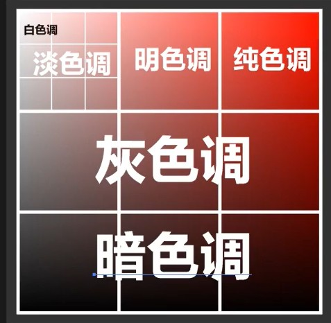

<h1> 界面排版 </h1>

****
[toc]
***

# 第一章 四大规则

* **对齐** ：界面规整
* **对比** ：各个元素之间有区分：大小、粗细、字体、颜色、间距、色块、前后、方向
* **分组** ：对元素有分类，对信息有归类
* **重复** ：风格统一，能重复，就尽量重复

## 一、分组

&emsp;&emsp;**同一组信息放近一些；不同组信息有空隙间隔。**
  
## 二、标题对比

* 主标题：字体放大；间距紧密
* 副标题：字体缩小；间距稀疏

## 三、对比

> * 大小
> * 粗细
> * 颜色: **色重**
> * **色调：主体和背景之间是色调的两个极端，其他元素的色调在中间，起过度作用**
> * 疏密
> * 色块：a）装饰；b）分组；c）提醒
> * 字体
> * 方向：文字排列方向可以改变
> * 前后：a）错层阴影；b）图文穿插；c）虚实对比
> * 线框\线条：a）装饰；b）串联整体；c）风格整体

# 第二章 主体和层级

## 一、规则

* **主要信息** ：大小标题区分（**字体上等比列变化**）
* **辅助信息** ：等差变化

## 二、错误

| 错误形式 | 解决方法                 |
| :------: | :----------------------- |
| 没有主体 | 创造主体                 |
| 主体隐蔽 | 放大主体                 |
| 主体过多 | 合并主体                 |
| 主体粗糙 | 先满足上面三项，然后细化 |

# 第三章 字体

## 一、字体选用的大方向

* **行业**
* **用户** 

## 二、无衬线体与衬线体

* **无衬线体**：笔画规整，没啥变化
	> * 简单粗暴
	> * 直接大气
	> * 识别性弱：

* **衬线体**：笔画有区别
	> * 精致优雅
	> * 文艺复古

## 三、字体总结

| 字体      | 衬线 | 特点                                                                         | 场景                                                     | 推荐                 |
| --------- | ---- | ---------------------------------------------------------------------------- | -------------------------------------------------------- | -------------------- |
| 黑体      | 无   | 严肃规矩，基本上通吃，使用频率最高                                           | 运动，美食，商业，男性，女性（细一点），地产，教育，正式 | 思源黑体             |
| 宋体      | 有   | 笔画精细，装饰性强，表达精致且富有                                           | 文化，艺术，女性，美食，化妆品，正式场合，生活，教育     | 思源宋体             |
| 圆体      | 无   | 既有黑体的严肃规矩，又有灵性活泼，表达柔美和爽滑感                           | 美食，文化艺术，儿童，活泼，女性柔美，女性用品           | 方正粗体，幼圆       |
| 卡通      | 全   | 随意性强                                                                     | 儿童，活泼                                               | 方正卡通，酷站快乐体 |
| 艺术      | 有   | 艺术性字可读性弱，用于装饰；楷书规矩，小说说明文；行书使用频率广；手写个性强 | 文化，大气，力量，艺术，动感                             | 放正楷体             |
| helvetica | 无   | 比较通用                                                                     | 标题                                                     |
| Din       | 无   | 商业设计，工业属性                                                           | 数字，标价，日期                                         | light，medium        |
| impact    | 无   |                                                                              | 促销价格                                                 |
| didot     | 有   |                                                                              | 与中文的衬线字体搭配                                     |

## 四、文字使用规范

> * 符合项目
> * 中文衬线字体配英文衬线字体，中文无衬线字体配英文无衬线字体
> * 中文艺术字体配英文衬线字体
> * 最多三种字体
> * 中文，英文的字体分开
> * 英文字的规范：**全小写，全大写，首字母大写，单词首字母大写（不要乱七八糟）**
> * 文字层级：分组，对比，主次
> * 字体不搞花里胡哨，**标题用粗体**

# 第四章 图片应用

## 一、视角

| 正面               | 侧面       | 仰视       | 俯视       | 背影       | 特写       |
| ------------------ | ---------- | ---------- | ---------- | ---------- | ---------- |
| 正式庄重，严肃规矩 | 自然，写实 | 权力，雄伟 | 全面，客观 | 神秘，文艺 | 真实，细节 |

## 二、图片版式

| 版式       | 特点                                 | 场景                                        |
| ---------- | ------------------------------------ | ------------------------------------------- |
| 画面整铺   | 用整张图片作为背景                   | 适合精致的图片  适合与文字形成反差的图片 |
| 留出血边   | 图片周围留空白，用来放文字           | 文字较多的版面   图片不适合放字的版面    |
| 去底抠图   | 对图片的主体部分进行抠图             | 打破呆板 活跃画面                        |
| 粗略抠图   | 图片留有一定的描边                   | 活泼风格   图片完整                      |
| 局部抠图   | 对图片的一部分进行抠图               | 打破图片框的呆板  活跃画面               |
| 放大局部   | 保留图片的突出部分                   |
| 去除多余   | 将图片中的多余元素去除               |
| 艺术化处理 |
| 多张图片   | 统一位置，比列，角度，色彩色调，风格 |

# 第五章 构图及平衡

## 一、对称

* 绝对对称：从画面中能找到具体的对称轴线
* 相对对称：画面中部分元素是对称的

## 二、构图形式

   | 形式     | 特点                                     | 应用     |
   | -------- | ---------------------------------------- | -------- |
   | 居中     | 所有元素能找到对称轴线                   |          |
   | 对角线   | 9宫格覆盖版面，文字一般在左上4个格子     |          |
   | 满版     | 整张图当背景                             |          |
   | 三角     | 元素排版呈现三角形                       | 横板海报 |
   | 黄金比列 | 1:1.618                                  | 各种场景 |
   | 上下型   | 上文下图：突出文字   上图下文：突出图 |          |
   | 左右型   | 左文右图：突出文字   左图右文：突出图 |          |

## 三、规则

* 排版要体现**平衡**
* **对称**是平衡的最好体现
* 一个版面可存在多种构图

# 第五章 网格系统

1. 根据网格系统摆放元素位置
2. 按照前几章规则，修改字体，字号，文字分组
3. 文字转曲线，用于更精确的与网格进行对齐
4. 最后调整文字颜色，特效 

# 第六章 色彩

## 一、色彩三要素

* H: 色相
* S: 饱和度
* B: 亮度
* S + B: 色调，颜色的整体倾向

## 二、色重

> * 黑色：最重
> * 白色：最轻
> * 灰色：中间
> * 七色相：
>     * 重：红，橙，蓝，紫
>     * 轻；黄，绿，青

## 三、冷暖

## 四、色调

   | 色调   | 优点             | 缺点                 | 场景               |
   | ------ | ---------------- | -------------------- | ------------------ |
   | 纯色调 | 刺激、直接       | 廉价、刺眼           | 促销活动，廉价商品 |
   | 明色调 | 青春、活力、干净 | 缺少档次             | 大众化             |
   | 淡色调 | 天真、纤细、高档 | 单薄、软弱           | 女性               |
   | 白色调 | 文艺、素雅、简洁 | 无趣、单调、缺乏个性 | 偏高冷             |
   | 灰色调 | 成熟、稳重       | 脏                   | 中年男性           |
   | 暗色调 | 历史、厚重、地位 | 压抑、危险           | 高端               |

## 五、色彩平衡

   | 平衡法         | 描述                         | 解释                                                                                                                     | 应用 |
   | -------------- | ---------------------------- | ------------------------------------------------------------------------------------------------------------------------ | ---- |
   | 色调平衡       | **所有画面首先满足**         | 1.**不能只有一种色调**   2. **主体和背景之间是色调的两个极端，其他元素的色调在中间，起过度作用**   3. **色重对比** | 通用 |
   | 冷暖平衡       |                              |                                                                                                                          | 电影 |
   | 互补平衡       | 使用互补配色                 |
   | 花色纯色平衡   | 画面很花时，使用纯色进行平衡 |
   | 有彩色与无彩色 |                              | 无彩色：黑白   有彩色：其他                                                                                           |

# 第七章 设计风格

   | 样式       | 特点                           | 制作                                                                                                                                        |
   | ---------- | ------------------------------ | ------------------------------------------------------------------------------------------------------------------------------------------- |
   | 立体字     | 简单粗暴、冲击力强、缺少品质感 | 混合工具                                                                                                                                    |
   | 图片合成   | 创意十足                       | ps                                                                                                                                          |
   | 微缩景观   | 比列夸张                       | 将实物进行夸张的缩放                                                                                                                        |
   | 双重曝光   | 想象力                         | 抠图，蒙蔽                                                                                                                                  |
   | 扁平化     | 简洁                           |
   | 长投影     | 增加扁平的立体感               | 混合工具，渐变，正片叠底                                                                                                                    |
   | 文字图形   | 创意                           | 刻刀划分区域；对象->封套扭曲                                                                                                                |
   | 2.5D       | 轻3D，无透视                   | 1.效果->3d->凸出：等角上，左，右   2.对象->扩展外观->取消编组*2                                                                          |
   | 标签设计   | 色彩对比                       |
   | 故障风     | 图像失真                       | 1. 图像颜色分离：两层，图层样式，混合选项，关闭一个通道(RGB)    2. 文字颜色分离：方法同上，要更改两层的通道   3. 增加一层渐变颜色滤镜 |
   | 切面的2.5D |                                | 先做成2.5D的面片，然后混合                                                                                                                  |
   | 错成阴影   |                                | 渐变                                                                                                                                        |
   

