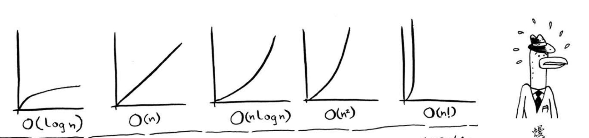
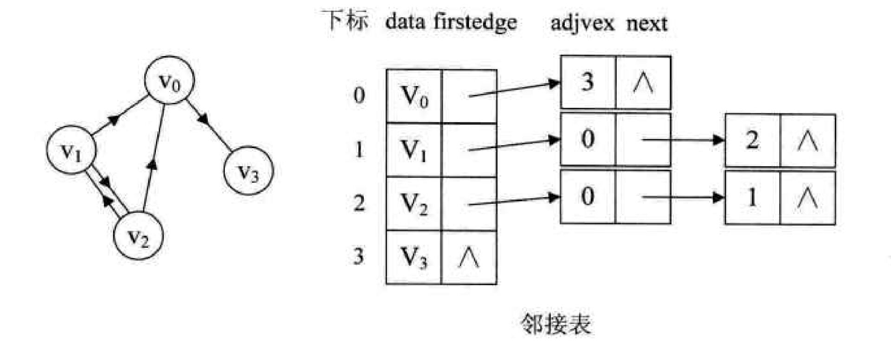
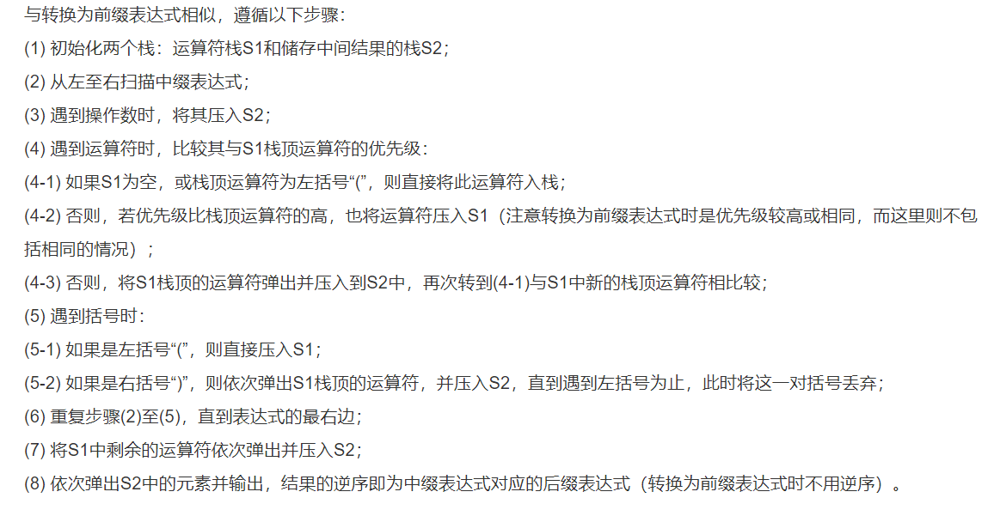
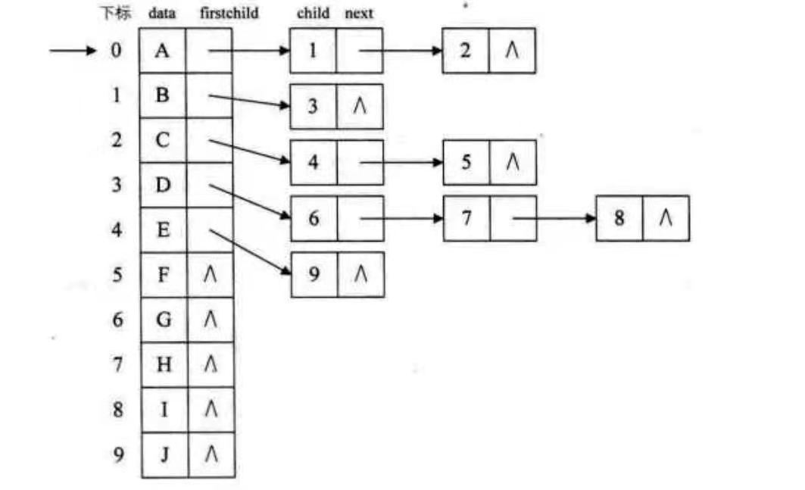
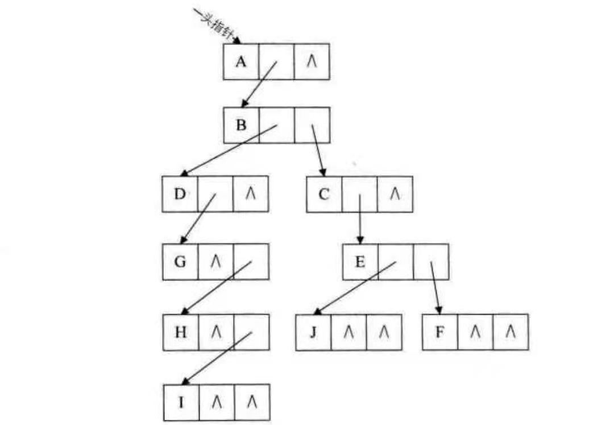
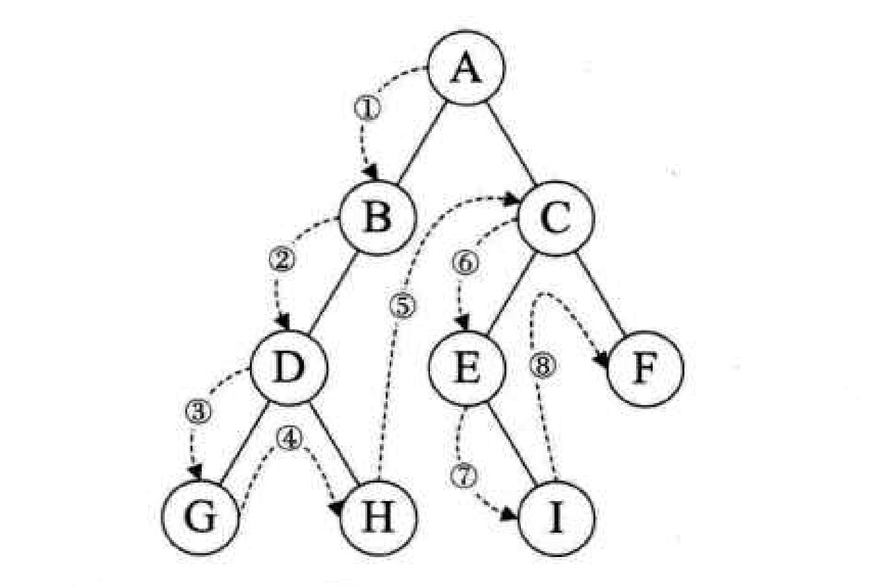
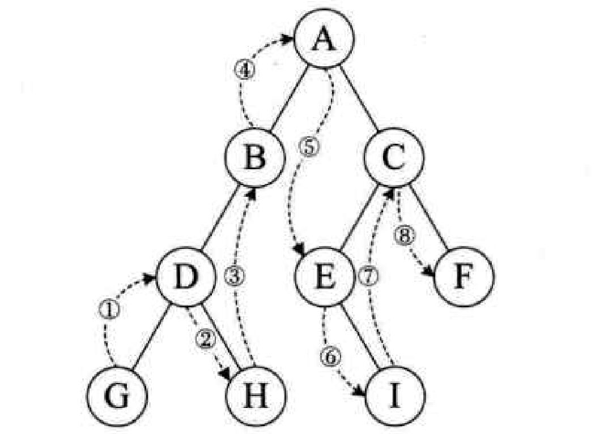
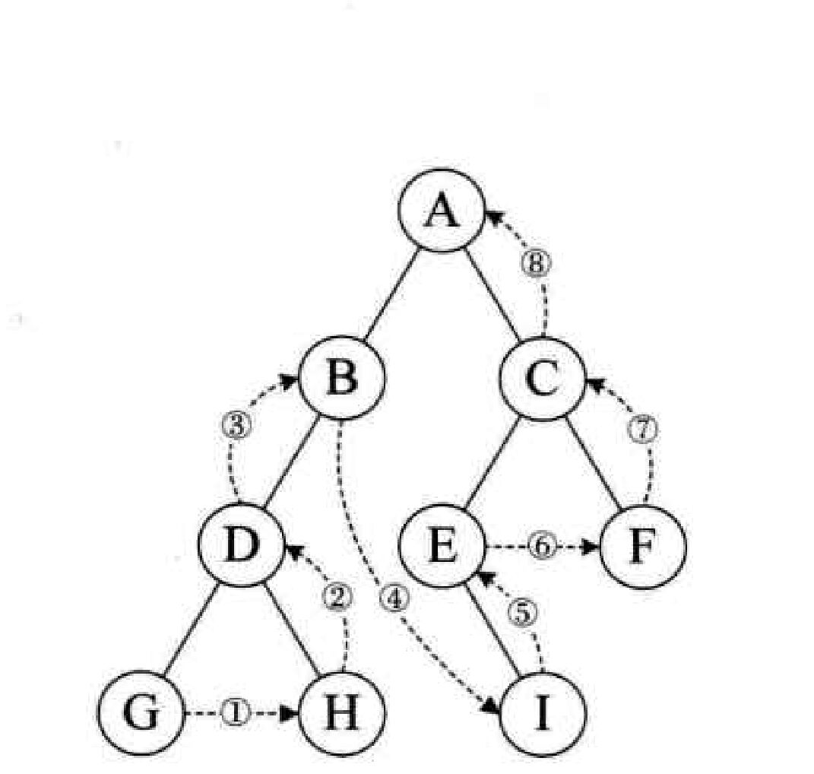
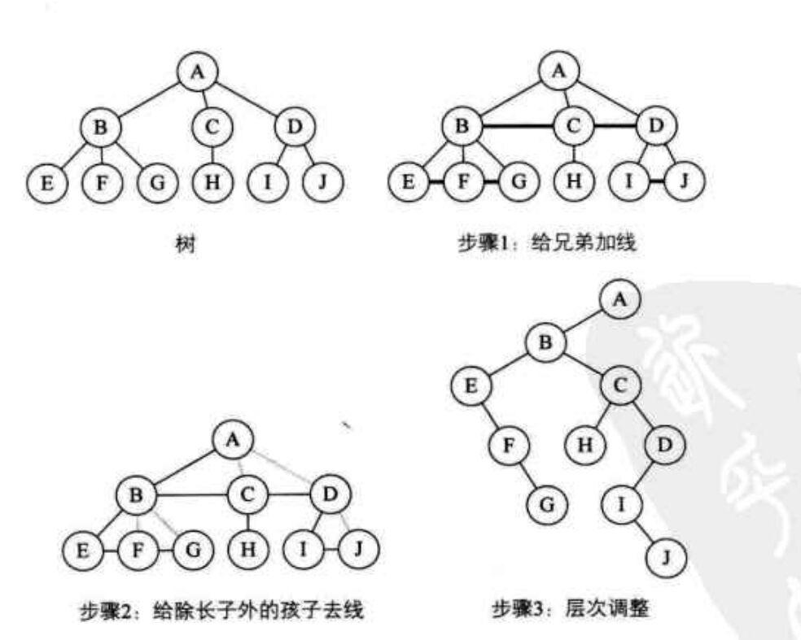
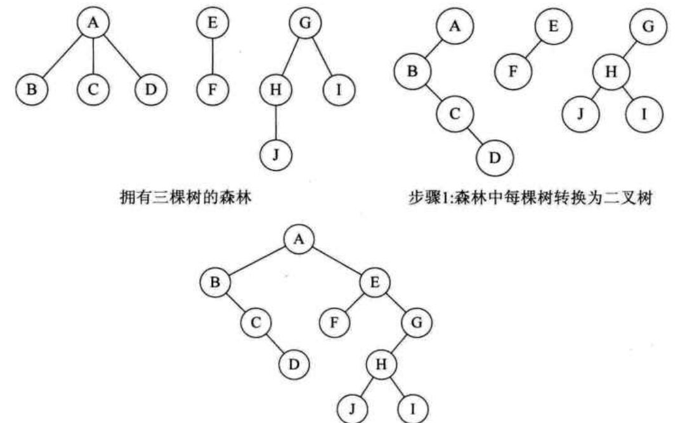

****
[toc]
****
## 《阿哈！算法》
* 快速排序： [quick sort](quicksort/quicksort.py)
* 队列: [queue](queue/queue.py)
* 栈：[stack](stack/stack.py)

    可以用来处理**镜像对称问题**

* 链表：[link](link/link.py), [simulation link](link/simLink.py)
  * 深度搜索：[depth first search](depthfFirstSearch/depthFirstSearch.py)
  ```c++
      void search(location){
          // 期望的结束条件
          if(){
              return;
          }

          // 尝试所有可能性，向后移动
          for(){

              // 移动到下一步
              loctation = location + 1;
              search(location);

              // 从 后面 回退回来，复原状态
              location = location - 1;
          }

          // 隐含的结束条件：**不能向后移动时，回退**
          return ;
      } 
  ```

* 广度搜索：[breadth first search](breadth_first_search/breadthFirstSearch.py)
    ```c++
        void search(location){

            // 尝试**当前点**对应的所有可能性；
            for(){
                // 将移动的一步入对
                queue.push(location + 1);

                // 找到目的时，就结束递归
                if(){
                    return;
                }
            }

            // 将**当前点**出队
            queue.pull();

            // 队列为空。没有找到目标，结束递归
            if(queue.head == queue.tail){
                return;
            }

            // 以队首为**起始点**继续处理
            search(queue.head)
        }
    ```
* 漫水填充：[floodfill](floodFill/floodFill.py)

    基于 *深度搜索*  或者 *广度搜索*

* 图 的遍历：[depth first search](graph_search/depth_first_search.py); [breadth first search](graph_search/breadth_first_search.py)

* 树
    > 1. 与图的区别：不包含回路的的连通无向图
    > 2. 树的特点
    >       1. 任意两个节点有且仅有一条通路
    >       2. n个节点对应(n - 1)条边
    > 3. 二叉树：一个节点最多只有两个子节点
    >       1. 满二叉树：叶节点的深度都是h；除叶节点外，所有节点都有两个子节点；深度为h，节点为$2_h - 1$
    >       2. 完全二叉树：叶节点的深度都是h；叶节点的右边补上几个节点才能形成满二叉树
    >       3. 满二叉树与完全二叉树特点：
    >           1. 父节点的编号为k，子左节点编号为2k，子右节点的编号为2k+1
    >           2. 子节点的编号为x，父节点的编号为$\lfloor x/2 \rfloor$
    >           3. 从上往下最后一个父节点的编号为$\lfloor n/2 \rfloor,n总节点数$

* [堆](tree/heap.py)：数据存储为完全二叉树；根节点为最大值或最小值。
    > 1. 存储数据使用 list 容器，代替数组。方便动态删除和扩充
    > 2. 数组的起始下标应为**1**，使用**0**会导致乘法计算下标出问题
    > 3. 堆排序：一直删除root节点，更新root节点，直到堆为空，就完成排序。

## 《图解算法》
* 二分法查找：只能用于查找有序的数据 

    1. 在有序序列中找到指定值: [dichotomizing search](dichotomizing_search/dichotomizingSearch.py)
        ```c++
            search(int low,int high){
                // 序列中不存在：由于low向左移动，high向右移动。所以找不到的情况就是 low > high
                if(low > high){
                    return "not found";
                }
                // 中间位置: 奇数时，向下取整
                int mid = (low + high) / 2;
                // 小于 中间 的值
                if(target < datas[mid]){
                    high = high - 1;
                }
                // 大于 中间 的值
                if(target > datas[mid]){
                    low = low + 1;
                }
                // 等于 中间 的值
                if(target == datas[mid]){
                    return mid;
                }

                // 下一次查找
                search(low,high);
            }

        ```

    2. 在有序序列中找到给定值的邻近区间: [dichotomizing block](dichotomizing_search/dichotomizingBlock.py)
        ```c++
            void findBlock(int left,int right){
                if ((right - left) == 1)
                {
                    // left 对应的索引就是区间左边，right 对应的索引就是区间的右边
                    return;
                }
                
                mid = (right + left) / 2;

                // 小于等于中间值
                if (current <= datas[mid])
                {
                    right = mid ;
                }

                // 大于中间值
                if (current > datas[mid])
                {
                    left = mid;
                }

                // 进行下一次寻找
                findBlock(left,right);
            }
            
        ```

* 大O表示法：描述的是运算时间的增量，而非运算时间
    
    > 1. 对一些算法的运算速度比较时，大O表示法中的省略项，例如(c * n)中的c，将起到主导作用。
    > 2. 对于递归的表示：O(调用栈的高度 * 一层中的O())

    * 递归的一般形式: (当下该如何做，下一步如何做则重复 -- 《啊哈！算法》)
        ```c++
            T function(T input){
                // 基线条件
                if(){
                    return ;
                }

                // 递归条件
                ...
                function(nextInput);
                ...
                return;
            }
        ```

* 图的储存方式：

  1. [邻近矩阵](graph_search/breadth_first_search.py)：对于边数相对顶点较少时，会造成空间浪费。

  2. [键值对](graph_search/breadthFirstSearchMap.py)

  3. 邻接表：只能表示一个点到另一个点：有向图只能搜索入（出）度。
  结构：所有顶点节点存一个数组；顶点节点指向邻接点节点（数据为顶点的数组下标）；
  

  4. 十字链表：将**有向图**的入度邻接表与出度邻接表整合到一起。
  结构：所有的顶点节点存数组。顶点节点：第一入边与第一出边；边节点：边的首尾点下标、下一条一样首顶点的边、下一条一样尾顶点的边。
  

  1. [邻接多重表](graph_search/adjacencyMultilist.py)：基于对十字链表思想对邻接表进行优化，应用于**无向图**。
  结构：所有顶点节点存数组。顶点节点：第一条边。所有的边节点通过链表存储了两个方向。边节点：边的两点，依附这两个点的下一条边。
  

* [狄克斯特拉算法](Dijkstra/Dijkstra.py)
    > 1. 书中描述错误：~~狄克斯特拉算法不能用于环向图，无向图~~
    > 2. 狄克斯特拉算法不能用于 **负边权重查询**
    > 3. 狄克斯特拉算法用于带权重图的短路径搜索

* [贪婪算法](greedy/greedy.py)
    > 1. 采用当前最优的方案
    > 2. 重复第 1；直到操作结束

* NP完全问题：可以使用贪婪算法进行解决
    > 1. 集合覆盖问题
    > 2. 旅行商问题

* [动态规划](dynamicProgram/backpack.py)
    > 1. 使用的前提条件（x是离散和解耦的）
    >       1. 无后效性: $f(x)$只与$f(x - 1)$有关；与$f(x-2),f(f-3),\dotsm$无关
    >       2. 最优子结构：$f(x)$描述的问题的解，就是当前x的最优解
    > 2. 递推式的获取思维方法（费曼算法）：
    >       1. 将问题写下来：$f(x)$公式的定义
    >       2. 好好思考：考虑各种情况，如果有必要还要修正$f(x)$定义。对于二维的问题可以使用二维网格作图分析。（[最长公共子串问题](dynamicProgram/longestSubstring.py)，[最长公共子序列问题](dynamicProgram/longestSubsequence.py)）
    >       3. 将答案写出来：给出递推公式$f(x) = f(x - 1) + "1"$；然后重复step2进行验证。
    >       4. 重复step3，直到获得精确的$f(x) = f(x - 1) + "1"$。

* [动态规划与分而治之](https://blog.csdn.net/u010002184/article/details/77046277)
    > 1. 动态规划
    >       1. 问题的最优结构的描述: $f(x)$
    >       2. 递推式获取：$f(x) = f(x - 1) + "1", "1"代表向前移动一步$
    >       3. 初始值指定
    >       4. 求解递推式得到：$f(i),i = range(起始，终止)$
    >       5. 根据$f(i)$获取最终结果

    > 2. [分而治之](quicksort/quicksort.py)：（**以能递归处理为前提**）
    >       1. 分解：拆分问题为不同类（不同区间）；分类不重合，且组合后就是原问题。
    >       2. 解决：对每一分类的解决方案
    >       3. 合并问解：对分类问题的解，进行处理。
    > 3. [案列](https://leetcode-cn.com/problems/maximum-subarray/solution/dong-tai-gui-hua-fen-zhi-fa-python-dai-ma-java-dai/)

## 《大话数据结构》

* 链表栈：[link stack](stack/LinkStack.py)

* 四则表达式运算：[四则表达式运算](example/calculator.py)

    1. 中缀表达式转后缀表达式
        
    2. 后缀表达式运算
* 循环队列：[loop queue](queue/loopQueue.py)

* 树的存储方法
    >  **对于同一层的节点，顺序默认为从左到右**

  1. 双亲表示法
&emsp;&emsp;每一个树节点由**父节点的索引下标和数据**两部分组成；然后将所有节点存储在数组中。(还可以添加一个右兄弟索引；第一个孩子索引。)

        ```c++
            struct Node{
                // 父亲节点的下标
                int parent;
                // 第一个孩子
                int firstChild;
                // 右边的兄弟
                int rightBrother;
                // 数据
                data;
            }

            class tree{
                // 定义树
                Node trees[N];
            }
        ```
  2. 孩子表示法
&emsp;&emsp;把一个节点的**子节点索引**全部放一个链表里面。**父节点用数组进行存储**。


        ```c++
            struct childNode{
                //  当前孩子的下标
                int index;
                // 下一个孩子的指针
                childNode * next;
            }
            struct Node{
                // 数据
                data;
                // 父节点
                int parentIndex;
                // 第一个孩子
                childNode * firstChild;
            }
            class tree{
                // 树的定义
                Node trees[N];
            }
        ```

  3. 孩子兄弟表示法（二叉链表同理）
&emsp;&emsp;由于同一层节点默认是从左到右排列，所以对于一个节点来说其右兄弟是唯一确定的；第一个孩子也是唯一确定的。**所有节点就使用链表进行存储。并且树也被改写成了一个二叉树的形式。**


        ```c++
            struct Node{
                // 数据
                data;
                // 第一个孩子节点
                Node * firstChild;
                // 右兄弟的节点
                Node * rightBrother;
                // 父节点
                Node * parent;
            }
            class tree{
                Node rootNode;
            }
        ```

  4. 数组
    完全二叉树

* 二叉树的遍历：**三种遍历方式，就是处理数据的位置不同**
    遍历的总体框架为**深度搜索法**。**以下描述中的Null表示节点遍历过或者该节点为空**
  1. [ 前序遍历 ](tree/preorderTraversal%20.py)

    > 先输出当前节点；然后遍历左子节点；左子节点到底为Null后，遍历右子节点。右子节点都为Null，就回退。

    ```c++
        void traversal(Node T){
            if(T == Null){
                return;
            }
            // 遍历所有可能性
            print(T.data);
            traversal(T.leftChild);
            traversal(T.rightChild);
        }
    ```
  2. [ 中序遍历 ](tree/inOrderTraversal.py)

    > 先遍历左子节点；左子节点到底为Null后，然后输出当前节点；遍历右子节点。右子节点都为Null，就回退。

    ```c++
        void traversal(Node T){
            if(T == Null){
                return;
            }
            // 遍历所有可能性
            traversal(T.leftChild);
            print(T.data);
            traversal(T.rightChild);
        }
    ```

  3. [ 后序遍历 ](tree/postOrderTraversal.py)

    > 先遍历左子节点；左子节点到底为Null后；遍历右子节点，右子节点为Null后；然后输出当前节点。右子节点都为Null，就回退。

    ```c++
        void traversal(Node T){
            if(T == Null){
                return;
            }
            // 遍历所有可能性
            traversal(T.leftChild);
            traversal(T.rightChild);
            print(T.data);
        }
    ```

* 二叉树的反向遍历：由遍历序列到二叉树结构
  1. 首先将**遍历序列扩展**：叶子节点添加左右为“#”的子节点；
  2. 选择一种遍历序列的方案，生成扩展的遍历序列；
  3. 以遍历序列为输入，用序列生成的遍历序列方案进行二叉树生成。

* 线索二叉树：在链式二叉树中，利用叶子节点空余的空间将最终的遍历序列从二叉树转为双链的形式。

* 树，森林与二叉树的相互转换
    1. 树转二叉树
        
        > 左子节点为第一个孩子
        > 右子节点为兄弟

    2. 森林转二叉树
        

        > 将每棵树的根节点，同(1.)中，当兄弟连接

* 最小生成树
    1. 生成树：是原图的一个子图；包含所有节点；n-1条边。
    2. 最小生成树：网图(权值图)权值加和最小的生成树。

* [ prim算法 ](prim/prim.py)
    * 贪婪算法
    * [2分钟搞懂最小生成树prim算法](https://www.bilibili.com/video/BV1Ma4y1W7pJ)
