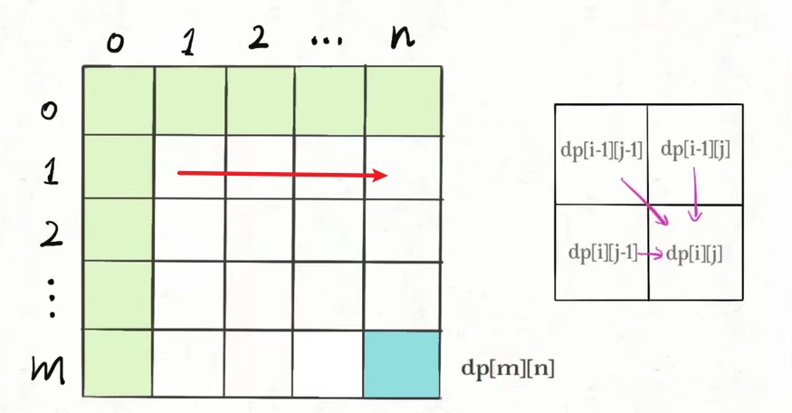

---
# c/c++笔记

---
[toc]
---

# 一、常规

## 1.1 c

头文件后缀名： .h

源文件后缀名： .c

## 1.2 c++

头文件后缀名： .h, .hpp, .hxx

源文件后缀名：.cpp, .cc, .cxx, .C .c++

.hpp: 声明和实现都有

.inl: 内联函数

## 1.3 内联函数

&emsp;&emsp;使用inline修饰的<font color="#4c9df8">具体函数实现，非声明</font>。<font color="#f44336">编译期间</font>对于编译器承认的inline函数，将会直接把代码拷贝到函数调用位置。

- 建议性质的关键字，只有简单的函数会被编译器承认。
- 默认地，类中定义的所有函数，除了**虚函数**之外，会隐式地或自动地当成内联函数; **虚函数也能用inline修饰，建议性质的。**
- 泛型定义


## 1.4 重定义
&emsp;&emsp; **#include会将头文件复制，同一个东西头文件实现一次，源文件实现一次就会触发重定义。** 

## 1.5 main函数

-  `int argc` : 传入参数个数，**默认为1**
-  `const char * argv[]` : 输入的参数列表
    - **一个字符串数组**
    -  `argv[0]` : 被执行程序（.exe文件）所在的绝对路径。


---
# 二、编译

## 2.1 编译器
- gcc与g++进行文件编译时，会互相调用， .c文件除外; 链接时，不会互相调用。

- 流程: 预处理，编译，汇编，链接。
 
## 2.2 定义与声明
- 定义：表示创建变量或分配存储单元
    - 定义必须有，且只能出现一次

- 声明：说明变量的性质，但并不分配存储单元;在 **链接** 时，查找具体定义。
    - 声明可以出现多次
- 变量
    ```c++
    // 声明
    extern int i; 
    // 声明又定义
    int i;
    int i = 1;
    extern int i = 1; // 函数外部才能被初始化
    ```
&emsp;&emsp;<font color="#f44336">源文件中的全局变量 `int a;` 形式，默认修饰符为extern。</font>
- 函数: 带有`{ }`的就是定义，否则就是声明。

## 2.3 模块化设计

1.  模块即是一个.c文件和一个.h文件的结合，**头文件(.h)中是对于该模块接口的声明，一般都用extern进行修饰**；
1.  供给其它模块调用的外部函数及全局变量需在.h中文件中冠以extern关键字声明；
1. 模块内的函数和全局变量需在.c文件开头冠以static关键字声明；
1. <font color="#f44336">永远不要在.h文件中定义全局变量！</font>
1. 头文件中可以定义的实体，<font color="#f44336">得有头文件保护，否则会重定义。</font>
    - 值在编译时就已知的const 变量的定义可以放到头文件中
    - 结构体，类的定义可以放到头文件中
    - inline 函数

---
# 三、关键字

## 3.1 new/delete
&emsp;&emsp;编译器关键字，会调用构造器与析构器。malloc/free为库函数实现。

## 3.2 const

```c++
// 限定内容
const int*p;
int const *p;

// 限定指针
 int*const p;

// 都限定
const int*const p;
```
<font color="#f44336"> `不可变的 := 可变的` ，反过来不行。</font>

### 1. c

- const变量: 可以通过指针修改值，就是一个建议。

### 1. c++

- 类成员函数后: 这个函数不会对这个类对象的数据成员（准确地说是非静态数据成员）作任何改变。 <font color="#f44336">const函数内，只能调用const函数。</font>
- 类成员函数前: 返回值是一个常量，不能修改。
- const变量: 
    - 编译器会将常量优化，放到符号表，<font color="#f44336">取值会从表中直接获取，而不是去内存</font>。通过指针修改值后，值不变。
    - 添加关键字volatile，可以防止编译器优化，从内存取值。通过指针修改值后，值会变。
- const对象: 只能访问const与static修饰。

## 3.3 override

&emsp;&emsp;配合 **virtual** 关键字使用；修饰子类 **override** 函数。

## 3.4 volatile

- 避免优化、强制内存读取的顺序。
- **没有线程同步的语义**

## 3.5 static
- 函数体内： 修饰的局部变量作用范围为该函数体，**在内存只被分配一次，下次调用的时候维持了上次的值**。
- <font color="#f44336">源文件</font>全局：修饰的全局变量或函数，范围限制在声明它的模块内，**不能被extern找到**。
- 类中修饰成员变量: 表示该变量属于整个类所有，对类的所有对象只有一份拷贝。
    - <font color="#f44336">在类里声明，到类外实现</font>
    - **类外全局处实现**，不用static修饰
    - **全对象共享**
- 类中修饰成员函数: 表示该函数属于整个类所有，不接受this指针，只能访问类中的static成员变量。
    - 类的里/外都能实现，类外实现省略static

## 3.6 extern "C"
&emsp;&emsp;会指示编译器这部分代码按C语言的进行编译，而不是C++的;能够正确实现C++代码调用其他C语言代码。

## 3.7 extern
&emsp;&emsp;使用include将另一个文件全部包含进去可以引用另一个文件中的变量，但是这样做的结果就是，被包含的文件中的所有的变量和方法都可以被这个文件使用，这样就变得不安全。如果只是希望一个文件使用另一个文件中的某个变量还是使用extern关键字更好。
- <font color="#f44336">源文件</font>中的全局变量与函数，默认都能被extern找到。

## 3.8 friend
&emsp;&emsp;可以让外部函数或者外部类，访问私有类的私有属性与函数。
- 友元函数
    - 定义在类外的普通函数
    - 需要在类中声明
- 友元类: 友元类的所有成员函数都是另一个类的友元函数，都可以访问另一个类中的隐藏信息（包括私有成员和保护成员）。
    - 不能被继承
    - 两个类的关系是单向的
    - 不可传递

## 3.8 储存类型符
- auto：所有**局部变量**默认的存储类， **对于C， 块语句中也可定义局部变量，形参也是。** 
- register: 存储在寄存器中（只是建议，具体实现看编译器）。
- static：局部修饰变量后改变了生存期;全局变量修饰后改变了作用域
- extern：引入其他C文件中已定义的非static全局变量;可以在函数的内外声明变量或者函数。
- mutable：仅适用于类的对象成员变量，它允许const函数能对成员变量进行修改

## 3.9 cin

### 1. 简介

- 遇到  `\n`  才会将写入内容加载到缓冲区
- `\n` 也算一个字符，会被加载到缓冲区
- 缓冲区为空时，cin 阻塞等待数据;一旦缓冲区中有数据，就触发 cin 去读取数据。

### 2. 用法

1. `cin >>` 
    - 连续从键盘读取想要的数据，<font color="#f44336">以空格、tab 、换行为分隔符</font>。

        ```c++
            char a;
            int b;
            float c;
            string 
            cin>>a>>b>>c;
        ```

   - 当 `cin >>`  从缓冲区中读取数据时，**若缓冲区中第一个字符是空格、tab或换行这些分隔符时，cin>> 会将其<font color="#f44336">忽略并清除</font>，继续读取下一个字符**; 若缓冲区为空，则继续等待。<font color="#f44336">但是如果读取成功，字符后面的 **空白符号** 是残留在缓冲区的，cin>> 不做处理。</font>
   - 不想略过空白字符，那就使用 noskipws 流控制。
   - `cin >>`的返回值为  `cin` ;当输入 `EOF` （windows:ctrl+z， Linux:ctrl+d）时， `cin >>` 会返回0。
  
        ```c++
        int a;
        // 当输入 EOF 时，可以终止循环
        while（cin >> a）{

        }
        ```


2.  `cin.get()` 

    &emsp;&emsp;<font color="#f44336">缓冲区没有东西时，会堵塞等待。</font>

    ```c++
    int get();
    istream& get(char& var);
    istream& get( char* s, streamsize n );
    istream& get( char* s,  streamsize  n, char delim);
    ```
 **读取字符** :

    ```c++

    #include <iostream>
    using namespace std;

    int main() {
        char a;
        char b;
        a=cin.get();
        cin.get(b);
        cout << a << b <<endl;
        return 0;
    }

    ```

    - <font color="#f44336">从输入缓冲区读取单个字符时不忽略分隔符，直接将其读取。</font>

 **读取行** 
    ```c++
    istream& get(char* s, streamsize n)
    istream& get(char* s, size_t n, char delim)
    ```
    -  `s` ，接收字符串用的数组
    -  `n` ，读取个数。<font color="#f44336">实际读取个数为  `n - 1` ，留了一个给  `\0` </font>
    -  `delim` ，指定终止符
    - **换行符(结束符)会被留在缓冲区**，<span style="color:red;font-weight:bold"> 但末尾其余空白符会被读取。 </span>


3. `cin.getline（）`  **读取行** 

    ```c++
    istream& getline(char* s, streamsize count); //默认以换行符结束
    istream& getline(char* s, streamsize count, char delim);
    ```

    - **换行符(结束符)会被清理掉**，<span style="color:red;font-weight:bold"> 但末尾其余空白符会被读取。 </span>
    -  `getline(cin,string,"结束符")` 功能更强。<font color="#f44336">传入的是  `cin`  ，不是  `stdin`  </font>

### 3. cin 清空输入缓冲区

1. 方法一
```c++
istream &ignore(streamsize num=1, int delim=EOF);
```

- **跳过输入流中  `num`  个字符，或遇到终止符  `delim` 结束（包括终止符）。**
-  `ignore()` ** 会阻塞等待，最好别用  `EOF` 做终止符**。
-  `num` : 可以设置一个很大的数
```
#include <limits>
numeric_limits<std::streamsize>::max();
```

1. 方法二

```c++
fflush(stdin);
```

## 3.10  `::` 

- 当局部变量与全局变量重名，可以修饰变量，访问全局变量。<font color="#f44336">仅c++支持</font>

```c++
int x;  // Global x 
 
int main() 
{ 
  int x = 10; // Local x 
  cout << "Value of global x is " << ::x; 
  cout << "\nValue of local x is " << x;  
  return 0; 
} 
```

- 在类之外定义函数

- 访问类的全局变量

```c++
class Test 
{   
public: 
    static int x; 
};

int Test::x = 1;

void main(){
    Test::x;
}

```

- 如果有多个继承，父类变量名重名，子类可以做区分。

- 两个命名空间重命名

- 访问内部类

```c++
#include<iostream> 
using namespace std; 
 
class outside 
{ 
public: 
      int x; 
      class inside 
      { 
      public: 
            int x; 
            static int y;  
            int foo(); 
 
      }; 
}; 
int outside::inside::y = 5;  
 
int main(){ 
    outside A; 
    outside::inside B; 
 
}
```

## 3.10 include

-  `#include<>`   :表示只从从标准库文件目录下搜索，对于标准库文件搜索效率快。

-  `#include""`    :表示首先从用户工作目录下开始搜索，对于自定义文件搜索比较快，然后搜索标准库。


---
# 四、类

## 4.1 指针与引用

<div style="margin: 0 auto;padding:1rem;width: 32rem;">

   |      | 储存         | 初始化     | 二次赋值 | 形式   |
   | ---- | ------------ | ---------- | -------- | ------ |
   | 指针 | 有储存空间   | NULL       | 可以     | 类名 * |
   | 引用 | 无空间，别名 | 已有的对象 | 不行     | 类名 & |

</div>

&emsp;&emsp; <font color="#f44336">c语言没有引用机制，是靠c++扩展实现。</font>

## 4.2 对象与类

<div style="margin: 0 auto;padding:1rem;width: 32rem;">

   |      | 描述                         | 储存                                                              |
   | ---- | ---------------------------- | ----------------------------------------------------------------- |
   | 类   | 模板，包括属性和行为         | 无                                                                |
   | 对象 | 类的实例化，主要是数据的集合 | 主要只储存了属性，储存位置看具体情况 ; 函数放代码段，所有对象通用 |

</div>

## 4.3 智能指针

&emsp;&emsp;通过库函数<memory>，管理对象指针。

-  ~~std::auto_ptr~~ : 废弃
- unique_ptr: 对象只能一个指针持有。
    ```c++
     // 初始化赋值
     std::unique_ptr<int> p1(new int(5));
     // 移交所有权，p1将变无效
     std::unique_ptr<int> p2 = std::move(p1);
     // 滞后赋值
     unique_ptr<string> p3;
     p3 = unique_ptr<string>(new string ("You"));
    ```
- shared_ptr: 多个指针指向相同的对象。内部会有一个指向计数器，当计数器变为0时，系统就会对这个对象进行销毁，线程安全。
    ```c++
    // make_shared生成
    std::shared_ptr<int> p1 = std::make_shared<int>(10);
    // 拷贝赋值
    std::shared_ptr<int> p2;
    p2 = p1;
    ```
- weak_ptr: <font color="#4c9df8">没有重载operator*和->，用于防止shared_ptr循环引用。</font>

## 4.4 野指针
&emsp;&emsp;**野指针不是NULL指针，是未初始化或者未清零的指针，在程序中乱指。**

- 指针变量没有被初始化
- 指针指向的内存被释放了，但是指针没有置NULL 
- 指针越界

## 4.5 指针与数组


|       | 二次修改 | 参与运算 |     sizeof     |
| :---: | :------: | :------: | :------------: |
| 指针  |   可以   |   可以   |   指针的字节   |
| 数组  |   不行   |   可以   | 声明空间的字节 |

## 4.6 字符串

### 1. c风格

- 字符串结尾标志为  `\0` 
-  ` " " ` : 自带 `\0` 
-  `strcpy，strncpy` 不会在末尾加 `\0`，<font color="#f44336">dest还得手动加终止</font>
-  `strcat` : <font color="#4c9df8">会自动加  `\0` </font>

```
#include <string.h>

// 创建
char str[] = "RUNOOB";
char *str =  "fuck you";
char str[7] = {'R', 'U', 'N', 'O', 'O', 'B', '\0'};

// 拷贝字符串
strcpy(char *dest, const char *src); // 将src拷贝到dest，拷贝以 \0 作终止;
char *strncpy(char *dest, const char *src, size_t n); // n指定长度，更安全

// 拼接字符串
char *strcat(char *dest, const char *src); // 往dest上加字符串

// 字符串长度
strlen(str); // \0 终止

// 比较字符串
int strcmp(const char *s1, const char *s2); // 相同返回 0

// 查找
char *strchr(const char *str, int c); //返回第一个字符位置，没有返回NULL
char *strstr(const char *haystack, const char *needle); // 返回第一个字符串位置，没有返回NULL
```

### 2.  c++字符串

-  `string` 是一个对象
-  `string` 的结尾没有结束标志  `\0` 
-  `==` 可以用来判断字符串是否相同

```c++
#include <string>

// 创建
string str; // s1的值为NULL
string str = "c plus plus";
string str(c风格);

// 字符串长度
str.length();

// 转c风格
str.c_str();

// 访问字符
str[i];

// 数字转字符串
string to_string(int value);
string to_string(long value);
string to_string(double value);

// 字符转数字
atoi(const char*);
stoi(const string&);
strtoi(const char *);

// 插入
string& insert (size_t pos, const string& str);

// 删除
string& erase (size_t pos = 0, size_t len = npos);

// 获取子串
string substr (size_t pos = 0, size_t len = npos) const;

// 查找 返回第一个找到的位置，没找到返回一个无穷数
size_t find (const string& str, size_t pos = 0) const;
size_t find (const char* s, size_t pos = 0) const;
find_first_of(const string& str); // 子字符串和字符串共同具有的字符在字符串中首次出现的位置

```


---
# 五、面向对象

## 5.1 重载，重写，重定义 

- 重载 overload: <font color="#f44336">同一个类中</font>、函数名字相同、传参类型与数目不同。
- 覆盖 override: 实现父类virtual修饰函数，函数定义完全一样。<font color="#f44336">覆盖了父类的虚函数。</font>
- 重写 overwrite: 重定义父类函数，会屏蔽父类所有同名函数。

&emsp;&emsp;**函数名相同就会屏蔽父类同名函数**

>**注** :
>&emsp;&emsp; 用户能定义自己的C语言库函数，连接器在连接时自动使用这些新的功能函数。这个过程叫做**重定向C语言库函数**。 

## 5.2 虚函数

- 虚函数实现
   - 带有虚函数的类都会持有一个虚函数表
   - 继承带有虚函数父类的子类，会复制一份父类虚函数表，并根据自身实现情况修改虚函数表
   - 继承多个有虚函数表的子类，会维护所有的父类虚函数表
   - 实例化的对象，会持有一个指向虚函数表的指针
- 虚函数/纯虚函数 <font color="#f44336">子类实现后算overwrite</font>
   - 虚函数: virtual修饰，父类实现
   - 纯虚函数: virtual修饰，父类不实现，后面可有 = 0，<font color="#f44336">纯虚函数的类为抽象类。</font>

&emsp;&emsp;<font color="#f44336">虚函数是动绑定，运行时确定。</font>
  
## 5.3 继承

&emsp;&emsp;<font color="#f44336">当私有继承和保护继承时，父类指针(引用)无法指向子类。默认为私有继承。</font> **防止多重继承，出现属性多次定义，继承时，还要使用 virtual 进行修饰。**
&emsp;&emsp; **在子类中均存在但不可访问** 
- 公有继承基类的private

- 保护继承中基类的private

- 私有继承中基类的private和protected和public， 


## 5.4 重载/多态

- 多态: <font color="#f44336">父类与子类之间</font>，父类可以接收不同子类，产生不同的行为。
  - **virtual 修饰函数的 override：父类调用子类的实现。** <font color="#ff0000"> 该方式才实现多态。 </font>
  - **无 virtual 修饰函数的 overwrite：父类调用父类的实现。**
- 重载: <font color="#f44336">一个类里</font>，同一名字的不同方法。

## 5.5 构造/析构函数

- 构造函数 
    - 不声明为虚函数
    - 先父类，后子类
    - 默认构造函数，即无参构造函数。
- 析构函数
    - **要声明为虚函数; 通过多态析构子对象时，才能正确调用子类析构**
    - 先子类，再父类

## 5.6 静绑定与动绑定

- 静态类型：对象在声明时的类型，在编译期既已确定；
- 动态类型：通常是指针或引用所指对象的类型，是在运行期决定的；
    ```c++
    /**
    * A 类是声明，是obj的静态类型
    * B 类是具体实例，是obj的动态类型
    */
    A* obj = new B();
    ```
- 静态绑定：绑定的是静态类型，所对应的函数或属性依赖于对象的静态类型，发生在编译期；
- 动态绑定：绑定的是动态类型，所对应的函数或属性依赖于对象的动态类型，发生在运行期；<font color="#f44336">可以进行二次修改。</font>

    ```c++
    A* obj = NULL;
    obj->fcn();
    ```
&emsp;&emsp;<font color="#f44336">上面的函数也是能正常运行的，因为obj在编译时静绑定。</font>

## 5.7 构造函数

- **普通构造函数**不能以本类的对象作为**唯一参数**
- **默认拷贝构造函数**: 对源对象的逐个字节的复制，成员变量和源对象相同，由编译器自动生成
- **拷贝构造函数**：构造函数的一种，只有一个本类的引用的参数，用不用const修饰都一样。
- **调用拷贝构造函数，不调用普通构造**: 
    - 一个对象去初始化同类的另一个对象，<font color="#f44336">赋值不会触发。</font>
        ```c++
        A a;
        // 初始化
        A b = a;
        A c(a);
        // 赋值
        b = a;
        ```
    - 作为形参的对象，是用复制构造函数初始化的。<font color="#f44336">直接传递对象，传过去的值，取决于构造函数的实现。</font>
    - return 语句所返回的对象

---
# 六、内存

## 6.1 c++

- 栈
- 堆: new
- 自由存储区: malloc分配的内存
- 全局/静态存储区：存放全局变量和静态变量
- 常量区：存放常量

## 6.3 内存泄露/栈溢出

- 内存泄露: 堆使用了，没清空，内存大量浪费
- 栈溢出: 使劲增加局部变量，栈用完了


## 6.4 字符存储编码
 
- ASCII 码: 使用指定的7 位或8 位二进制数组合来表示128 或256 种可能的字符。

- BCD码: （Binary-Coded Decimal‎）亦称二进码十进数或二-十进制代码。用4位二进制数来表示1个十进制数中的0~9这10个数码。

- 内码: 指汉字系统中使用的二进制字符编码。 

## 6.5 对象的内存分布


- 父类的 `vptr` 放第一个，接着是父类的非static属性，最后放子类的属性
- 属性存放顺序与定义顺序一样
- 对象变量指向第一个内存位置的地址
- <font color="#f44336">防止多重继承，出现属性多次定义，继承时，使用 virtual 进行修饰。</font>

## 6.6 代码地址

- 运行时地址起始位置：它芯片公司指定的一开始运行代码的位置。

- 运行地址: 就在从运行时地址起始位置（包括起始位置）往后排都是运行时地址。(程序代码被搬过来执行)

- 链接地址起始位置：链接脚本设定，这个位置在程序链接之后，就会确定下来。(用来计算偏移量的伪地址，之后重定向)

- 链接地址: 就是从链接地址起始位置（包括起始位置）往后排都是链接地址。(类似汇编地址)

- 加载地址: 从flash的那个地方开始读取程序，加载内存中去。

- 存储地址: 程序存储在哪儿的。


---
# 七、进程线程

 ## 7.1 进程

### 1. 创建

&emsp;&emsp;创建的是原进程的子进程，子进程会复制父进程的PCB(进程控制块)，二者之间代码共享，数据独有，拥有各自的进程虚拟地址空间。

```c++
#include <unistd.h>
pid_t fork(void);
```
- 写时拷贝技术 
&emsp;子进程创建后，与父进程映射访问同一块物理内存，当父或子进程对值进行修改时，会给子进程重新在物理内存中开辟一块空间，并将数据拷贝过去。
- pid_t: 创建子进程失败，会返回-1; 创建子进程成功，父进程返回pid号，子进程返回0。

### 2. 终止

- 正常终止
    - main函数返回
    - 调用exit函数:  `status` 可以通过 `wait（int *status）` 接收; **会刷新缓冲** 
    ```c++
    #include <stdlib.h>
    void exit(int status);
    ```
    - 调用_exit函数:  `status` 可以通过 `wait（int *status）` 接收;  **不会刷新缓冲** 
    ```c++
    #include <unistd.h>
    void _exit(int status);
    ```

- 异常退出
    -  Ctrl+C
    - 被信号终止

### 3. 等待
&emsp;&emsp;如果**子进程先于父进程退出**，而父进程并没有关心子进程的退出状况，从而无法回收子进程的资源，就会导致**子进程变成僵尸进程**。<font color="#4c9df8">**进程等待的作用就是父进程对子进程收尸！父进程通过进程等待的方式，回收子进程的资源，获取子进程的退出状态。**</font>

- wait 
    ```c++
    #include <sys/types.h>
    #include <sys/wait.h>
    pid_t wait(int *status);
    ```
    - **利用阻塞，等待子进程退出。**
    - **一次只能等待一个**
    - pid: 成功，子进程的pid; 失败(**没有子进程**)，返回-1; 
    - status: 进程退出信息

- waitpid
    ```c++
    //头文件同wait的头文件
    pid_t waitpid(pid_t pid, int *status, int options);
    ```
    - 返回值:          
         1. 等待成功，返回pid
         1. **options为WNOHANG时，没有等待到子进程，马上退出不阻塞，返回0**
         1. 出错则返回-1
    - pid:         
         1. -1: 随便等待一个进程
         1. pid号: 明确指定一个进程等待
    - options:
        1. 0: **阻塞等待**，等待到一个就退出
        1. WNOHANG: 没有等待到子进程，马上退出不阻塞，返回0

### 4. 进程退出信息status

-  **低16位存放信息，高16位不用** 
-  **高8位** : 退出码， `exit` 的传入值或者 `return` 值
    ```c++
    (status >> 8) & 0xFF;
    ```
-  **低8位** : 异常退出信息
    - 第7位: core dump标志位;0，不产生;1，产生
    ```c++
    (status >> 7) & 0x1;
    ```

    - 低7位: 子进程是否异常退出;0，正常;非0，终止的信号

    ```c++
    status & 0x7F;
    ```

## 7.2 进程状态
- R (running): PCB被放入CPU的可执行队列中;CPU上执行的RUNNING状态、而将可执行但是尚未被调度执行的READY状态
- S (sleeping): 睡眠状态，PCB被放入等待队列，可以通过中断唤醒。
- D (disk sleep):睡眠状态，不能中断被唤醒。**内核的某些处理流程是不能被打断的。用来保护进程。**
- T (stopped): SIGSTOP信号让进程进入暂停，SIGCONT信号能将进程恢复。
- t (tracing stop): 在被追踪时，进程暂停;典型应用就是 **gdb断点** 。调试进程退出，被调试的进程才能恢复TASK_RUNNING状态。
- Z (zombie): 进程退出后，PCB没有被回收。<font color="#f44336">父进程没有对子进程收尸，就只能等父进程退出后，让爷进程来统一收尸。</font>
- X (dead): 马上会被彻底销毁

## 7.3 进程状态变化

- <font color="#4c9df8"> **R 变 非R状态。** </font>
- <font color="#4c9df8"> **非R 变 R状态** </font>

---
# 八、STL
## 8.1 简介
&emsp;&emsp;STL（Standard Template Library），即标准模板库，是一个具有工业强度的，高效的C++程序库。该库包含了诸多在计算机科学领域里所常用的**基本数据结构**和**基本算法**。
- 数据结构和算法的分离
- 不是面向对象的
- 广泛应用泛型

&emsp;&emsp;主要构成有六大组件: 

- 容器（Container）
- 迭代器（Iterator）
- 算法（Algorithm）
- 仿函数（Functor）
- 适配器（Adaptor）
- 分配器（allocator）

## 8.2 容器（Container）

- 序列式容器（Sequence containers）
    - Vector: 动态数组
    - Deque: 双端队列，是一种具有**队列和栈**的性质的数据结构。元素可以从两端弹出，**其限定插入和删除操作在表的两端进行**。
    - List: 双向链表
- 关联式容器（Associated containers)
    -  Set/Multiset: Set内的相同数值的元素只能出现一次; Multisets内可包含多个数值相同的元素。
    - Map/Multimap: map只允许key唯一；multimap中key可以重复使用；

&emsp;&emsp;  `set map multi set multimap` 通过红黑实现，无序 `unoder_map unorder_set` 通过哈希表实现。
 
## 8.3 分配器
&emsp;&emsp;<font color="#f44336">容器类自动申请和释放内存，无需new和delete操作。</font>

## 8.4 迭代器
- 遍历数据用的。
- <font color="#f44336">支持运算符:  `*;+＋;＝＝;！＝;＝` </font>。
- <font color="#f44336"> 指针操作 </font>

```c++
    Container c;
    Container::iterator it;
    for(it=c.begin();it!=c.end();it++){
        // vector 获取值
        *it;
        // map 获取键值对
        it->first;
        it->second;
    }
```


## 8.5 算法

### 1. 头文件
&emsp;&emsp;算法部分主要由头文件<algorithm>，<numeric>和<functional>组成。

- <algorithm>: 由一大堆模版函数组成的，可以认为每个函数在很大程度上都是独立的，其中常用到的功能范围涉及到比较、交换、查找、遍历操作、复制、修改、移除、反转、排序、合并等等。
- <numeric>: 只包括几个在序列上面进行简单数学运算的模板函数，包括加法和乘法在序列上的一些操作。
- <functional>: 中则定义了一些模板类，用以声明函数对象。

### 2. 常用算法

&emsp;&emsp; [STL常用算法](https://blog.csdn.net/b_ingram/article/details/118874862)


## 8.6 仿函数

&emsp;&emsp; **钩子函数，可以当参数传递，让具体算法进行调用。** 系统定义好的仿函数: \<functional\>

- 函数指针实现

- 仿函数实现: 
    1. 定义一个**简单的类**
    2. 实现 `operator()` 操作符，**本质上就定义了一个符号函数**。

```c++
    #include <stdio.h>
    #include <algorithm>
    #include <vector>

    class Compare{
        public:
        bool operator()(int a,int b){
            return a > b;
        } 
    };

    int main(int argn,const char* args[]){
        vector<int> vec(5,1);
        vec[0] = 2;
        vec[1] = 1;
        vec[2] = 9;
        vec[3] = 3;
        vec[4] = 1;

        // 排序算法
        sort(vec.begin(),vec.end(),Compare());

        // 实际的函数调用
        bool flag = Compare()(10,12); 
    }
```

> **注意：**
> &emsp;&emsp; **`Compare()`是定义了一个临时对象**，作为参数传递给了 `sort()`；**若`sort()`没有采用引用传递，则对象将是值传递。** 


## 8.7 容器适配器

&emsp;&emsp;对基础容器进行功能扩展，标准库提供了三种顺序容器适配器: 

- queue(FIFO队列)
- stack(栈)
- priority_queue(优先级队列)

|      容器      |  头文件   | 默认容器 |      可选容器       |               说明               |
| :------------: | :-------: | :------: | :-----------------: | :------------------------------: |
|     queue      | \<queue\> |  deque   |     list、deque     | 基础容器必须提供push_front()运算 |
| priority_queue | \<queue\> |  vector  |    vector、deque    |   基础容器必须提供随机访问功能   |
|     stack      | \<stack\> |  deque   | vector、list、deque |                                  |

## 8.8 栈 stack

- <font color="#f44336"> **没有迭代器功能。** </font>

```c++
#include <stack>
#include <vector>
stack<int> s;
stack< int, vector<int> > stk;  //覆盖基础容器类型，使用vector实现stk
s.empty();  //判断stack是否为空，为空返回true，否则返回false
s.size();   //返回stack中元素的个数

s.pop();    //删除栈顶元素，但不返回其值
s.top();    //返回栈顶元素的值，但不删除此元素

s.push(item);   //在栈顶压入新元素item
```
## 8.9 队列 queue

- <font color="#f44336"> **没有迭代器功能。** </font>
```c++
queue<int> q; //priority_queue<int> q;
q.empty();  //判断队列是否为空
q.size();   //返回队列长度

// 出队和入队
q.push(item);   //对于queue，在队尾压入一个新元素
q.pop();  //删除 queue 中的第一个元素

// 队列访问
q.front();  //返回队首元素的值，但不删除该元素
q.back();   //返回队尾元素的值，但不删除该元素
```

## 8.10 vector

```c++
#include <vector>

// 创建
vector<T> vec;
vector<T> vec(int nSize); // 指定容器初始大小
vector(int nSize,const T& initValue):// 指定容器初始值

// 增加
vec.push_back(const T& item); // 在屁股添加
iterator vec.insert(iterator it,const T& item); // 迭代器指定位置插入元素

// 删除
vec.pop_back(); // 删除屁股
iterator erase(iterator it); // 删除迭代器指定位置元素
vec.clear(); // 删除全部

// 查找
vec[i];
vec.at(i); // 会检查是否越界，提高稳定性

// 容器内储存元素个数
vec.size();

// 容器是否有东西
vec.empty();

// 迭代器位置
vector<int>::iterator it = vec.begin(); // 起始位置
vector<int>::iterator it = vec.end(); // 结束位置
int a = *it; //获取值
*it += 1; 

// 定义二维数组
 vector< vector<int> > obj(row); // row定义行数
```

**排序：**

 - `>` : 从大到小排序
 - `<` : 从小到大排序，默认方式
   
    ```C++
    class Compare{
    public:
        // 对象最好用引用进行传递 
        bool operator()(T const & a,T const & b){
            return a > b;
        } 
    };

    // 调用函数
    sort(vec.begin(),vec.end(),Compare());
    ```

## 8.11 map/multimap

- <font color="#f44336">map支持[ ]运算符，multimap不支持[ ]运算符。在用法上没什么区别。</font>
- `key` **不允许修改**

```c++
//头文件
#include<map>
 
// 创建
map<int, string> map;

// 使用{}赋值是从c++11开始的，因此编译器版本过低时会报错，如visual studio 2012
map<int, string> map = {
                { 2015, "Jim" },
                { 2016, "Tom" },
                { 2017, "Bob" } };

map<int, string,Compare> map; // 指定排序规则

// 迭代器
map<int,string>::iterator it = map.begin(); 
map<int,string>::iterator it = map.end();
it->first; // key
it->second; // 值

// 添加key value 
pair<iterator,bool> state;// 能判断是否插入成功;插入key存在时，返回false
state = map.insert(pair<int, string>(1, "student_one")); 
state = map.insert(map<int, string>::value_type (1, "student_one")); 

map[key] = value; // key存在就覆盖，key没有就创建

// 查找
// 关键字查询，找到则返回指向该关键字的迭代器，否则返回指向end的迭代器
// 根据map的类型，返回的迭代器为 iterator 或者 const_iterator
iterator find (const key_type& k);
const_iterator find (const key_type& k) const;

// 删除
// 删除迭代器指向位置的键值对，并返回一个指向下一元素的迭代器
iterator erase( iterator pos );

 // 根据Key来进行删除， 返回删除的元素数量，在map里结果非0即1
size_t erase( const key_type& key );

// 删除一定范围内的元素，并返回一个指向下一元素的迭代器
iterator erase( const_iterator first, const_iterator last );
 
// 清空map，清空后的size为0
void clear();

// 查询map是否为空
bool empty();
 
// 查询map中键值对的数量
size_t size();

// 查询关键字为key的元素的个数，在map里结果非0即1 ，可用于检测key是否包含
size_t count( const Key& key ) const; 

```

**排序：**

 - `>` : 从大到小排序
 - `<` : 从小到大排序，默认方式
 - `map<string,int,Compaer>`
 - **`map` 对 `key` 进行排序。**
 - `map` <span style="color:red;font-weight:bold"> 不允许对 `key` 进行修改，所以 `operator()`引用与函数必须为 `const`  </span>
   
```C++
class Compare{
public:
    bool operator()(const string & a,const string & b) const {
        return a.c_str()[0] < b.c_str()[0];
    } 
};
map<string,int,Compare> names;
```

## 8.12 set/multiset

- **搜索、移除和插入计算速度 `O(log(n))`**。 
- set 通常以红黑树实现。
- **set不允许两个元素有相同值**。
- <font color="#f44336">不能通过set的迭代器去修改set元素，原因是修改元素会破坏set组织。</font> : ~~*it += 1~~

```c++
#include <set>

// 创建
set<string> names;
set<string,Compare> names; // 指定排序规则 

// 添加
pair<set<int>::iterator, bool> ret = names.insert(name);

// 删除
names.erease(name);
names.clear();

// 查找，找不到返回 end()
set<string>::iterator it = names.find(name);

// 迭代器
set<string>::iterator it = names.begin();
set<string>::iterator it = names.end();
*it;

// 计数
names.count(name);

names.size();
names.empty();
```

**排序：**

 - `>` : 从大到小排序
 - `<` : 从小到大排序，默认方式
 - `set` <span style="color:red;font-weight:bold"> 不允许对 `key` 进行修改，所以 `operator()`引用必须为 `const`  </span>
   
```C++
class Compare{
public:
    bool operator()(const string & a,const string & b) const {
        return a.c_str()[0] < b.c_str()[0];
    } 
};
set<string,Compare> names;
```

## 8.13 deque

```c++
    #include <deque>

    // 创建
    deque<string> que;
    
    // 首尾操作 
    que.push_back(item);
    que.pop_back();
    que.push_front();
    que.pop_back();
    que.front();
    que.back();

    // 删除
    que.erase(it);
    que.clear();

    // 查找 没有查找 用 #include<algorithm> 库中的 find

```


---
# 九、工具

## 9.1 math

```
#include<math.h>

// 绝对值
int abs(int);
double fabs(double);

// 四舍五入
double round(double);

// 取整
double ceil(double num); // 向上取整
double floor(double num);// 向下取整

// 余数
double fmod(double num，double base);
%; 只能用于int;

```
## 9.2 regex

-  `\b` : 字符边界
-  `.` : 除 `\n` 以外所有字符
-  `\w` : 等价于 `[(0-9)(a-z)(A-Z)(_)]` ，数字，字母，下划线
-  `\W` : 上面取反 `[^(0-9)(a-z)(A-Z)(_)]`
-  `\d` : 数字
-  `\D` : 上面取反
-  `\s` : 空白符(空格，制表符，换行)
-  `\S` : 上面取反
-  `regex_search` : <font color="#f44336">只返回第一次匹配到的子串</font>
- <font color="#4c9df8">上面的匹配字符，编程用时还要再加一个 `\` </font>

```c++
#include <regex>

// 定义表达式
regex reg("[a-z0-9]+");

// 是否匹配
bool regex_match(string,regex);//全匹配
bool regex_search(string,regex);//子串匹配，只匹配第一次找到的

// 捕获
bool reg_search(string，smatch，regex);
smatch.size(); //匹配到的个数: 表达式匹配 + 捕获匹配
smatch.str(0); // 整个正则匹配到的部分
smatch.str(i); // 0之后的，都是捕获部分
smatch.prefix().str(); // 未匹配的前部分
smatch.prefix().str();// 未匹配的后部分
```

## 9.2 动态规划

 **动态规划问题的一般形式就是求最值**。

- **重叠子问题**: 最终点问题是由**某一单步小问题**的重复，这些 **小问题的求解可能会重复计算**。
- **最优子结构**: 当前步骤的最优只与"上一步"有关。根据这个特点可以**状态压缩**
- **状态转移方程**: 递推式，解决问题的核心。

### 1. 解题框架

1. 明确 base case: 初始条件
1. 明确「状态」: **推进子问题向大问题演变的变量。**
1. 明确「选择」: 也就是导致「状态」产生变化的行为。**「状态」能取哪些值**
1. 定义 dp 数组/函数:  dp值 = f（当前状态）
    - dp函数: 参数就是上面说到的「状态」。函数的返回值就是题目要求我们计算的量。
    - **dp 数组**：当状态为「状态」，问题结果为dp[状态]

```c++

# 初始化
dp[] = init

# 边界条件
dp[0][0][...] = base

# 进行状态转移
for 状态1 in 状态1的所有取值：
    for 状态2 in 状态2的所有取值：
        for ...
            dp[状态1][状态2][...] = 求最值(选择1，选择2...)
```
### 2. 流程方向

- **自顶向下: 从目标开始，把大问题拆解小问题，直到到初始条件。**
    - 暴力递归: 把大问题拆成小的，递归下去
    - **备忘录递归**: 算过的值记录下来，不在重复算
-  **自底向上: 从初始开始，根据递推式，一步一步迭代，直到目标结束。** 
    - **dp数组**: 从初始状态，根据递推关系，算到目标状态，**循环数组，不用递归。**

### 3. 重复子问题的确定

```c++
    dp[i][j] = min{
        dp[i-1][j] + 1,
        dp[i][i-1] + 1,
        dp[i-1][j-1] + 1
    }
```
&emsp;&emsp;**当从`dp[i-1][j-1]`过度到`dp[i][j]`的求解有多种路径时，就存在解重叠的情况。采用备忘录和dp数组解决。**

### 4. 状态遍历顺序

<center>


</center>

> 1. **确定二维表`dp[][]`初始值**
> 1. **确定递推式`dp[i][j]`的依赖情况（上图左边）**
> 1. **根据依赖关系填充二维表，满足横向填充或者纵向填充**

```c++
    // i = 0, j = 0 的情况是边界条件，已经初始化好了。 
    for (int i = 1; i <= m; i++){
        for (int j = 1; j <= n;j++){
            dp[i][j] = f(dp[i-1][j-1],dp[i][j-1],dp[i-1][j]);
        }
    }
```