<h1>数字信号处理</h1>

*****
[toc]
*****

****
# 第一章 时域离散信号和时域离散系统

## 一、基本概念

### 1.1 时域离散信号表示

&emsp;&emsp; **驱动的变量为次数n，而非时间。**

1. **集合表示**
	$$
	x(n) = \{\underline{1},2,4,6,5,\dotsm\} \tag{1.1}
	$$

	> * n=0的样本：添加下划线
	> * 样本按照顺序排列

1. **公式**	

	$$
	x(n) = sin(\omega n), \  n为样本数
	$$

1. **图像**

### 1.2 常用信号

1. **单位脉冲序列 $\delta(n)$**
	$$
	\delta(n) = \{\dotsm,0,\underline{1},0,\dotsm\} \tag{1.2}
	$$

	

	
	
	

	 所有的数字信号，都能通过单位脉冲的缩放，偏移，叠加得到。 

1. **单位阶跃序列 $u(n)$**
	$$
	u(n) = \{\dotsm,0,\underline{1},1,1,\dotsm\} \tag{1.3}
	$$
	

	
	
	

1. **单位矩形序列 $R_N(n)$**
	$$
	R_N(n) = \{\dotsm,0,\underline{1},1,1,\dotsm,0,0\} \tag{1.4}
	$$
	

	
	
	

1. **实指数序列 $a^n u(n)$**

	

	
	
	

	 如图，左边全为0，右边有值的序列又称之为：单边序列。 

1. **复指数序列 $e^{( \sigma + j \omega_0 )n}$**

	$$
	e^{( \sigma + j \omega_0 )n} = e^{\delta}(cos(\omega_0 n) + j sin(\omega_0 n)) \tag{1.5}
	$$

	

	
	
	

1. **正弦 $sin(\omega_0 n)$**

	

	
	
	

	 正弦的离散采样值，不一定是周期循环的。 

1. **周期序列**

	$$
	x(n) = x(n + N) ; N 是整数。\tag{1.6}
	$$

### 1.3 正弦信号求解周期

&emsp;&emsp;**当多个正弦叠加时，周期为所有正弦信号的公倍数。**

### 1.4 信号的运算 

1. **加减乘除**
	**n对齐后，直接各个对应采样值进行加减乘除**

1. **位移，翻转**
	> 位移：x(n-N)，**左加右减**
	> 翻转：x(-n)

1. **尺度变换**
	**$x(an)$ :序列x(n)每间隔a个点取一个点，构成一个新的序列。**

	

	
	
	

## 二、时域离散系统概念

### 2.1 时域离散系统的运算

1. **加减，乘除，倍增**

	

	
	

1. **函数运算**

	

	
	
	

### 2.2 线性系统

* **定义：系统的输入输出之间满足线性叠加原理。**
* **判断原则：**  是用系统进行判定，而不是用单位脉冲响应h(n)进行判定 

$$
\begin{aligned}
	设：
	y_1(n) &= T [a_1 x_1(n)] \\
	y_2(n) &= T [a_2 x_2(n)] \\
	则：
	y_1(n) + y_2(n) &= T[[a_1 x_1(n) + a_2 x_2(n)]
\end{aligned} \tag{2.1}
$$

### 2.3 时不变系统

* **定义：系统对于输入信号的运算关系在整个过程中不随时间变化。**
* **判断原则：** 是用系统进行判定，而不是用单位脉冲响应h(n)进行判定 

$$
\begin{aligned}
	设：
	y(n) &= T [a x(n)] \\
	则：
	y(n - n_0) &= T [a x(n - n_0)]
\end{aligned} \tag{2.2}
$$

### 2.4 线性时不变系统

&emsp;&emsp;**同时满足上述的2.2和2.3的系统。**

### 2.5 单位脉冲响应

&emsp;&emsp; **系统输入$\delta(n)$时，系统输出就是单位脉冲响应。**
$$
h(n) = T [\delta(n)] \tag{2.3}
$$

### 2.6 卷积和

&emsp;&emsp;对于 **线性时不变系统** 系统的输出可以通过 **单位脉冲响应和系统输入卷积计算得到。**

$$
y(n) = x(n) * h(n) = \sum_k x(k) h(n - k) \tag{2.4}
$$

> * 交换律：a * b = b * a
> * 结合律：(a * b) * c = a * (b * c)
> * 分配律：a * (b + c) = a*b + a * c

### 2.7 因果性与稳定性 

1. **因果性**

	**定义：** 系统的输出不发生在输入之前。**超前系统没有因果性。**  通过系统进行判定 
	$$
	\begin{aligned}
		y(n) &= ax(n) + b \\
		y(n) &= ax(n - 1) + b ; 滞后\\
		y(n) &= ax(n + 1) + b ; 超前 \\
	\end{aligned} \tag{2.5}
	$$
	**线性时不变系统的判定：** 充要条件为，当 $n < 0 $ 时，$h(n) = 0$；即 **系统的初始储能为0。**  通过单位脉冲响应判定h(n) 

1. **稳定性**
	**定义：** 对有界限的输入，系统产生的输出也是有界的。  通过系统进行判定 
	**线性时不变系统的判定：** 系统的单位脉冲响应 **绝对可和**；$\sum_{n=-\infin}^{\infin} |h(n)| < \infin$。 通过单位脉冲响应判定h(n) 

## 三、时域离散系统数学模型

### 3.1 常系数差分方程

1. **D延时**
	

	
	
	

	$$
	\begin{aligned}
		y(n) &= {\underline{1},2,3,\dotsm}\\
		y(n) &= {\underline{0},1,2,3,\dotsm}\\ 
	\end{aligned} \tag{3.1}
	$$

1. **常系数差分方程**

	

	
	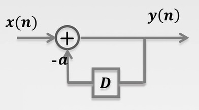
	
	

	
	$$
	\begin{aligned}	
		y(n) + ay(n-1) &= x(n)；一阶常系数差分方程 \\
		y(n) + ay(n-1) + by(n-2) &= x(n)；二阶常系数差分方程 \\
		\dotsm
	\end{aligned}\tag{3.2}
	$$

	&emsp;&emsp;**定义：** 有几个D延时，就是几阶。

### 3.2 解差分方程

**定义：求解差分方程，就是计算y(n)值。** 

> * 经典法：直接算y(n)的公式
> * 递推法: 根据 **初始条件** 和 **递推式** 进行递推求解y(n)
> * z变换法

## 四、信号的采集

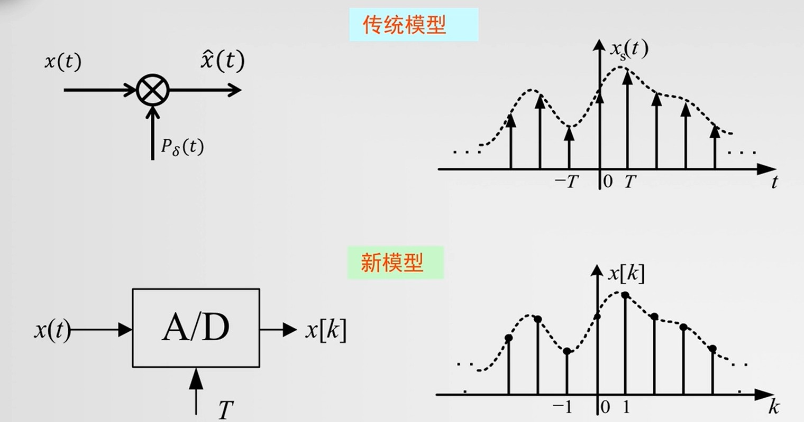

* 传统模型：只完成了采样
* A/D转换器：直接完成三个步骤，输出数字信号

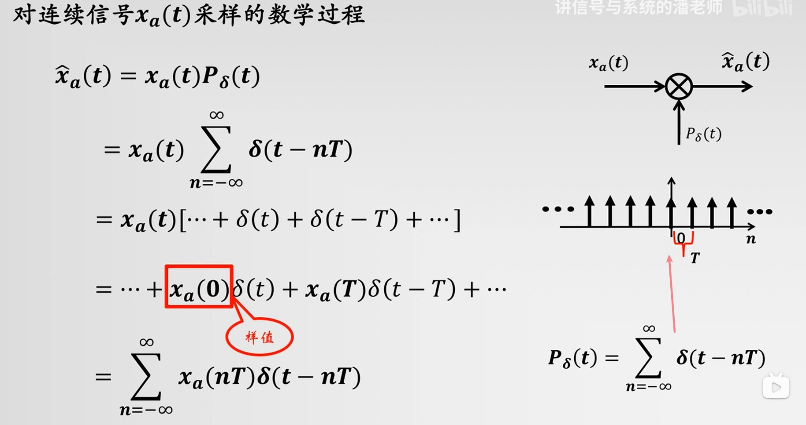
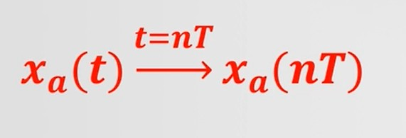

## 五、信号的频谱

源信号频谱：

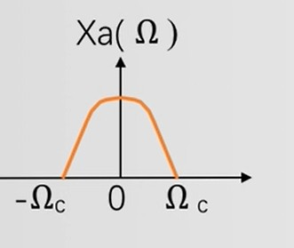

采样信号的频谱：

&emsp;&emsp;**奈奎斯特采样定律：采样频率 $\Omega_s \ge 2\Omega_c $，就能唯一恢复源信号。**

**注意：**
> * **角频率与频率不一样**
> * **频率是 $\frac{1}{T}$，表示的是一秒重复多少次。** 

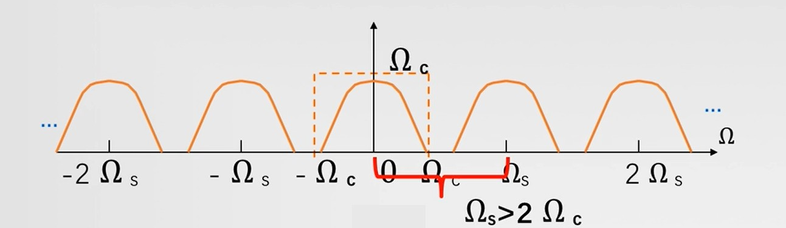

抽样信号的恢复：通过低通滤波器进行恢复。

----
# 第二章 频域分析

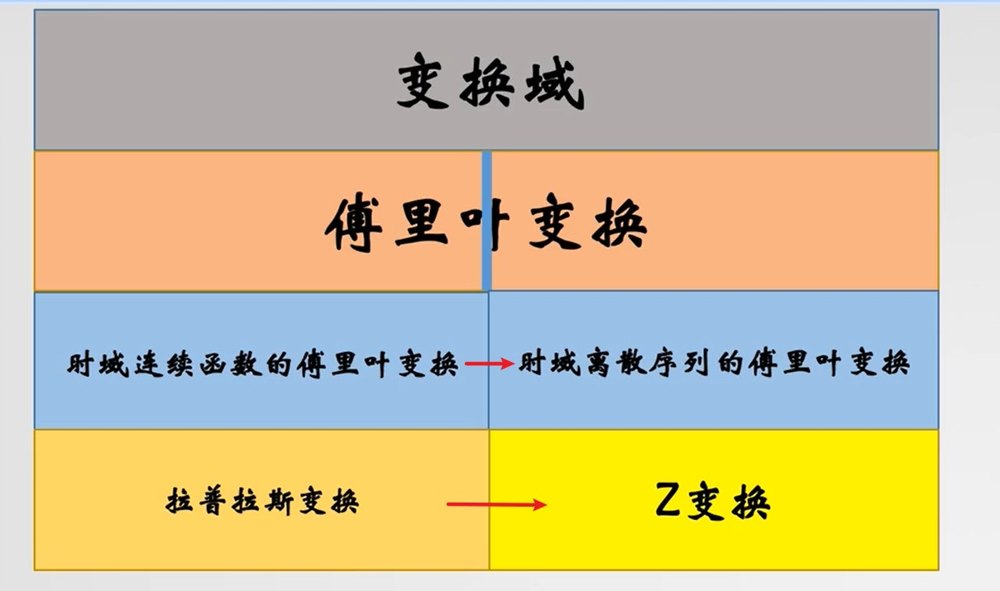

## 一、序列傅里叶变换

### 1.1 定义

* 采样信号：
$$
\hat{x}(t) = \sum_{n=-\infin}^{\infin} x(nT)\delta(t - nT) \tag{1.1}
$$

其中：T为采样周期

* 连续傅里叶变换

$$
\begin{aligned}
	X(j\Omega) &= \int_{-\infty}^{+\infty} \widehat{x}(t) e^{-j \Omega t} d t \\
	&= \int_{-\infty}^{+\infty}\left[\sum_{n=-\infty}^{\infty} x(n T) \delta(t-n T)\right] e^{-j \Omega t} dt \\
	& = \sum_{n=-\infin}^{\infin} x(nT) e^{-j \Omega n T}
\end{aligned} \tag{1.2}
$$

* 序列傅里叶变换
	令：x(n) = x(nT)；$\Omega T = \omega$
	$$
	X(e^{j \omega}) = \sum_{n=-\infin}^{\infin} x(n) e^{-j \omega n} \tag{1.3}
	$$

	**存在条件：$\sum_{n=-\infin}^{\infin} |x(n)| < \infin$**

### 1.2 典型的序列傅里叶变换

* 单位脉冲  

$$
X(e^{j \omega}) = 1 \tag{1.4}
$$

* 单边实指数序列

$$
X(e^{j \omega}) = \frac{1}{1 - a e^{-j \omega}} \tag{1.5}
$$

### 1.3 性质

* 周期性：欧拉

$$
X(e^{j \omega}) = X(e^{j (\omega + 2 \pi M)}) \tag{1.6}
$$

* 线性叠加

$$
\begin{aligned}
	&设：FT[x1(n)] = X1(e^{j \omega}),FT[x2(n)] = X2(e^{j \omega}) \\
	&则：FT[x1(n) + x2(n)] = X1(e^{j \omega}) + X2(e^{j \omega})
\end{aligned} \tag{1.7}
$$

* 时移与频移：

$$
\begin{aligned}
	&时移：FT[x(n-n_0)] = e^{-j \omega n_0} X(e^{j \omega})  \\
	&频移：FT[e^{j \omega_0 n} x(n) = X(e^{j (\omega - \omega_0})]	
\end{aligned} \tag{1.8}
$$

* 时域卷积性质

$$
\begin{aligned}
	&设：y(n) = x(n) * h(n) \\
	&则：Y(e^{j \omega}) = X(e^{j \omega})H(e^{j \omega})
\end{aligned} \tag{1.9}
$$

* 频域卷积

$$
\begin{aligned}
	&设：y(n) = x(n) h(n) \\
	&则：Y(e^{j \omega}) = \frac{1}{2 \pi} X(e^{j \omega}) * H(e^{j \omega})
\end{aligned} \tag{1.10}
$$

* 帕斯维尔定理（能量定理）

$$
\sum_{n=-\infin}^{\infin} |x(n)|^2 = \frac{1}{2 \pi} \int_{-\pi}^{\pi} |X(e^{j \omega})|^2 \tag{1.11}
$$

### 1.4 序列傅里叶变换的对称性

* 共轭复数

$$
\begin{aligned}
	&设：z = x + yj \qquad z = re^{j \omega}\\
	&共轭复数：z^* = x - yj \qquad z^* = re^{-j \omega}
\end{aligned} \tag{1.12}
$$

* $x(-n),x^*(n),x^*(-n)$

$$
\begin{aligned}
	FT[x(-n)] &= X(e^{-j \omega}) \\
	FT[x^*(n)] &= X^*(e^{-j \omega}) \\
	FT[x^*(-n)] &= X^*(e^{j \omega})
\end{aligned}\tag{1.13}
$$

 

* 共轭对称与反对称序列

	**共轭对称序列：** $x(n) = x^*(-n)$；虚部为0，为 **偶序列**
	**共轭反对称序列：** $x(n) = - x^*(-n)$；虚部为0，为 **奇序列**

* 共轭对称与反对称函数

	**共轭对称函数：** $X(e^{j \omega}) = X^*(e^{-j \omega})$
	**共轭反对称函数：** $X(e^{j \omega}) = - X^*(e^{-j \omega})$

 

* x(n)序列的共轭对称分量与反对称分量

	

	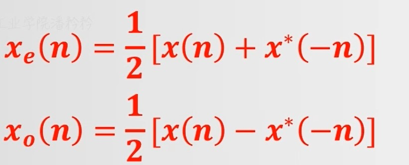
	

	&emsp;&emsp;**由此，可将x(n)进行改写：**

	$$
	x(n) = x_e(n) + x_o(n) \tag{1.14}
	$$

	 $x(n)$ 与 $FT[x(n)] $ 的实部，虚部与共轭对称分量，共轭反对称分量一一对应。

	

	
	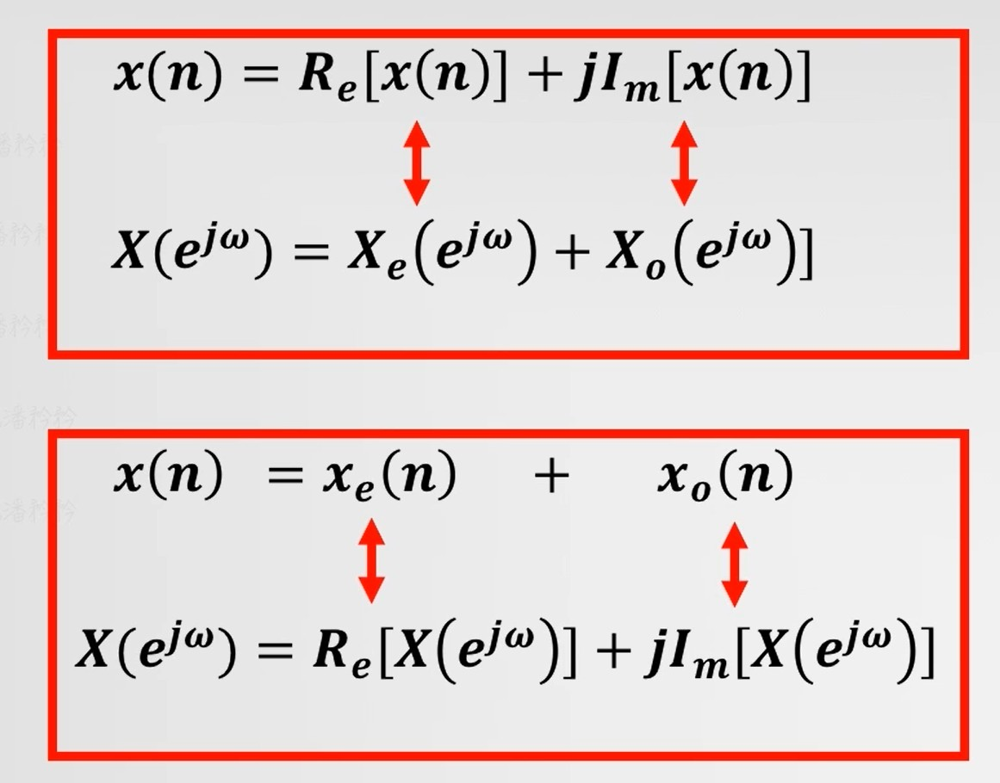
	

## 二、Z变换

### 2.1 定义

&emsp;&emsp;**由于序列傅里叶变换与连续傅里叶变换同样存在这成立条件，采用拉普拉斯的思路方案，可以将序列傅里叶变换的使用范围拓宽，这个就是Z变换。**  z变换存在收敛域，就是a能不能存在。
 

&emsp;&emsp;定义一个数 $a^{-n}$，可以驱使x(n)满足序列傅里叶变换的存在条件：

$$
X(ae^{j \omega}) = \sum_{n=-\infin}^{\infin} x(n) a^{-n} e^{-j \omega n} \tag{2.1}
$$

**令：$z = ae^{j \omega}$**

$$
X(z) = \sum_{n=-\infin}^{\infin} x(n) z^{-n} \tag{2.2}
$$

### 2.2 序列分类

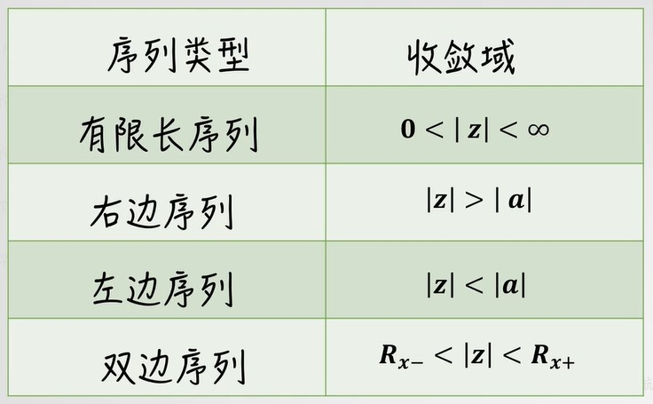

 因果序列是右边序列的一种；因果序列是物理上能实现的。 

### 2.3 性质

* 线性

	$$
	Z[ax_1(n) + bx_2(n)] = aX_1(z) + bX_2(z) \tag{2.3}
	$$

	&emsp;&emsp; 需要讨论收敛域 

* 移位

	* 双边序列：
		$$
		Z[x(n \pm n_0)] = z^{\pm n_0}X(z) \tag{2.4}
		$$
	* 右边序列右移：
		$$
		Z[x(n - n_0)] = z^{- n_0} X(z) + \sum_{i=-n_o}^{-1} x(i)Z^{n_0+i}  \tag{2.5}
		$$
	* 右边序列左移：
		$$
		Z[x(n + n_0)] = z^{n_0} X(z) - \sum_{i=1}^{n_0} x(i)Z^{n_0-si} \tag{2.6}
		$$

* Z域的尺度变换

&emsp;&emsp;设Z[x(n)] = X(z)，则 $y(n) = a^n x(n)$的z变换为：$Y(z)=X(a^{-1}z)$。

* 序列乘以n

$$
Z[nx(n)] = -z \frac{dX(z)}{dz} \tag{2.7}
$$

* 初值定理

$$
\begin{aligned}
	x(0) = \lim_{z \rightarrow \infty} X(z) \tag{2.8}
\end{aligned}
$$

* 终值定理
  
$$
\begin{aligned}
	x(\infty) = \lim_{z \rightarrow 1} (1 - z)X(z) \tag{2.9}
\end{aligned}
$$

## 三、z反变换

### 3.1 常用的z变换公式

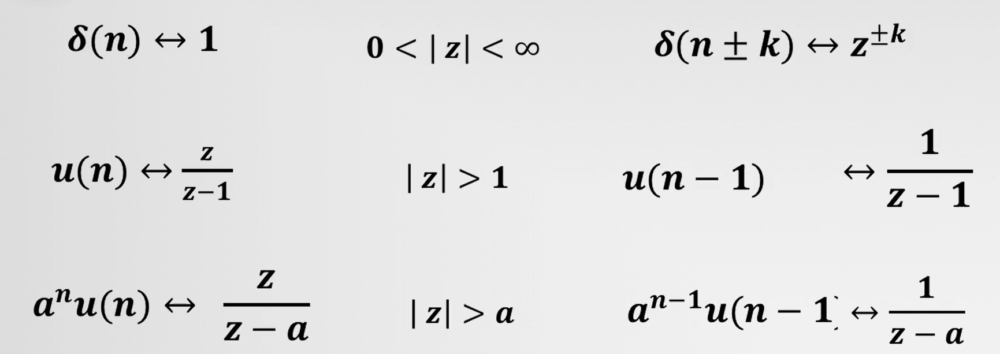

### 3.2 z反变换

* **定义：** 已知序列的z变换X(z)，求原序列x(n)变换称为 **z反变换**。

* **通式：** 所有的z变换公式都能化解为有理分式形式。
	$$
	X(z)=\frac{N(z)}{D(z)}=\frac{b_{m} z^{m}+b_{m-1} z^{m-1}+\cdots b_{1} z+b_{0}}{a_{n} z^{n}+a_{n-1} z^{n-1}+\cdots a_{1} z+a_{0}} \tag{3.1}
	$$

	> * **极点$p_k$：** $D(z) = 0$
	> * **零点$z_k$：** $N(z) = 0$

### 3.3 部分分式展开求解

&emsp;&emsp;主要引用了：实指数的z变换；z变换的线性。

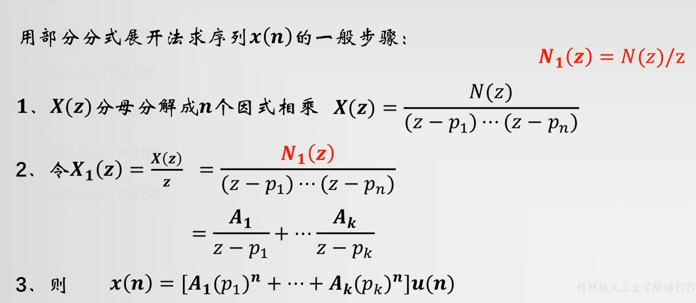

### 3.4 留数法

* z反变换公式：**围线积分（复数域积分）**
	$$
	x(n)=\frac{1}{2 \pi j} \oint_{c} X(z) z^{n-1} d z \tag{3.2}
	$$

* 留数定理解围线积分：**1阶(单)实极点，右边序列**
  
	* **问题**
		$$
		X(z)=\frac{N(z)}{\left(z-p_{1}\right) \cdots\left(z-p_{k}\right)}，|z|>\max \left[\left|p_{n}\right|\right] \tag{3.3}
		$$
		**单极点：** 分母每个括号的次方都是1。
	* **求解**
		$$
		x(n) = \sum^k Res[X(z)z^{n-1}]_{z = p_k} , k为极点的个数 \tag{3.4}
		$$

		

		
		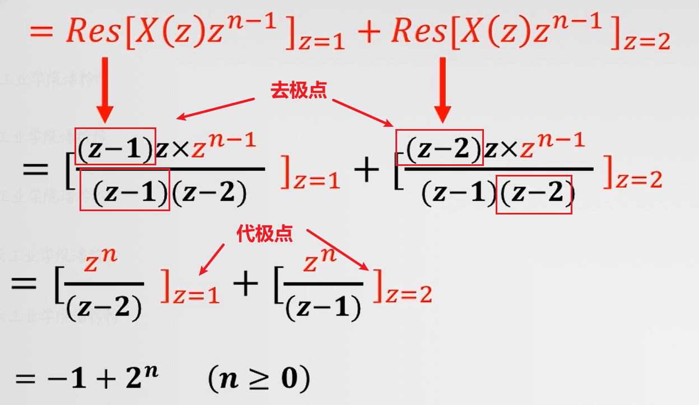
		

* 留数定理解围线积分：**高阶(重)实极点，右边序列**
	

	
	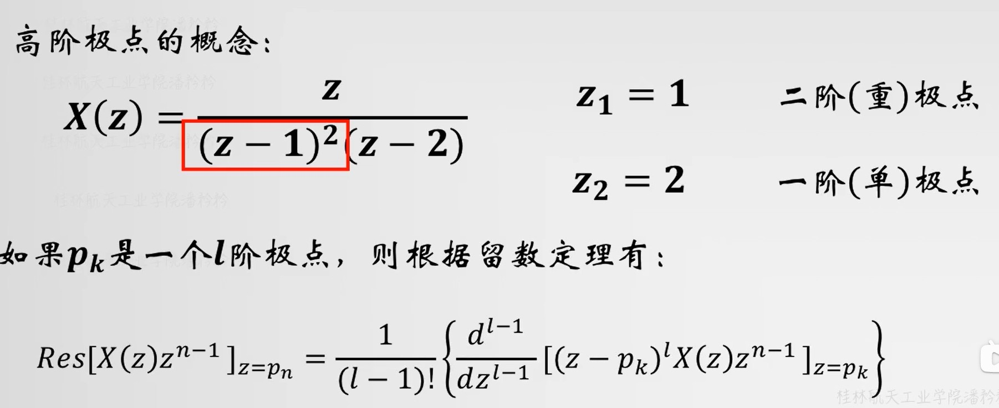
	

## 四、z变换解差分方程

* **差分方程**

	

	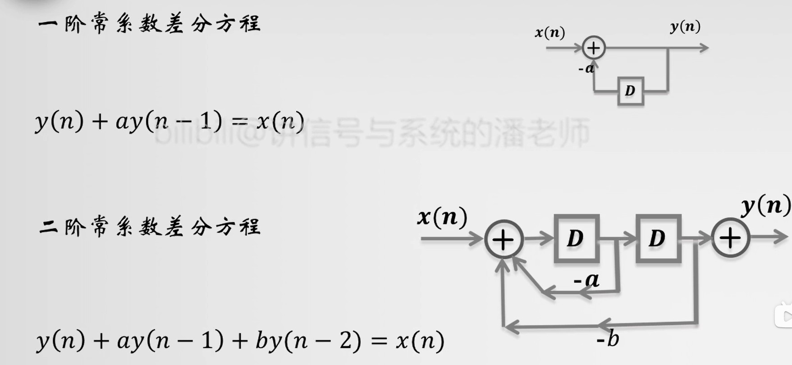
	

* **z的位移变换**

	

	
	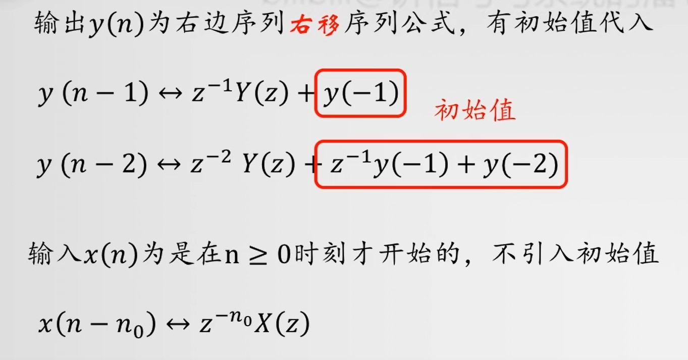
	

## 五、z变换分析系统的频响特性

### 5.1 频率响应函数与系统函数

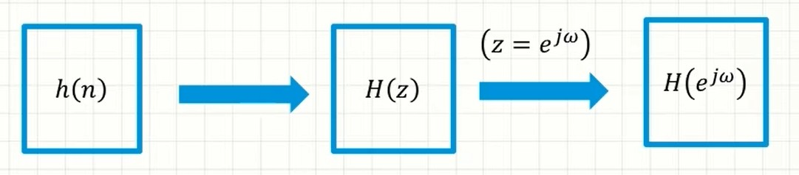

* **频率响应函数 $H(e^{j \omega})$**
	**定义：** 系统输出频率响应的特性。

* **系统函数 $H(z)$**

	$$
	H(z) = \frac{Y(z)}{X(z)} \tag{5.1}
	$$

### 5.2 系统频响特性

$$
H(e^{j \omega}) = |H(e^{j \omega})|e^{j \phi(\omega)} \tag{5.2}
$$

> 幅频特性：$|H(e^{j \omega})|$
> 相频特性：$\phi (\omega)$

### 5.3 输入频率信号 $x(n) = e^{j \omega_0 n}$

$$
\begin{aligned}
	y(n) &= h(n) * x(n) \\
	&= \sum_{m=-\infin}^{\infin} h(m)x(n-m) \\
	&= \sum_{m=-\infin}^{\infin} h(m) e^{j \omega_0 (n-m)} \\
	&= e^{j \omega_0 n}\sum_{m=-\infin}^{\infin} h(m) e^{- j \omega_0 m} \\
	&= e^{j \omega_0 n} H(e^{j \omega_0}) \\
	&=|H(e^{j \omega_0})|e^{j (\phi(\omega_0) + n \omega_0)}
\end{aligned} \tag{5.3}
$$

### 5.4 几何法绘制响应特性图

* **频响的距离**

	$$
	\begin{aligned}
		&求：|1-z|\\
		&设：z = a + jb \\
		&则：|1-z|^2 = |(1-a)-jb|^2=(1-a)^2 + b^2
	\end{aligned} \tag{5.4}
	$$

	&emsp;&emsp;对于(1 - z)而言，(1,0)就是一个**零极点**。对于圆 $(1-a)^2 + b^2 = R^2$ 而言，(1,0)又是一个**圆心**，且   **模 R=|1 - z|** 为半径。

	

	
	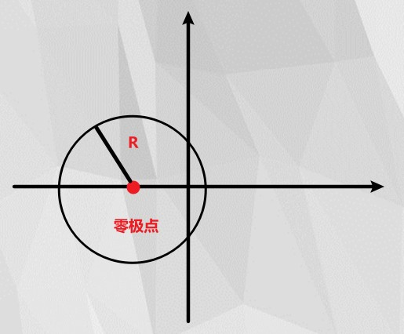
	

	&emsp;&emsp;由于 $H(z)$ 频响中的  $z = e^{j \omega}$ ，**因此，z的变化应该是在一个单位圆上。**

	

	
	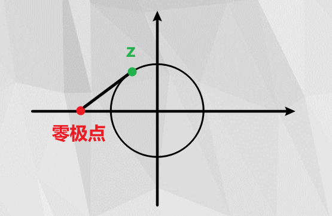
	

* **幅频响应特性**
	
	$$
	H(z) = \frac{(1-b_1 z^{-1})(1-b_2 z^{-1}) \dotsm}{(1 - a_1 z^{-1})(1 - a_2 z^{-1}) \dotsm} \tag{5.5}
	$$

	$$
	|H(e^{j \omega}) |= \frac{所有零点到单位圆上动点的长度之积}{所有极点到单位圆上动点的长度之积} \tag{5.6}
	$$

	> **极点：决定曲线峰值**
	> **零点：决定曲线谷值**

* **相频响应特性**

	$$
	\phi(\omega) = \frac{所有零点到单位圆上动点的辐角之和}{所有极点到单位圆上动点的辐角之和} \tag{5.7}
	$$

## 六、系统函数极点分布与系统因果性、稳定性

### 6.1 系统函数：线性时不变系统

$$
H(z) = \frac{Y(z)}{X(z)} \tag{6.1}
$$

### 6.2 系统因果性

* **n < 0 时，h(n) = 0**

* **右边序列**
	&emsp;&emsp; $H(z)$ 存在收敛域条件：
	$$
	|z| > max(p_k) \tag{6.2}
	$$

### 6.3 系统稳定性

$$
\sum_{n=-\infin}^{\infin} |h(n)| < \infin \tag{6.3}
$$

&emsp;&emsp;结论： H(z)收敛域包含单位圆。 

***
# 第三章 离散傅里叶变换 

## 一、定位

&emsp;&emsp; 用于计算机进行运算。 

## 二、离散傅里叶变换定义

$$
X(k) = \sum_{n=0}^{N-1} x(n) W_N^{nk}  \tag{2.1}
$$

其中：N，**DFT的变换区间长度**；k，频率的编号。

$$
W_N^{nk} = e^{-j \frac{2 \pi}{N} n k} \tag{2.2}
$$

 根据序列傅里叶变换可知，离散傅里叶也是周期的，其结果就是在对序列傅里叶变换的结果进行抽样。

## 三、离散傅里叶级数

&emsp;&emsp;  根据傅里叶存在定理，周期序列不满足绝对可和条件，因此周期序列就不存频谱。  **对于这个问题需要利用傅里叶级数来解决。** 

**周期序列的傅里叶级数：**

$$
\tilde{x}(k) = \sum_{n=0}^{N-1} \tilde{x}(n) W_N^{nk} \tag{3.1}
$$

 计算结果为傅里叶级数的系数。  **N，为一个周期长度。**

## 四、傅里叶变换总结

| 变换类型       | 特点               | 周期           |
| -------------- | ------------------ | -------------- |
| 连续傅里叶级数 | 时域连续，频域离散 | 时域           |
| 序列傅里叶     | 时域离散，频域连续 | 频域           |
| 离散傅里叶级数 | 时域离散，频域离散 | 频域   时域 |
| 离散傅里叶     | 时域离散，频域离散 | \              |

**结论：要想对频域进行离散采样，时域必须：1）周期；2）离散**

## 五、周期延拓

&emsp;&emsp; 将求解离散傅里叶问题，转换为求解离散傅里叶级数问题。 

* **表示符号**

  |      | 时域           | 频域           |
  | ---- | -------------- | -------------- |
  | 序列 | x(n)           | X(n)           |
  | 周期 | $\tilde{x}(n)$ | $\tilde{X}(n)$ |

* **周期延拓**

	**定义：** 将有限长的序列进行重复拼接，就能构造出一个新的周期性序列。

	$$
	\tilde{x}(n) = x((n))_N = x(n\%N) \tag{5.1}
	$$

	* $\tilde{x}(n)$ 为 $x(n)$ 的周期延拓序列
	* x(n) 为 $\tilde{x}(n)$ 的主值序列
	* **$((n))_N$ 表示为求余数：n % N**

* **主值序列**

	$$
	X(n) = \tilde{X}(n)R_N(n) \tag{5.2}
	$$

	**注意：**   序列从 0 到 N-1 ；4.2式也是原序列x(n)的频谱X(n)计算公式。

* **三种主值序列的构造方式**
	> 序列x(n)的长度：M
	> 周期延拓序列的周期(也是DFT的点数)：N

	* M = N，直接重复序列实现延拓；
	* M < N，缺少的用0进行补全；
	* M > N，先将序列以N进行拓展，重合部分，进行叠加。(**不推荐**)

## 六、离散傅里叶变换的性质

### 6.1 线性
$$
DFT(ax_1(n) + bx_2(n))_N = aX_1(k) + bX_2(k) \tag{6.1}
$$

其中：$x_1(n),x_2(n)$为有限长序列；**N >= max(N1,N2)**

### 6.2 循环移位特性

* **时移**

$$
y(n) = x((n + m))_N R_N(n) \tag{6.2}
$$

&emsp;&emsp;将 $x(n)$ 进行周期延拓，得到 $\tilde{x}(n)$ ；然后将 $\tilde{x}(n)$ 向右移动 m 位，得到 $\tilde{x}(n + m) = x((n + m))_N$；最后取出主值序列 $y(n)$ 。**其结果就是有限序列x(n)被循环重排列了。**

$$
Y(k) = DFT[y(n)]_N = W_N^{-mk} X(k) \tag{6.3}
$$

* **频移**

$$
IDFT[\tilde{X}(k + l)_N R_N(k)] = W_N^{nl} x(n) \tag{6.4}
$$

### 6.3 循环卷积

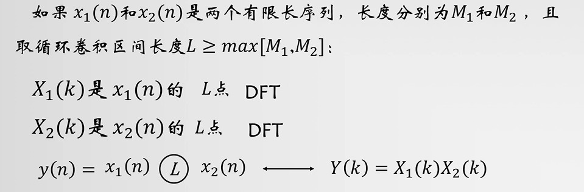
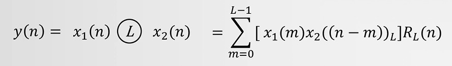

### 6.4 复共轭DFT

$$
\begin{aligned}
	DFT[x^*(n)]_N &= X^*(N-k) ; 0 \le k \le N-1 \\
	X(N) &= X(0) ; k = N
\end{aligned} \tag{6.5}
$$

### 6.5 DFT的共轭对称性

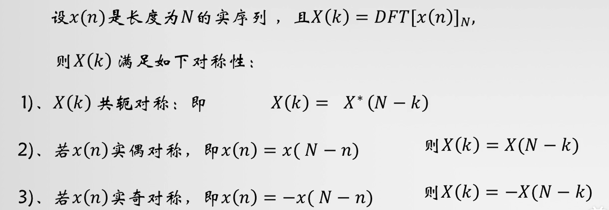

&emsp;&emsp;  由于DFT变换后，X(k)满足共轭对称性，所以X(k)序列的模是对称分布的，计算结果就只用存一半就行。 

***
# 第四章 FFT快速傅里叶变换

## 一、蝶形运算

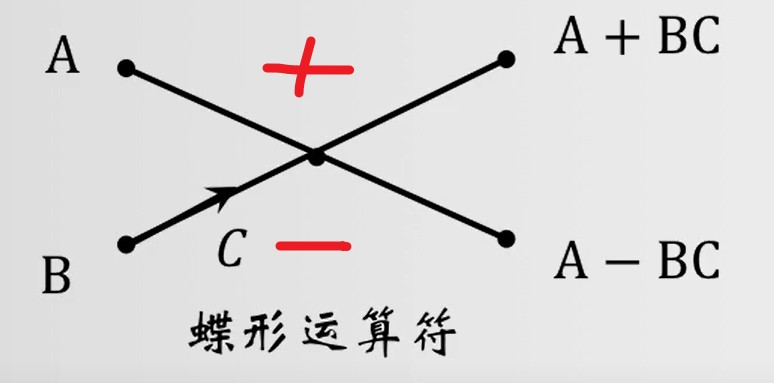

## 二、倒叙算法

**对于N点的DFT：**

> 1. 二进制编号的位数：$M = log_2 (N)$
> 1. 初始二进制全为0
> 1. 二进制编号就是右边蝶形时域序列的输入点的编号
> 1. 二进制编号加一，向着次高位进位，一直重置

## 三、旋转因子：$W_N^k$

* N点DFT的级数：$M = log_2 (N)$
* L级数的旋转因子：$W_N^{J 2^{M - L}}，J = 0,1,2 \dotsm ,(2^{L -1} -1)$

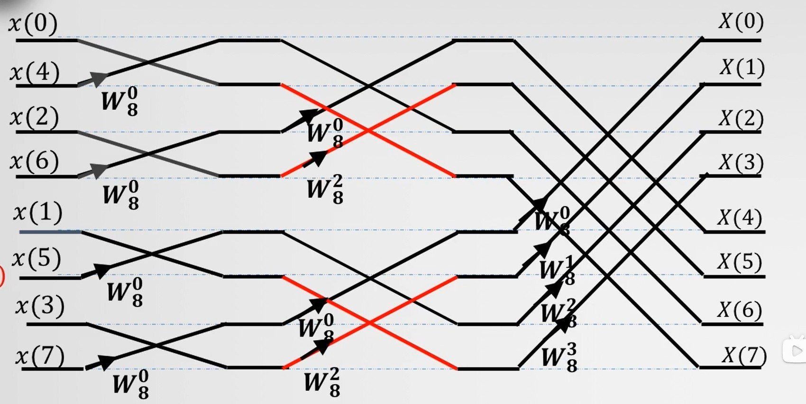

***
# 第五章 时域离散系统的网络结构

## 一、系统框图

### 1.1 表示

### 1.2 系统图转系统函数

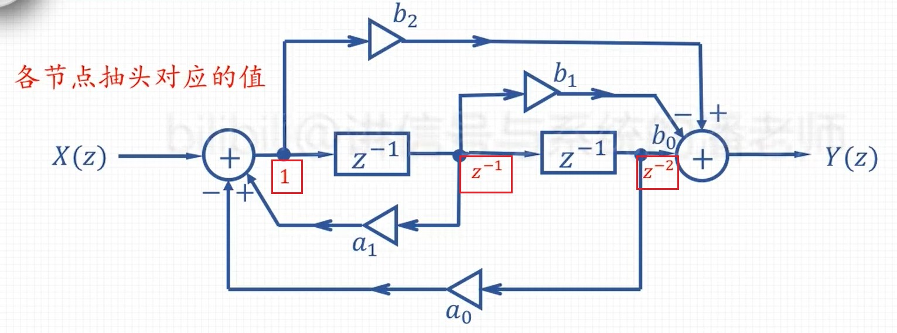

1. 第一个节点假设为1，依次计算出主线的各个节点值
2. 正向线路：计算 $Y(z) = b_0 z^{-2} - b_1 z^{-1} + b_2$
3. 反向线路：计算 $1 = X(z) + a_1 z^{-1} - a_0 z^{-2}$
4. 系统函数：$H(z) = \frac{b_0 z^{-2} - b_1 z^{-1} + b_2}{1 - a_1 z^{-1} + a_0 z^{-2}}$

## 二、信号流图

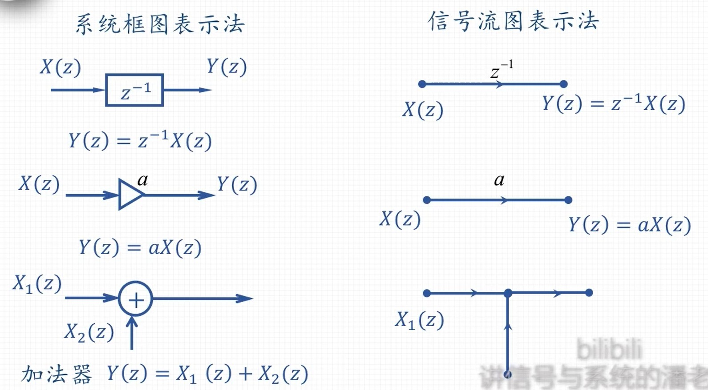

***
# 第六章 滤波器

## 一、模拟频率与数字频率

### 1.1 模拟信号

* **线频率：** $f$，每秒时间内信号变化的周期数。
* **角频率：** $\Omega = 2 \pi f$，每秒时间内信息变化的弧长。

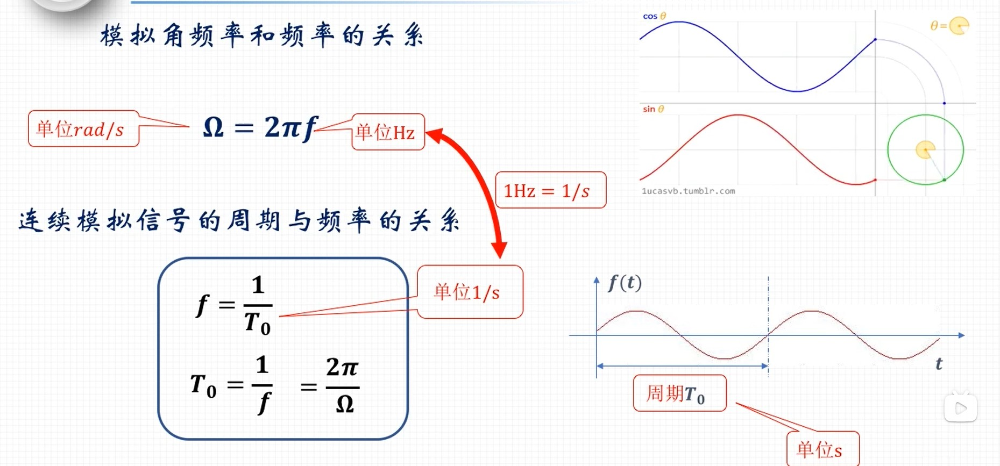

### 1.2 数字信号

* **采样频率：** $f_s$，单位时间内采样的次数
* **数字频率：** $\omega = 2 \pi \frac{f}{f_s}$，相邻两个采样点之间变化的弧度。

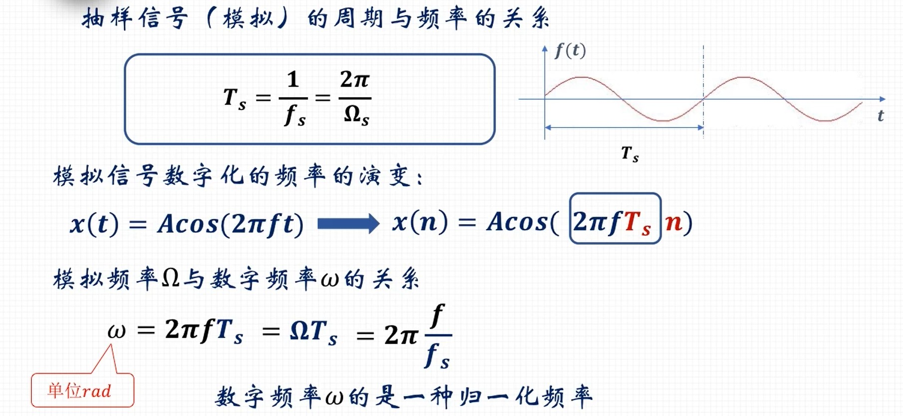

 根据奈奎斯特采样定理：$f_s \ge 2f， \ \omega \le \pi  $ ；数字信号频率：$\pi$ 就对应着模拟信号的最高角频率。

## 二、滤波器分类

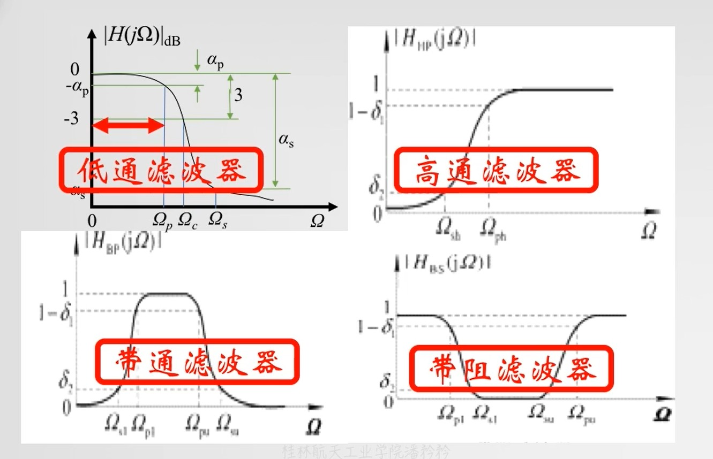

## 三、典型低通滤波器

* 巴特沃斯滤波器
	单调下降
* 切比雪夫滤波器
	在通带或者阻带具有等波纹的特性，可提供选择性
* 椭圆滤波器
	选择性好，但是通带内均匀呈现，等波纹幅频特性
* 贝塞尔滤波器
	在通带内具有线性相位特性

## 四、巴特沃斯低通滤波器

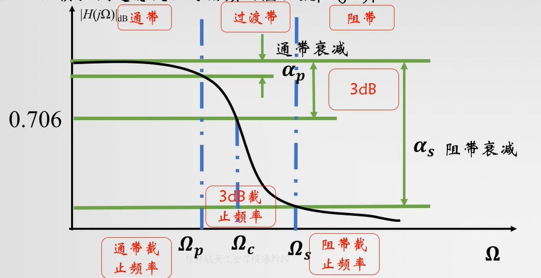

1. **计算N**
	

	
	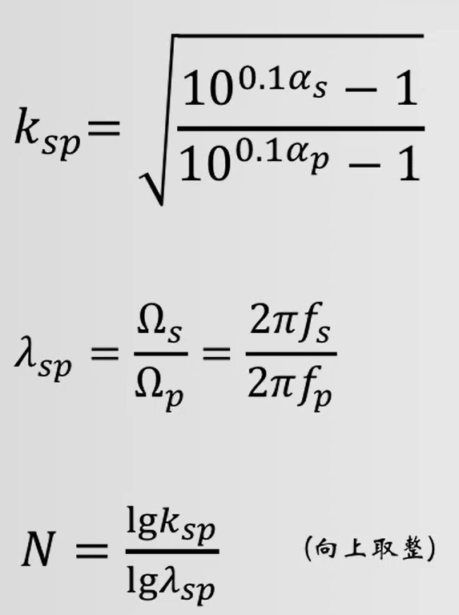
	

1. **查表**

	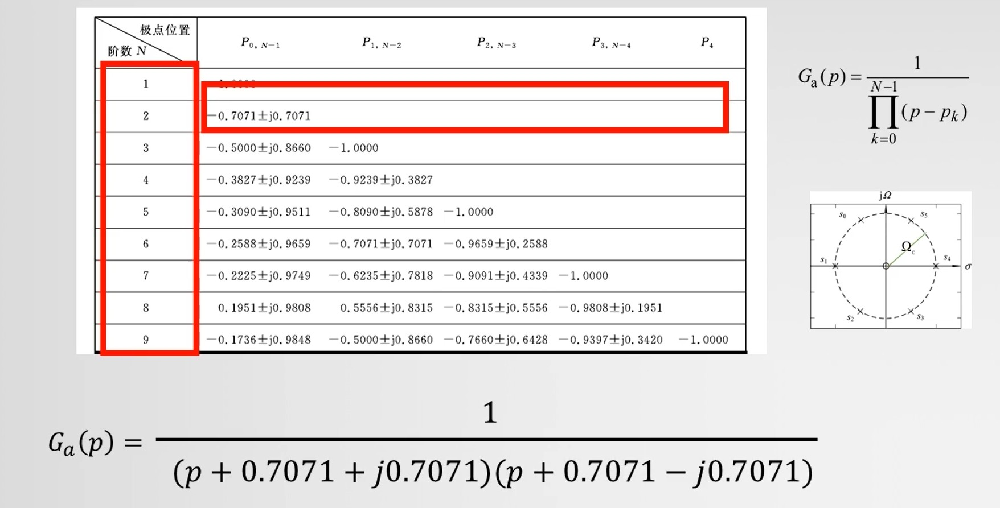

	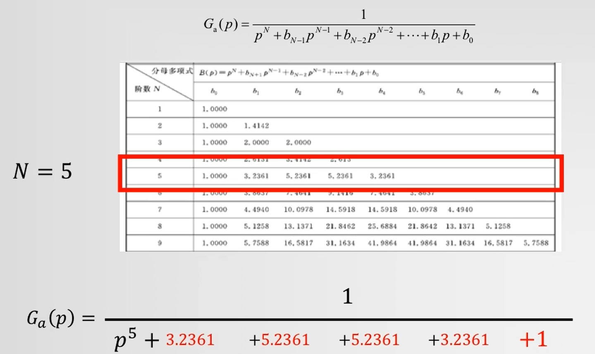
1. **计算 $\Omega_c$**

	

	
	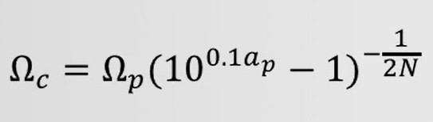
	

1. **令 $P = \frac{s}{\Omega_c}$ 计算得到  $H_a(s)=G_a(P)$**

## 五、数字滤波器分类

### 5.1 通道类型分类
 根据奈奎斯特采样定理：$f_s \ge 2f， \ \omega \le \pi  $ ；数字信号频率：$\pi$ 就对应着模拟信号的最高角频率。

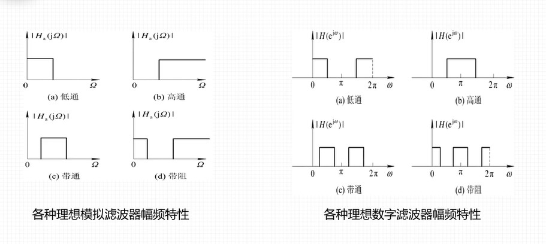

### 5.2 单位脉冲响应的长度分类

* **IIR滤波器** : 无限长脉冲响应数字滤波器

	$$
	y(n) - \sum\limits_{k=0}^{N-1} a_k y(n-k) = \sum\limits_{k=0}^{N-1} b_k x(n-k)\tag{5.1}
	$$

	$$
	H(z) = \frac{\sum\limits_{j=0}^{M}a_j z^{-j}}{1 + \sum\limits_{k=0}^{N}b_k z^{-k}} \tag{5.2}
	$$

	 阶数由分母决定：N 

* **FIR滤波器** : 有限长脉冲响应数字滤波器

	$$
	y(n) = \sum\limits_{k=0}^{N-1} b_k x(n-k) \tag{5.3}
	$$

	$$
	H(z) = \sum\limits_{k=0}^{N-1} h(k) z^{-k} \tag{5.4}	
	$$

	 阶数为：N-1 

## 六、IIR滤波器的间接法设计

1. 使用模拟滤波器的设计方法，设计出系统函数：$H_a(s)$
2. 将 $H_a(s)$ 转换为 $H(z)$
	* 脉冲响应不变法 ：**高频会混叠，不能用于高通滤波器和带阻滤波器**
		* **s平面与z平面坐标对应关系：将$\Omega$的一个$2 \pi$ 区间映射到z平面**
			

			
			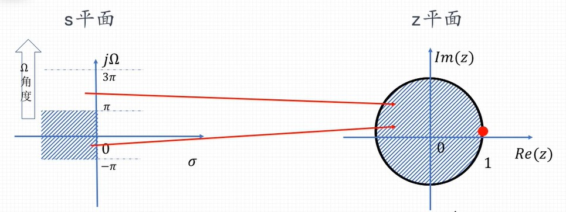
			

			$$
			\begin{aligned}
				s &= \delta + j \Omega \\
				z &=  a e^{j \omega} \\
				根据 \omega = \Omega T_s：z &= e^{sT_s}
			\end{aligned} \tag{6.1}
			$$
		* **极点变换**
			

			
			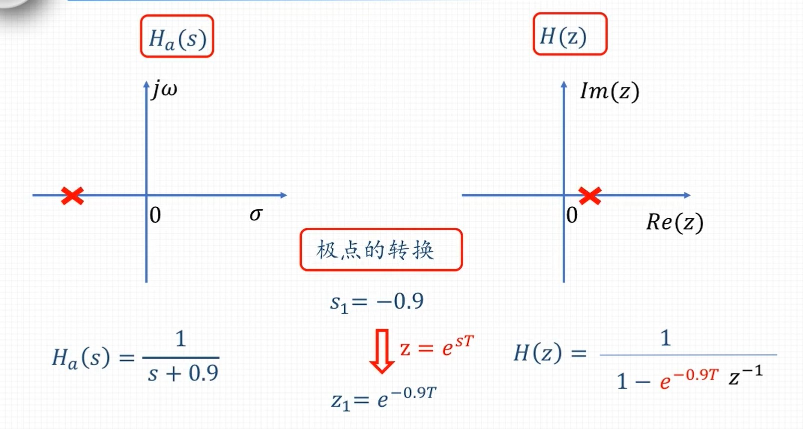
			

			$$
			H(z) = \sum\limits_{i = 1}^{N} \frac{T_s A_i}{1 - e^{p_{ki}T_s} z^{-1}} \tag{6.2} 
			$$

			**注意：**  1）模拟滤波器要化解为列项之和的形式（部分分式分解）；2）分子乘以 $T_s$，防止采样频率过高，换算后的 $H(z)$ 过大。  

	* 双线性变换法
		* **$\omega , \Omega$ 之间的映射关系，转为单值映射**
			

			
			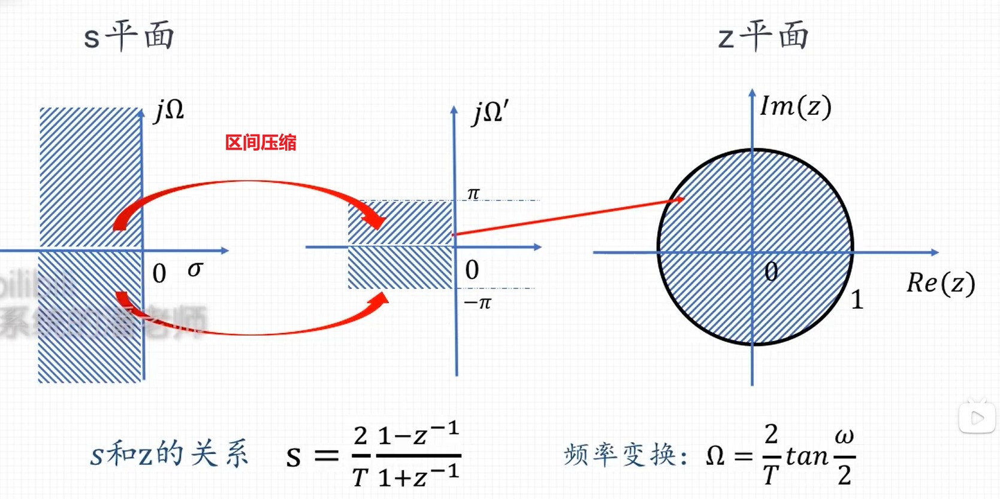
			

		* **替换H(s)中的s**

## 七、高通滤波器
&emsp;&emsp;高通转为低通进行设计：

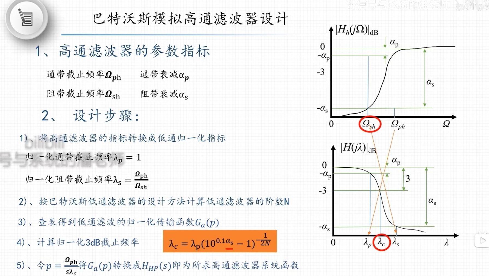

&emsp;&emsp; 双线性法求解数字滤波器 

## 八、带通滤波器

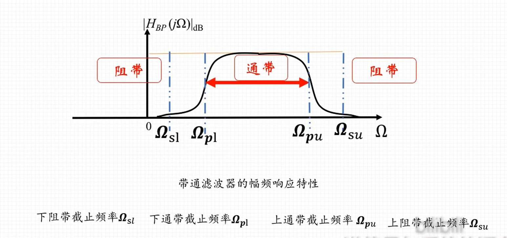

## 九、FIR滤波器

## 9.1 特点

$$
y(n) = \sum\limits_{k=0}^{N-1} b_k x(n-k) \tag{9.1}
$$

$$
H(z) = \sum\limits_{k=0}^{N-1} b_k z^{-k} \tag{9.2}	
$$

> 零点：$\sum\limits_{k=0}^{N-1} b_k z^{-k} = 0$，有N-1个
> 极点：$1 = 1 + \sum\limits_{k=0}^{N-1} a_k z^{-k}$，即极点$z^{-k} = 0$

&emsp;&emsp; 通过时域公式可知，FIR滤波器是因果的；极点在单位圆内。故FIR恒稳定。 

## 9.2 分类

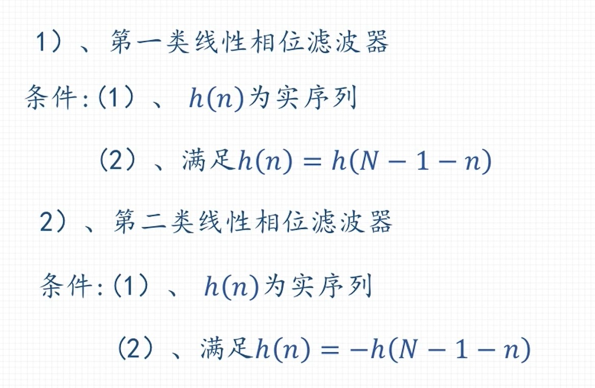

## 十、FIR滤波器设计

### 10.1 通用公式

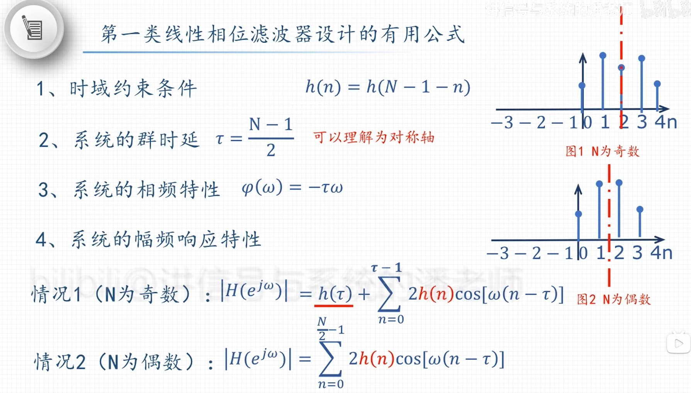

### 10.2 理想的FIR低通滤波器

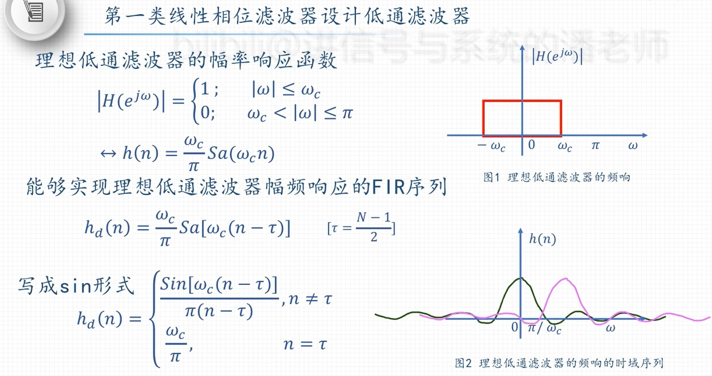

### 10.3 窗函数

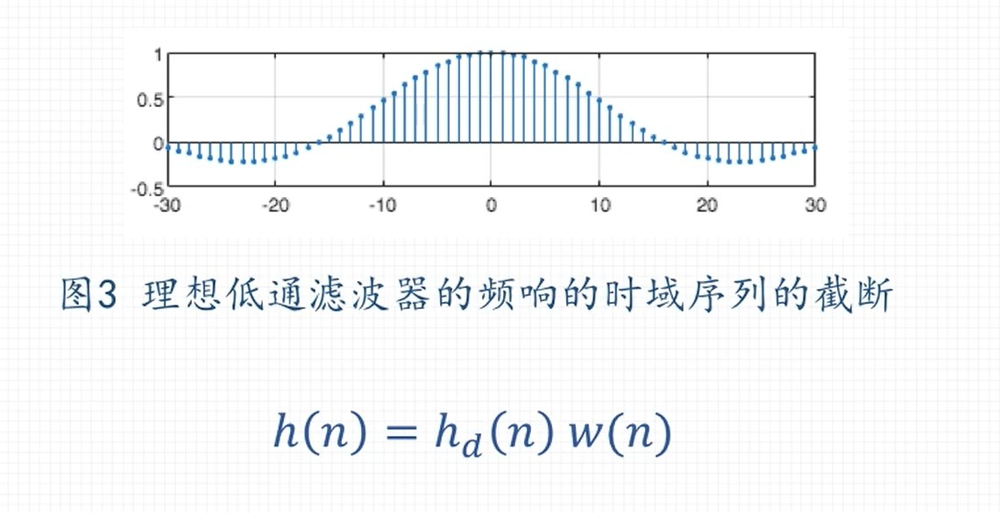
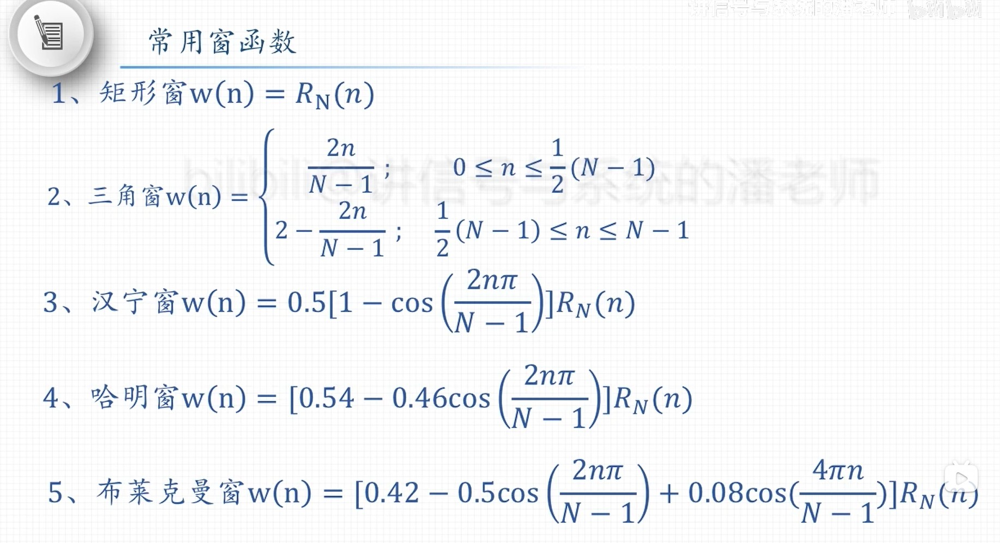
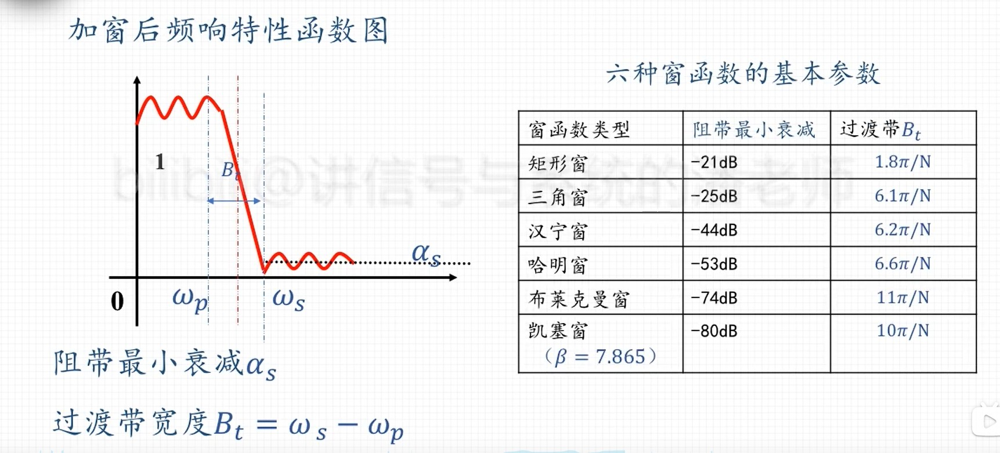

