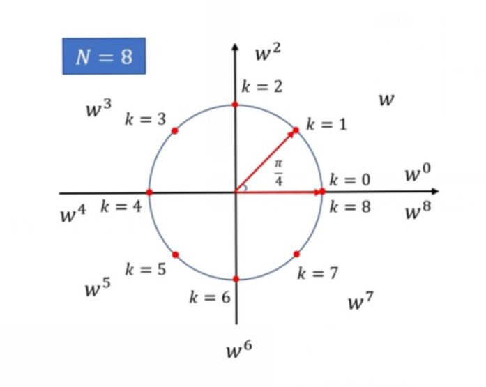
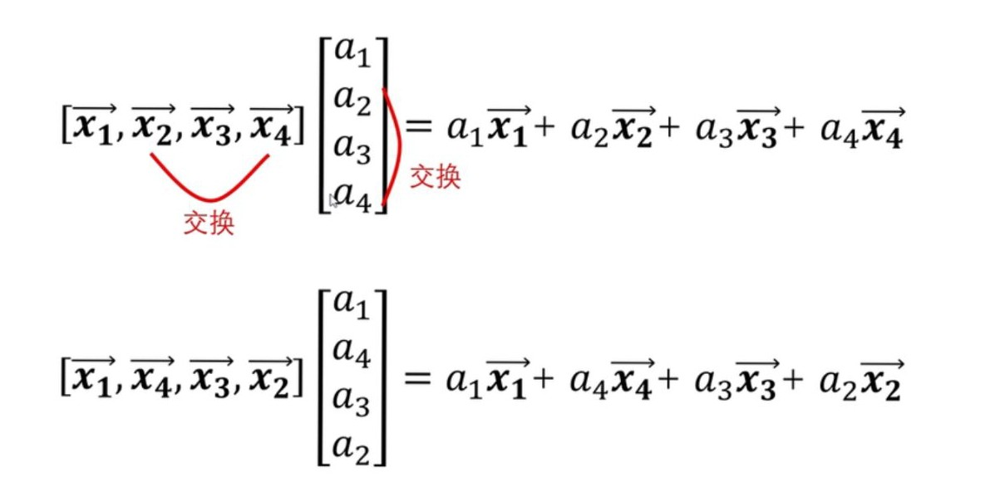
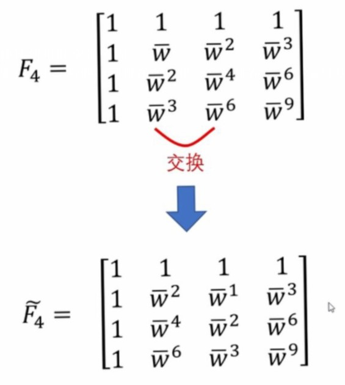
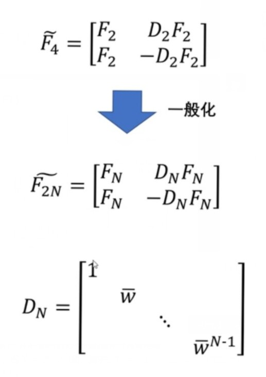
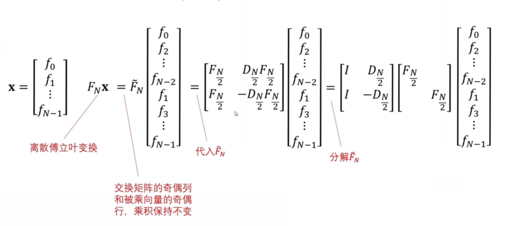
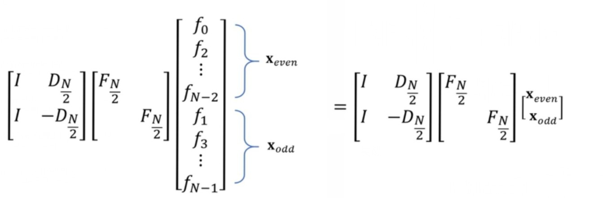
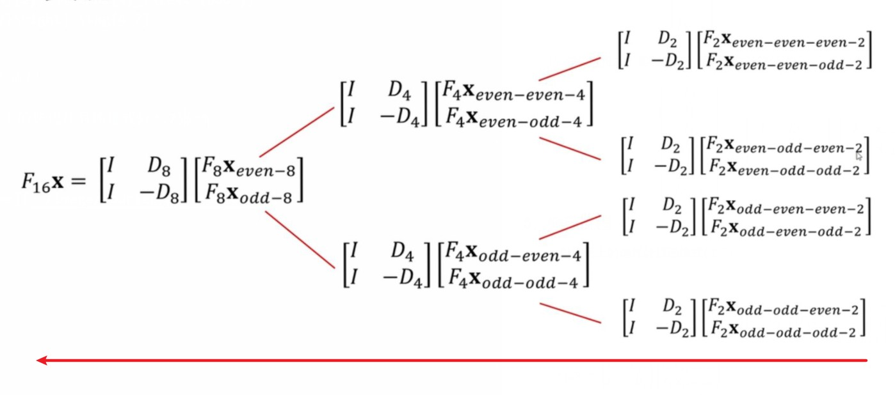

[toc]
## 一，预备知识

### 1，三角函数正交性

对于三角函数系：
$$
    \{1,\sin{ x },\cos{ x },\dotsm,sin{ nx },cos{ nx }\} \tag{1.1}
$$
任意取两个三角函数，满足：
$$
    \int_{-\pi}^{\pi} \sin{nx} \cos{mx} \mathrm{d}x = 0,m \not = n \tag{1.2}
$$

### 2，傅里叶变换思想
$f(x)$可以转换为三角函数系的加和：
$$
    f(x)=\frac{a_0}{2}  + \sum_{k=1}^{\infty} a_k \cos{k \omega x} + \sum_{k=1}^{\infty} a_k \sin{k \omega x} \tag{1.3}
$$

## 二，傅里叶级数
函数$f(x)$周期为T，在复数域下求解得：
$$
    \begin{array}{l}
        f(x) = f(x + T) \\
        f(x) = \sum_{-\infty}^{\infty}  c_n e^{i n \omega x} \\
        c_n = \frac{1}{T} \int_{0}^{T} f(x) e^{-i n \omega x} \mathrm{d}x
    \end{array} \tag{2.1}
$$
> **注意：这里的$\omega = \frac{2 \pi}{T}$，为基频率，是常值。**

## 三，连续的傅里叶变换
函数$f(x)$没有周期。
$$
    \begin{array}{l}
        f(x) = \int_{-\infty}^{\infty} c(\omega) e^{i \omega x} \mathrm{d} \omega\\
        c(\omega) = \frac{1}{ 2 \pi} \int_{-\infty}^{\infty} f(x) e^{-i \omega x} \mathrm{d}x
    \end{array} \tag{3.1}
$$
> **注意：这里的$\omega$是连续变量。**

## 四，离散傅里叶变换
### 1，作用
**不是新的理论，而是计算$c_n$算法**：通过N个离散的等距的采样点，计算出周期为T的函数$f(x)$的傅里叶级数$c_n$。**(这里的 T 可以推广到无周期)**
### 2，前提假设
$f(x)$的傅里叶级数形式为有限个$[c_0,c_1,\dotsm,c_{N-1}]$。
### 3，基$w^k$
1，定义
    $$w^k = e^{ k \frac{2 \pi i}{N}} \tag{4.1}$$

2，性质

N个采样点，$w^0,w^1,\dotsm,w^{N - 1}$，**在复平面上是一个圆**。对于$w^{N},w^{N+1},\dotsm$则在这个圆上循环。
    

### 4，傅里叶离散
**取N个采样点$[(0 \frac{T}{N},f(0 \frac{T}{N})),(1 \frac{T}{N},f(1 \frac{T}{N})),\dotsm,((N - 1) \frac{T}{N},f((N - 1) \frac{T}{N}))]$。分别带入傅里叶级数$(2.1)$，得到N个方程，然后求解方程组，得到$c_n$序列，实现傅里叶变换**。

例如，令$x = \frac{T}{N}$，则$\omega \frac{T}{N}= \frac{2 \pi}{N}$，带入$(2.1)$得到：
$$
\begin{aligned}
f(\frac{T}{N}) &= \cdots+c_{-1} e^{-1 \frac{2 \pi i}{N}}+c_{0} e^{0 \frac{2 \pi i}{N}}+c_{1} e^{\frac{2 \pi i}{N}} \cdots c_{N} e^{N \frac{2 \pi i}{N}}+c_{N+1} e^{(N+1) \frac{2 \pi i}{N}}\cdots \\
&= \cdots+c_{-1} w^{-1} + c_{0} w^{0} + c_{1}w^{1} \cdots c_{N} w^{N} +c_{N+1} w^{N + 1} \cdots
\end{aligned} \tag{4.2}
$$
由所有的$w^k$都可以化解为$[w^0,w^1,\dotsm,w^{N - 1}]$中的某个形式。所以$(4.2)$进一步化解：
$$
\begin{aligned}
f(\frac{T}{N}) &= (\dotsm c_{-N} + c_{0} + c_{N} \dotsm) w^{0} \\
&+ (\dotsm c_{-N + 1} + c_{1} + c_{N+1} \dotsm) w^{1} \\
&+ (\dotsm c_{-N + 2} + c_{2} + c_{N+2} \dotsm) w^{2} \\
&\dotsm \\
&+ (\dotsm c_{- 1} + c_{N-1} + c_{2N-1} \dotsm) w^{N - 1} \\
\end{aligned} \tag{4.3}
$$

通过$(2.1)$式还可以看出，$x = k \frac{T}{N}$只会影响$f(x)$中的$w^k$项，而不会影响$c_n$值。剩余的N-1个采样点均可以按照上述方式进行处理。
$$
\begin{aligned}
f(k \frac{T}{N}) &= (\dotsm c_{-N} + c_{0} + c_{N} \dotsm) w^{0 k} \\
&+ (\dotsm c_{-N + 1} + c_{1} + c_{N+1} \dotsm) w^{1k} \\
&+ (\dotsm c_{-N + 2} + c_{2} + c_{N+2} \dotsm) w^{2k} \\
&\dotsm \\
&+ (\dotsm c_{- 1} + c_{N-1} + c_{2N-1} \dotsm) w^{( N - 1 )k} \\
\end{aligned} \tag{4.4}
$$

再引入假设，**傅里叶级数形式为有限个$[c_0,c_1,\dotsm,c_{N-1}]$**：
$$
\begin{aligned}
f(k \frac{T}{N}) &= c_{0} w^{0 k} \\
&+ c_{1} w^{1k} \\
&+ c_{2}  w^{2k} \\
&\dotsm \\
&+ c_{N-1} w^{( N - 1 )k} \\
\end{aligned} \tag{4.5}
$$

将$(4.5)$写成矩阵形式，进行解方程组计算。
$$
\left[\begin{array}{c}
f(0 \frac{T}{N}) \\
f(1 \frac{T}{N}) \\
f(2 \frac{T}{N}) \\
f(3 \frac{T}{N}) \\
\vdots \\
f((N-1) \frac{T}{N})
\end{array}\right]=\left[\begin{array}{cccccc}
1 & 1 & 1 & 1 & \cdots & 1 \\
1 & w & w^{2} & w^{3} & \cdots & w^{N-1} \\
1 & w^{2} & w^{4} & w^{6} & \cdots & w^{2(N-1)} \\
1 & w^{3} & w^{6} & w^{9} & \cdots & w^{3(N-1)} \\
\vdots & \vdots & \vdots & \vdots & \vdots & \vdots \\
1 & w^{N-1} & w^{2(N-1)} & w^{3(N-1)} & \cdots & w^{(N-1)^{2}}
\end{array}\right]\left[\begin{array}{c}
c_{0} \\
c_{1} \\
c_{2} \\
c_{3} \\
\vdots \\
c_{N-1} 
\end{array}\right] 
$$

> **注意: 采样值N一定要大于等于$f(x)$的傅里叶级数的个数，才能实现对系数$c_n$的求解。否则会导致$c_n$的重合**

## 五，快速傅里叶变换
### 1，作用
**加速离散傅里叶变换计算的算法**。

### 2，基的共轭$\bar{w}^k$
将上述方程组进行改写：
$$
\left[\begin{array}{cccccc}
1 & 1 & 1 & 1 & \cdots & 1 \\
1 & \bar{w} & \bar{w}^{2} & \bar{w}^{3} & \cdots & \bar{w}^{N-1} \\
1 & \bar{w}^{2} & \bar{w}^{4} & \bar{w}^{6} & \cdots & \bar{w}^{2(N-1)} \\
1 & \bar{w}^{3} & \bar{w}^{6} & \bar{w}^{9} & \cdots & \bar{w}^{3(N-1)} \\
\vdots & \vdots & \vdots & \vdots & \vdots & \vdots \\
1 & \bar{w}^{N-1} & \bar{w}^{2(N-1)} & \bar{w}^{3(N-1)} & \cdots & \bar{w}^{(N-1)^{2}}
\end{array}\right]\left[\begin{array}{c}
f_{0} \\
f_{1} \\
f_{2} \\
f_{3} \\
\vdots \\
f_{N-1}
\end{array}\right] = \left[\begin{array}{c}
c_{0} \\
c_{1} \\
c_{2} \\
c_{3} \\
\vdots \\
c_{N-1} 
\end{array}\right] 
$$
定义$\bar{w}^k$：
$$\bar{w}^k = e^{-k\frac{2 \pi i}{N}} \tag{4.6}$$

### 3，矩阵乘法
交换顺序，矩阵乘积的结果不变。

### 4，快速傅里叶变换推导

1）对于傅里叶的共轭矩阵将偶数列排在前，将奇数列排在后（**编号从0开始**）。

2）对交换后的矩阵进行分块

> **注意：**
> 1. **子块$F_2$并不是采样数为2时的傅里叶共轭矩阵**；
> 1. **$\bar{w}^k$，当$N = 2^n \ge 4$时，对于$\bar{w}^{\frac{N}{2}} = -1$**；（此时采样点在园上对半分，第$\frac{N}{2}$个采样点就刚好在负实轴上。）
> 1. **上述分块法用于$N = 2^n$的情况**；

3）将分块公式一般化

4）**获得递推式，实现快速傅里叶算法计算公式l**

$$
F_{N} 
\left[\begin{array}{c}
f_{0} \\
f_{1} \\
f_{2} \\
f_{3} \\
\vdots \\
f_{N-1}
\end{array}\right]=\left[\begin{array}{cc}
I & D_{\frac{N}{2}} \\
I & -D_{\frac{N}{2}}
\end{array}\right]\left[\begin{array}{c}
F_{\frac{N}{2}} \mathbf{x}_{\text {even }} \\
F_{\frac{N}{2}} \mathbf{x}_{\text {odd }}
\end{array}\right] \tag{4.7}
$$

### 5，编程流程

> **自下而上的迭代计算递推式$(4.7)$**

## 参考
> * [纯干货数学推导_傅里叶级数与傅里叶变换](https://www.bilibili.com/video/BV1Et411R78v)
> * [傅立叶变换夯实基础系列视频](https://www.bilibili.com/video/BV1aT4y1J7JP/?spm_id_from=333.788.recommend_more_video.0)