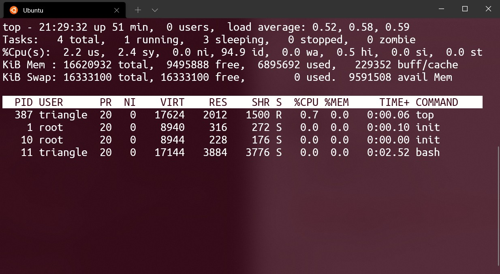

# Linux笔记

---
[toc]
---

# 一、磁盘

## 1.1 硬盘分区

1. 文件系统区
1. 交换区: 硬盘充当内存
 
## 1.2 磁盘块类型划分

1. 导引块: 加载硬盘的程序
1. 专用块: 磁盘相关信息
1. i节点表块: 所有i节点
1. 数据存储块: 文件数据

&emsp;&emsp;<font color="#f44336">默认一块为4096个字节，对应硬盘8个扇区。</font>

# 二、文件系统

## 2.1 文件储存结构

- 目录: 包含一组目录项信息的文件
- 目录项: 文件名与i节点索引
- i节点: 指向磁盘上该文件存储区

## 2.2 链接

- 硬链接:  ln -d; 多个<font color="#4c9df8">目录项</font>绑定一个文件，硬链接数是0的时候，文件才能被真正删除。
- 符号链接: ln -s; 文件名是指向一个目录项的路径。

## 2.3 文件
### 1. /etc/fstab文件
&emsp;&emsp;当系统启动的时候，并且会自动将此文件中指定的文件系统挂载到指定的目录。
- file systems 要挂载的分区或存储设备
- dir 挂载的目录
- type 要挂载设备或是分区的文件系统类型;auto类型自动搜索，用于cd，DVD
- options 挂载参数
- dump dump工具
- pass fsck检测顺序

### 2. /proc/cpuinfo
&emsp;&emsp;查看CPU的信息
 
### 3. /proc/meminfo
&emsp;&emsp;查看内存的信息

## 2.4 文件夹

- /proc: 是一个伪文件系统，它只存在内存当中，而不占用外存空间。它以文件系统的方式为访问系统内核数据的操作提供接口。

# 三、指令

## 3.1 查看硬盘

- df （disk free) : 查看硬盘整体使用情况
    - h （human）: 会进行单位换算，方便人看
    - i （inode）: 查看i节点
- du （disk usage）[路径]: 文件夹和文件的磁盘占用
    - h
    - a : 默认只显示文件夹，a会显示到具体文件
    - <font color="#f44336">文件夹的大小 = 目录文件大小 + 文件夹内文件的大小; 数据块的大小</font> 
    - s （summarize） : 查看路径对于数据块的总大小
    - --max-depth= : 文件夹路径的层级

## 3.2 查看硬件
### 1. top
&emsp;&emsp;类似于Windows的任务管理器

<center>


</center>

>* top 行：当前时间，运行时间，用户数量，cpu使用情况:5min/10min/15min
>* tasks行：进程信息
>* CPU行：cpu的详细占用情况， **默认只显示了一个CPU** 
>* mem行：内存
>* swap行：交换区
>* 进程列表

&emsp;&emsp;常用指令：

> * e：进程列表单位
> * E：men行、swap行的单位
> * z：颜色区分
> * Z：自定义颜色
> * m：如何显示内存 
> * f：进程表排序
> * W：保存配置

### 2. free
&emsp;&emsp;查看内存使用情况

- -k: 单位kb
- -m: 单位mb
- -g: 单位gb

### 3. uname
&emsp;&emsp;查看系统信息
- -a: 全部信息
-  -r（release）: 显示操作系统的发行编号

## 3.3 网络
### 1. netstat
&emsp;&emsp;利用 netstat 指令可让你得知整个 Linux 系统的网络情况。
- -n numeric: 直接使用IP地址
- -p programs: 显示正在使用Socket的程序识别码和程序名称。
- -t tcp: 显示TCP传输协议的连线状况。
- -u udp: 显示UDP传输协议的连线状况。

> proto: 协议类型
> Local Address: 本机的IP与端口
> Foreign Address: 远程的IP与端口
> State: 连接状态

&emsp;&emsp;<font color="#f44336">配合grep指令可以进行目标内容查询。</font>

### 2. ifconfig
&emsp;&emsp;查看或者配置主机的网络设备

- ethX: 真正的物理网卡
- lo: 本地虚拟网卡

## 3.4 权限

### 1. 概念

- 文件的访问对象分为 **u用户，g组，o其他** ;
- 文件的访问权限分为 **r，w，x 对应二进制 111** 

### 2. umask
&emsp;&emsp;决定文件创建的默认权限; 777 减 掩码
- -S: 具体权限分配

### 3. chmod
- [a，u，g，o] + [r，w，x]: 添加权限
- [a，u，g，o] - [r，w，x]: 移出权限
- 编号: 批量修改
 
### 4. chown

&emsp;&emsp;修改拥有者

### 5. chgrp 

&emsp;&emsp;修改组

### 6. visudo

&emsp;&emsp;可以配置能使用sudo的用户。

## 3.5 管道组

### 1. grep
&emsp;&emsp;查找**文件**里符合条件的字符串。管道给的stdin也算一个文件。
- -i: 忽略大小写
- -n: 显示行号
- -F  fixed-regexp: 规则视作普通字符串
- -E  extended-regexp : 扩展正则
- -c : 匹配计数
- -o only-matching: 只显示匹配内容，不显示完整行
- -v invert-match : 反向查找

### 2. xargs
&emsp;&emsp;管道实现的是将前面的输出stdout作为后面的输入stdin，但是有些命令不接受管道的传递方式。**这就需要xargs将管道产生的stdin进行处理，将stdin文件转为指令的参数**。

### 3. 管道
&emsp;&emsp;<font color="#f44336">将前一个指令的stdout转为后一个指令的stdin，被视为一个文件。</font>

## 3.6 {}
&emsp;&emsp;可选符号，能将多个参数合并为一个，`{，，，}`中为可变部分。

## 3.7 find

- -size: 根据大小查找
    - -size +6k: 大于6k
    - -size -10k: 小于10k
- -name: 根据名字查找
- -type: d，文件夹;f，文件;l，软链接

## 3.8 uniq
&emsp;&emsp;用于检查及删除文本文件中重复出现的行列。<font color="#4c9df8">不会修改源文件，控制台输出或生成新文件。</font>

-  -c: 计数
- -u unique: 显示出现一次的行

## 3.9 sed
&emsp;&emsp;文件流处理工具，**操作的单位为文本中的一行**。

```Linux
    sed [选项] [表达式 指令] 源文件
```

选项：
- -e: 指定一行表达式指令
- -f: 指定一个表达式指令文本
- -n: 会屏蔽未被选中的行
- -i: 输出覆盖源文件
- -r: 扩展正则

表达式：按照行进行选择
- `/ /`：正则表达式，选中对应目标的所在行
- `/ /,/ /`: **选中两个表达式之间的所有行**
- 数字: 指定行号；逗号隔开可指定多行`'1,2 p'`

指令: 针对一行进行操作
- s: 替换
- i: 前插入一行
- a: 后插入一行
- p: 打印
- d: 删除
- c: 用指定内容替换选中行
- `;`: 用于指定多个指令
- `{}`: 当表达式是 `/ /` 时，需要用 `{}` 框住多个指令


## 3.10 sort

&emsp;&emsp;默认使用 **空格，制表符** 作为文本的分割符号；默认对第一列进行排序。每一行作为一个单位，相互比较，比较原则是从首字符向后，依次按ASCII码值进行比较，最后将他们按**升序**输出。
- t: 自定义分隔符
- k: 按照第几列排序
- n: 按照数值，从大到小排序
- r: 逆序排序
- h: 按照单位进行排序
- u: 去重

## 3.11 压缩、解压

### 1. zip

```Linux
    zip [选项] [压缩包.zip] [文件]
```
- -r: 递归文件夹
- -q quite: 不显示指令信息
- -d: **删除压缩包中的文件**

### 2. unzip

- -d: 解压缩的路径
- -v: 查看压缩包

### 3. tar

- 通用
  - -f: 指定压缩包，**切记，这个参数是最后一个参数，后面只能接压缩包名**
  - -v: 显示详细信息
  - -c create: 创建包
  - -C: 指定解压目录
  - -t list: 列出备份文件的内容；
  - -x extract: 解压缩
  - -r: 追加

- .tar：**没有进行压缩**
  - -c[v]f: 创建一个tar包
  - -t[v]f: 查看压缩包
  - -x[v]f: 解压

- .tar.压缩方法:

    <div style="margin: 0 auto;padding:1rem;width: 16rem;">
    
    | 格式 | 指令 | 后缀 |
    | ---- | ---- | ---- |
    | gzip | -z   | .gz  |
    | bz2  | -j   | .bz2 |
    | xz   | -J   | .xz  |
    
    </div>

## 3.12 file
&emsp;&emsp;查看文件类型

# 四、程序

## 4.1 core dump

&emsp;&emsp;当程序运行的过程中异常终止或崩溃，操作系统会将程序当时的内存状态记录下来，保存在一个文件中，这种行为就叫做Core Dump。<font color="#4c9df8">由signal触发。</font>
- 是否启动 : ulimit -c;0表示关闭
- 启动: ulimit -c unlimited［文件大小 kb］
- 查看: gdb [程序名] [core文件名]
