<h1>x86从实模式到保护模式</h1>

*****
[toc]
*****

****
# 第一章 处理器、内存和指令

## 一、指令
<center>


</center>

&emsp;&emsp;当使用涉及一个寄存器的计算器时，可以通过定义不同操作的开关来完成计算；当涉及多个寄存器进行计算时，每个操作设置一个开关就会很丧心病狂，所以就可以对这些操作进行编号，减少输入量。这些编号就是指令。

> * 指令集：所有指令的集合
> * 算数运算指令和逻辑指令
> * 数据传输指令
> * 处理器状态指令

## 二、内存
<center>


</center>

* 地址线：用于访问地址
* 数据线：读写内存中的数据
* 读写控制：切换读写模式

> 字节序：字节的存储顺序
> * 低端字节序：数据的高位对应高位内存，低位对应低位内存
> * 高端字节序：数据的高位对应低位内存，低位对应高位内存  

## 三、处理器

### 3.1 自动执行指令处理器

<center>


</center>

&emsp;&emsp;使用内存来存储一段指令（程序），然后靠运算器自动读取指令，进行数学运算。
$$
指令 = 操作码 + 操作数 \tag{3.1}
$$
&emsp;&emsp;立即数就是一类操作数；操作码就是操作的指令。

### 3.2 处理器

<center>


</center>

&emsp;&emsp;4位，8位，16位，32位，64位：就是指寄存器，算数运算的数据长度。

> 16位：8086CPU
> 32位：80836（i386）

## 四、8086处理器

### 4.1 程序的存储

&emsp;&emsp;一个程序在内存的存储大体主要分为**程序段与数据段**。
<center>


</center>

### 4.2 数据段的重定位

<center>


</center>

&emsp;&emsp;在处理器中会分配出两个寄存器：1）一个用于存储下次指令的首地址；2）一个用于存储数据段的起始地址。**对于程序段中存储的数据信息为数据首地址相对于数据段起始地址的偏移量，这个就能实现程序在内存中的浮动加载。**

$$
真实地址 = 段地址 + 偏移量 \tag{4.1}
$$

## 五、寄存器


### 5.1 触发器

<center>


</center>

&emsp;&emsp;启动触发器开关后，触发器会锁存当前的输入，并一直记住该输入，直到下一次锁存数据。

<center>


</center>

&emsp;&emsp;改进触发器，用于临时储存一个数据。

### 5.2 段寄存器
<center>


</center>

&emsp;&emsp;对于8086而言，有20根地址线，能访问1MB的内存。**由于寄存器为16位，不是所有的地址都能作为段地址。能作为段地址使用的是16进制的低位为0的地址，例如（33CE0）将低位的0抹掉，（33CE）放入段地址寄存器中。**
> DS：存储数据段的段地址。
> CS：存储代码段的段地址。
> ES：储存显卡内存的段地址。
> IP：存储代码指令的偏移量。（数据的偏移量已经存储在代码中了）
> SS：stack，栈的段地址


&emsp;&emsp;段地址的表示为：**段地址:偏移量**。**一个段地址最大能访问64KB内存。**

### 5.3 通用寄存器
<center>


</center>

&emsp;&emsp;AX,BX,CX,DX,SI,DI,SP,BP；均为16位（一个字长）的寄存器。其中AX,BX,CX,DX可以拆开为两个的8位的寄存器使用：高位H，低位L。

> AX：accumulator，累加寄存器
> BX：base，基寄存器
> CX：counter，计数器
> DX：data，数据寄存器
> SI：source，源寄存器
> DI：destination，目标寄存器
> SP：栈的偏移指针
> BP


### 5.4 寄存器其他规范

> **1. 能提供偏移地址的寄存器：BX，SI，DI，DP**
> **2. 段地址不能直接通过 立即数 进行赋值**

<center>


</center>

# 第二章 计算机硬件

## 一、8086计算机的加电和复位

<center>


</center>

&emsp;&emsp;通过 **rest** 引脚，可以对cpu进行复位操作。**reset会使得cpu的寄存器恢复默认值，并且cpu一上电就会加载默认指定的内存段中的指令。** 8086一上电就会加载 FFFF:0000 处的指令。

## 二、地址分配

<center>


</center>

&emsp;&emsp;8086cpu能识别1MB的地址，**但是这些地址不是集中在一个硬件上的，而是在不同的硬件中进行分配，例如内存条，显卡，硬盘，声卡，网卡等等。**

### 2.1 DRAM

&emsp;&emsp;依靠**晶体管+电容**储存0与1，无法断电后保存数据。

### 2.2 ROM
&emsp;&emsp;**断电后还能存储数据。** 根据需求不同，可以进行电擦除等手段重写数据。

## 三、BIOS
<center>


</center>

&emsp;&emsp;8086首先 **调用#FFFF0处的ROM芯片中(FFFF:0000)** 的指令，这些指令就是用于内存，键盘，鼠标等硬件启动，是最基础的指令，因此 **又将其称之为BIOS（基础的输入输出系统）**。

> **当BIOS将硬件设置启动完毕后，最后一条指令就是去加载硬盘的主引导扇区，准备开始加载硬盘中的操作系统。**

&emsp;&emsp;对于32位系统而言，为了兼容16位的系统，**加电后CS：#F000，IP：#FFF0**。20位地址线就是#FFFF0，对于32位地址线而言（#000FFFF0）会将其余0位都强制变为F（#FFFFFFF0）。这样就能实现32位与16位的一致性：**最高的16B内存都分配给了ROM，用于初始化启动，保证了之后所有的地址的连续性。**
## 四、硬盘

### 4.1 机械硬盘结构

<center>


</center>

&emsp;&emsp;机械硬盘盘片的两面都能依靠磁道存储数据。1) 盘面，磁头，磁道的编号都是从0开始。2）由于磁头都是靠支架转动而转动，所以将在同一直径下的所有磁道组成的圆柱称之为柱面，数据的存储是以柱面的结构在不同盘面上进行读写的。

<center>


</center>

&emsp;&emsp;每个磁道又分为多个扇区，一般为63个扇区，**并且编号从1开始**。扇区头会记录当前磁道的位置，盘面的位置，扇区的位置，扇区的好坏等信息。

### 4.2 扇区的编号

<center>


</center>

&emsp;&emsp;机械硬盘对于数据块（block：扇区）的访问在物理结构上就是靠柱面（cylinder），磁头（header）和扇区（sector）一级一级的查找，但是这样不方便编程。**所以，为了程序查找方便，引入了逻辑块地址（Logic block address）来对所有扇区进行编号，方便查找。**

## 五、I/O设备接口

<center>

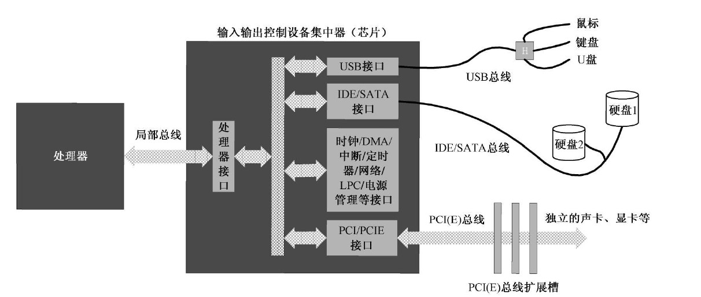
</center>

&emsp;&emsp;处理器和外部设备交换信息，不是直接通过线路连接的，而是通过 **总线(bus)** 连接 **输入输出控制设备集中器（I/O controller hub，南桥）** 提供的 **IO接口** 与外部设备进行连接。

## 六、IO端口

&emsp;&emsp; **端口（Port）** 就是放置在外围设备上的寄存器，cpu就是通过接口连接，然后操控这些端口，实现对外围设备的控制。

> * 端口具有统一的编号
> * 一个端口的长度，设备厂商自己设定，无要求。

# 第三章 汇编

## 一、虚拟机

&emsp;&emsp;**为了运行通过nasm编译好汇编二进制文件，需要将程序加载到硬件的导引区，让cpu运行完bios后运行相关的汇编程序。** 由于该方法会覆盖掉原有的硬盘导引，操作系统就完蛋了，所有需要用虚拟机来模拟运行。

> bochs : 可以对汇编程序进行调试。
> visual box：用于创建虚拟硬盘等操作。

## 二、编译器NASM

&emsp;&emsp;编译：

```linux
    nasm -f bin 汇编文件.asm -o 输出文件.bin
```

&emsp;&emsp;列表文件：

```linux
    nasm 汇编文件.asm -l 输出文件.lst
```

## 三、虚拟硬盘

&emsp;&emsp;虚拟机上的硬盘是以一个文件的形式进行模拟，采用 **固定分配的vhd格式** 。该格式简单，数据的存放就是按照机械硬件的 **逻辑地址** 顺序进行存放。

## 四、主引导扇区

&emsp;&emsp;对于硬盘的主引导扇区需要满足规范，才能让cpu识别并加载。**加载到内存的地址为 0x7C00**。
> 1. 主引导扇区为逻辑0扇区，即0面，0道，1扇区。
> 1. 导引头扇区的结尾的两个字节为：0x55 0xAA


## 五、bochsdbg 调试指令

> 1. s : step 执行一步指令
> 1. c : countinue 继续运行
> 1. b : break 打断点，断点打在内存地址上。
> 1. r : register 查看通用寄存器
> 1. sreg : sector register 段寄存器
> 1. xp /512xb 内存地址：查看 512 个 b 的内存，并且以 x 进行显示
> 1. u /数量: 反编译
> 1. next ： 下一步，可用于显卡调试 
> 1. info eflags : 显示标志位，大写为1，小写为0

## 六、32位与64位寄存器

<center>


</center>

> R : 64 位的扩展
> E ：32 位的扩展

## 七、显卡
****
### 7.1 显卡的工作原理

<center>


</center>

&emsp;&emsp;显卡先读取显存上的指令，然后再在屏幕上将内容通过像素点将内容绘制出来。对于图像，在现存上存储的是RGB像素信息；对于字符，显卡自带字符发生器，能够将显存上的代号转换为字符显示在屏幕上。

> 80x25显示的显存在内存上的逻辑地址为：B800:0000 到 B800:7FFF

### 7.2 字符编码

<center>


</center>

> 字符类型：最具代表的是ASCII码
> 字符样式：对于80x25的文本显示用跟随在ascii码后的一个字节（KRGB IRGB）进行设置。

## 八、汇编指令

### 8.1 段寄存器赋值

<center>


</center>

&emsp;&emsp;段地址不能直接通过 **立即数** 进行赋值。

### 8.2 mov

&emsp;&emsp;mov 指令必须字节长度明确才能进行；不同类型的mov操作，其二进制指令集不同(可以通过列表文件查看)。

### 8.3 JMP

1. 绝对转移
<center>


</center>

&emsp;&emsp;直接使用 **JMP + 逻辑地址** 完成指令的跳转，称之为 **段间直接绝对跳转指令**。

2. 相对转移

$$
jmp \ near \ start
$$

&emsp;&emsp; 该指令的操作数: **目标位置相对于当前指令的偏移量**。

$$
操作数 = 标号汇编地址 - jmp指令偏移地址 - 3 （Byte）\tag{8.1}
$$

其中：3为该指令的长度：1个操作码 + 2个操作数。**因为当执行该指令时，IP已经指向下一条指令了，所以要将JMP指令的长度减掉，然后通过该操作数去修改IP的值：IP = IP + 操作数。**

3. 转移方式对比

    > * 段内短转移：jmp short 标号，只相对修改IP，-128字节～127字节（8位）
    > * 段内近转移：jmp near ptr 标号，只相对修改IP，32768字节～32767字节（16位）
    > * 段内绝对转动：jmp near 寄存器,[数字]，只绝对修改IP
    > * 直接段间转移：jmp 逻辑地址，修改（CS:IP）
    > * 间接段间转移：jmp far [标号/数字，寄存器]，修改（CS:IP）,**偏移地址指向两个16位数**

### 8.4 标号

<center>


</center>

&emsp;&emsp;标号代表了最近一行指令的 **汇编地址(汇编地址也是物理地址中的偏移地址)**，并且其数值可以在汇编中使用。

### 8.5 div

1. 16位除以8位
    > * 被除数：AX
    > * 除数：8位通用寄存器或8位内存
    > * 结果：商存AL，余数存AH
2. 32位除以16位
    > * 被除数：高16位在DX，低16位在AX
    > * 除数：16位通用寄存器或16位内存
    > * 结果：商存AX，余数存DX

### 8.6 DB,DW,DD,DQ(伪指令)

&emsp;&emsp;用于在 **程序段** 声明存变量的空间：**内存地址就是当前的汇编地址**。
> D : declare
> B : byte
> W : word
> D : double word
> Q : quad word

### 8.7 []
&emsp;&emsp;**支持[寄存器]的寄存器有：BX,SI,DI,BP；其余的全部非法**
> [偏移地址]：段内地址取值，DS + 偏移地址
> [段地址：偏移地址]：段间地址取值，段地址 + 偏移地址


### 8.8 xor
规则：
> 0 xor 0 = 0
> 1 xor 0 = 1
> 0 xor 1 = 1
> 1 xor 1 = 0

### 8.8 movsb,movsw

&emsp;&emsp;进行段间批量搬运数据，movsb：字节，movsw：字。数据搬运还要指定传输方向：正向，SI与DI加1或2；反向，SI与DI减1或2。

> 一次指令，只运行一次
> 原数据的地址：DS:SI
> 目标的地址：ES:DI
> 传输数目：CX
> 正向/反向传输：DF

### 8.9 rep(repeat)

&emsp;&emsp;重复指令：CX为0则停止，不为0则重复。

### 8.10 loop

&emsp;&emsp; loop 的指令跳转同 jmp near 是相对位移跳转。

> cx--
> cx为0：跳出循环；否则，跳到指定位置

### 8.11 cbw,cwd

&emsp;&emsp;将有符号数的符号位向高位填充。
> cbw：al 转 ax
> cwd：ax 转 ax dx

### 8.12 jcc指令族

&emsp;&emsp;**执不执行转移，与对应的标值位有关。** 例如：与SF有关的jcc：
> jns：SF = 0，则跳转
> js：SF = 1，则跳转 

&emsp;&emsp;其他指令族：je,jne,jg,jge,jng.....

### 8.13 cmp

&emsp;&emsp;**两个值做减法，然后修改标值位。与sub的区别是：不会保留计算结果。** 之后就通过jcc指令族完成相关指令跳转。

### 8.14 push,pop

&emsp;&emsp;只能操作 **字，双字，四字。**

1. push
    > 1. SP首先运算：SP = SP - 2；**无符号运算**
    > 1. 根据字节序写入数据

2. pop
    > 1. 根据字节序弹出数据
    > 1. SP运算：SP = SP + 2；**无符号运算**

### 8.15 section,segment
&emsp;&emsp;在汇编中声明一个段：数据段，代码段，栈段。。都行。

> section [名称] align=16 vstart=0
> section.[段名].start: 段的起始汇编地址
> * align:指定对齐方式，就是段地址二进制下偏移了多少个位
> * vstart:表示该段的汇编地址的起始位置：是以当前段为起始，还是以整个汇编程序的开头为起始。

### 8.16 in,out

in: 从端口读取数据
> 1. 读取的目标寄存器：AL，AX 
> 1. 端口的存放寄存器：DX (**只有一个寄存器，说明端口的总个数有上限**)

out：将数据写入端口
> 1. 写出数据的寄存器：AL,AX
> 1. 端口的设置：8位立即数，DX

### 8.17 call
&emsp;&emsp;调用函数，靠 **ret/retf** 返回。

1. **16位相对近调用**

    > call near 标号 / 数字（由于编译器会直接将标号转为数字，所以数字是一样的）
    > 段内调用
    > 范围：**16位有符号数偏移**，-32768 ~ 32768
    
    > 偏移的计算：
    >> 1.  指令的操作数 = 跳转的汇编地址 - call当前的汇编地址 - 3 ：**计算的是指令到要跳转的位置之间的间隔，所以要剪掉指令的长度。**
    >> 1. IP = IP + 指令的操作数 + 3 ：**当前用于计算的IP是偏移到cal指令的值，下一次IP就要跳转到目标指令，所以还要加上指令的长度。**

1. **16位间接绝对近调用**
    > call 寄存器 / [数字]
    > 段内调用
    > 范围：该段的所有位置都能跳转，**因为 IP = 寄存器/[数字]**

1. **16位直接远调用**
    > call 偏移量:段地址
    > 段间调用

1. **16位间接远调用**
    > call far [标号 / 数字，寄存器]：**偏移地址指向的是一个预先定义好的32位值：偏移量，段地址。**
    > 段间调用

### 8.18 adc
&emsp;&emsp;带进位的加法。

### 8.19 shr/shl

<center>

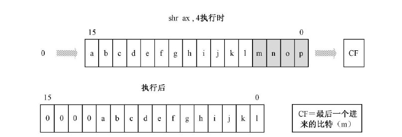
</center>

### 8.20 ror/rol

<center>

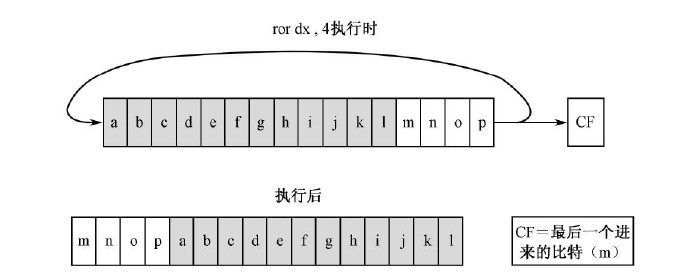
</center>


## 九、标志寄存器FLAGS

### 9.1 ZF(zore flag)

> 第6位
> 当计算结果为 0 时，ZF = 1

### 9.2 DF(direction flag)

> 第10位
> 控制movsb与movsw的方向: 0 正（指令：cld），1 负（指令：std）

### 9.3 SF(sign flag)

> 记录计算结果的最高位

### 9.4 PF

> 计算结果的 **低8位** 1的个数为偶数：1，奇数：0

### 9.5 CF

> 计算发生 **进位** 或者 **借位** ：1

### 9.6 OF

> 溢出标记位，发生溢出就为：1

> **溢出：在进行有符号运算时，计算结果超出了寄存器的长度界限，也就是有符号计算结果错误。**
$$
01110000 + 01110000 = 11100000 \tag{9.1}
$$

### 9.7 IF

> 0 : 屏蔽所有的INTR中断
> 1 : 接收所有INTR中断 


## 十、负数

1. 二进制编码

    &emsp;&emsp;对于有符号数，由最高位的标值来区分，0：正，1：负。**对于负数在计算机中的表示就为：0 - 正数**

    **用0进行二进制减法，然后无限的向前借位（指令：neg）**
    > 负数编码：00000000 - 00001100 = 11110100
    > 解码负数：00000000 - 11110100 = 00001100

1. 低位向高位扩充(cbw,cwd)

    &emsp;&emsp;**将标值位向高位进行复制就行。**
    > 8位：10000010 --> 16位：11111111 10000010

---
# 第四章 栈

<center>

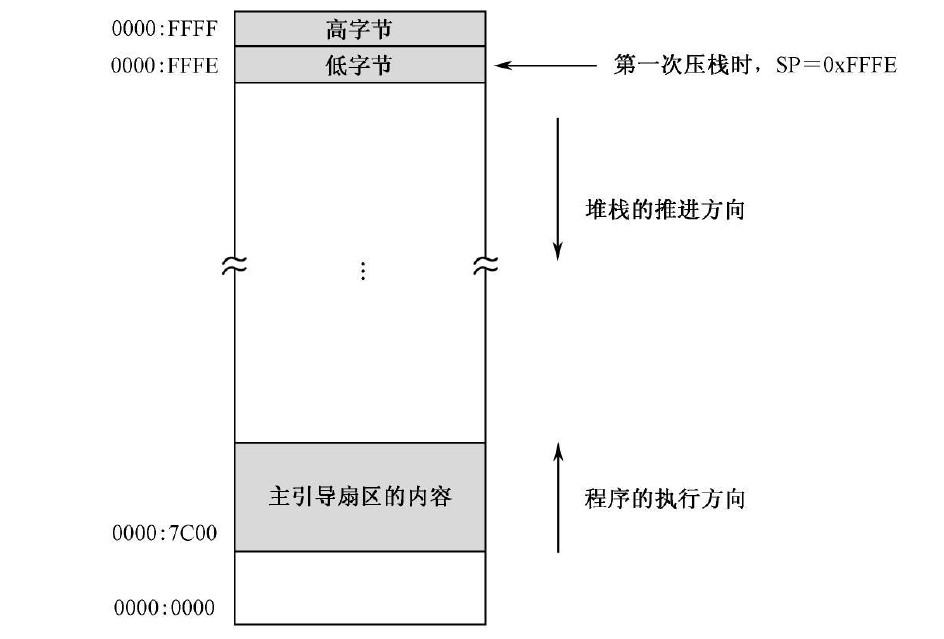
</center>

&emsp;&emsp;**栈被定义成了一块内存段，SS:SP。**

> 1. 初始化：SS=#0000,SP=#0000
> 1. 第一次执行指令：push
> 1. 首先，由于最小长度为16位（字）：sp = #0000 - #0002 = #FFFE
> 1. 然后，根据低端字节序写入数据。 

&emsp;&emsp;<span style="color:red;font-weight:bold"> 需要保证栈的一致性：入栈与出栈要对称。 </span>

---
# 第五章 硬盘和显卡的访问与控制

## 一、分段

&emsp;&emsp;在代码中通过 **section** 进行段的声明，声明后的段能够根据 **align** 自动去寻找到相应的 **汇编地址**，中间空余的部分都使用 **#0** 进行填充。

## 二、段地址计算

方案一
> 1. 8086的地址线为20根，所以需要使用两个字节来储存最原始的段地址：dx:ax
> 1. 使用32位的除法，除以 16；即将原始地址向右移动4位
> 1. 存储在ax中的16位数，就是需要的段地址

方案二
> 1. 将程序的20位汇编地址存入：dx:ax，**然后在加上代码在内存中的首地址(高位dx要用dac加法指令)**（将汇编地址映射到了实际的内存地址上）
> 1. ror移动dx，shr移动axl : 实现32位的左移4位
> 1. and dx,0x8000 : 只保留最高的4位
> 1. or dx,ax : 合并dx与ax


## 三、IO端口的访问

> 方案一：映射内存。将端口这些寄存器映射到内存上，处理器之间进行读写。
> 方案二：独立编地。处理器配置了一个引脚 **M/IO#(#:低电平有效)** 来切换内存和端口的地址。

<center>

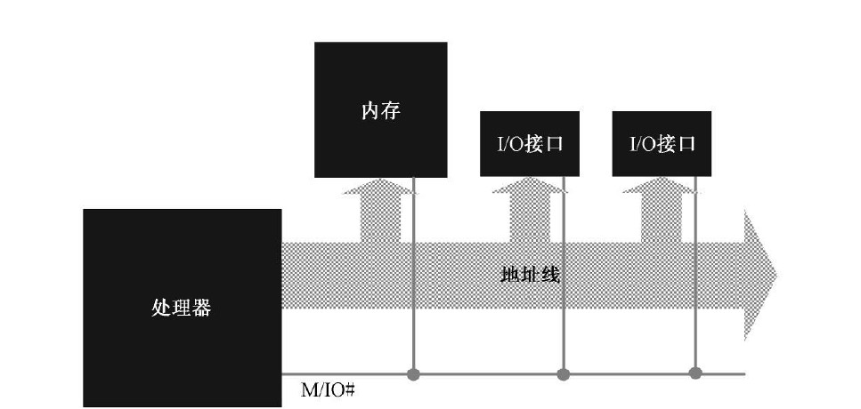
</center>

## 四、硬盘数据的读取

1. **设置要读取扇区的数量**。
    > 端口：0xlf2
    > 位数：8位
    > * 对于硬盘数据是以 **扇区** 为单位进行读写。

1. **设置LBA（逻辑扇区地址）扇区号**
    > 端口：0x1f3 ~ 0x1f6
    > 位数：8位
    > * 8086处理器使用的LBA编号方案是LAB28：**使用了28位来给扇区编号，所以端口8位的端口要4个。**
    > * 端口0x1f6：前4位用来编号；**第4位切换硬盘（支持两块硬盘）**；最高3位用来切换编号方式。

    <center>
    
    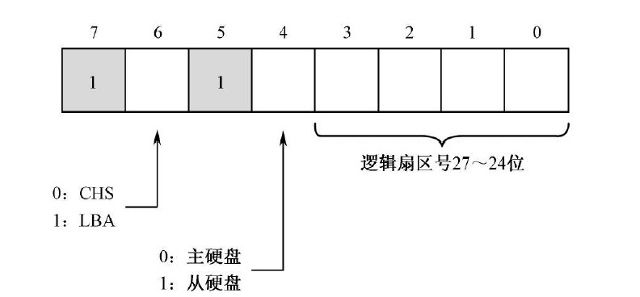
    </center>

1. **向硬盘说明读/写**

    > 端口：0x1f7
    > 位数：8位 
    > * 读：0x20；写：0x30

1. **等待操作完成**

    > 端口：0x1f7
    > 位数：8位
    > * 该端口还可以作为 **状态端口**

    <center>
    
    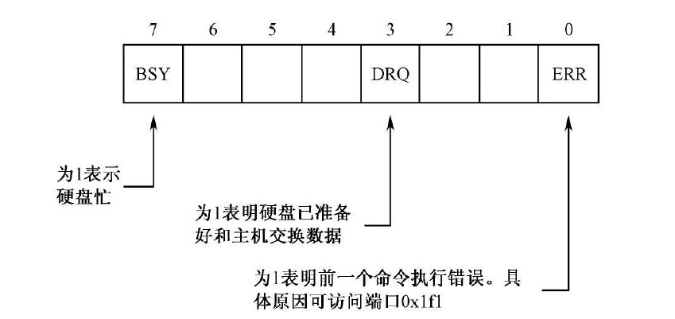
    </center>

1. **读/写数据**
    > 端口：0x1f0
    > 位数：**16位**
    > * 就靠该端口循环一个一个的读/写的数据。**持续至少一个扇区**

## 五、从硬盘加载程序

### 5.1 用户程序的头部

&emsp;&emsp;加载器和用户程序是两套分开的程序，会有不同的厂商进行编写，**所以加载器加载用户程序，就需要用户程序满足一定的规范并提供相应的程序信息，这些东西就写在程序的头部段内。**

<center>

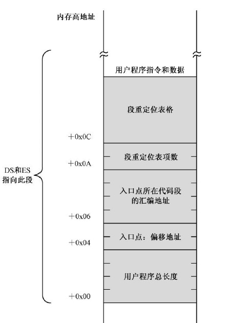
</center>

> 1. 程序的总长度：有多少个字节。
> 1. 应用程序的入口点：第一条程序的 段地址( **首先使用编译的，之后还要根据实际内存位置进行修改** ):偏移地址
> 1. 段重定位表：段的总数+段的汇编地址。提供一个程序编译后的编译段表，用于加载器重新计算，这些段在实际内存中的段地址。 

### 5.2 用户程序的加载运行

> 1. 计算程序加载位置的 **段地址**
> 1. 设定程序头所在的 **LBA号**
> 1. 加载用户程序的 **储存用户程序最开始的扇区**（<span style="color:red;font-weight:bold"> 该扇区包括程序的header段，还有其他的代码段 </span>）
> 1. 解析用户程序长度信息，根据长度信息计算扇区个数：
>> * 扇区数为1：程序总长度不足 512时，已经读取完毕
>> * 扇区数为整数：剩余扇区数 = 计算扇区数 - 1
>> * 扇区数为小数：剩余扇区数 = int(计算扇区数) 
> 5. 读取剩余的程序代码到内存  
>       **为了防止偏移地址出界，每读取一个扇区，就将 ds 偏移 0x20（512），并且偏移地址从0开始**
> 5. 重计算代码段的 **入口点段地址** 
> 6. 用户程序重定位：**段列表的内容根据实际内存地址进行重新计算。**
> 7. 使用 jmp 跳转到程序的入口 

### 5.3 执行用户程序

> 1. 根据修改后的 **段列表**，初始化**SS，SP**。
> 1. 根据修改后的 **段列表**，初始化**DS**。
> <span style="color:red;font-weight:bold"> 初始化的顺序不能变。 </span>
> 1. 最后交给处理器执行用户程序。

---
# 第六章 中断

## 一、外部硬件中断（硬中断）

<center>

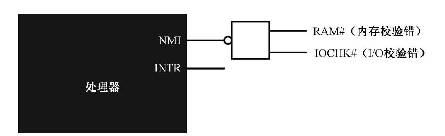
</center>

### 1.1 非屏蔽中断（Non Maskable Interrupt: NMI）

&emsp;&emsp;NMI中断用来处理计算机遇到的最严重的问题，一般情况下触发这类中断的问题，计算机基本上已经无能为力处理了。

> * NMI中断靠一个 **与非门** 触发：**高电平触发，且要维持4个时钟周期以上认为中断信号有效。**
> * 各个中断信号靠 **与** 进行连接，且 **低电平有效（设备完蛋，就没电流了）**
> * NMI的中断号就一个：**2**

### 1.2 可屏蔽中断（INTR）

<center>

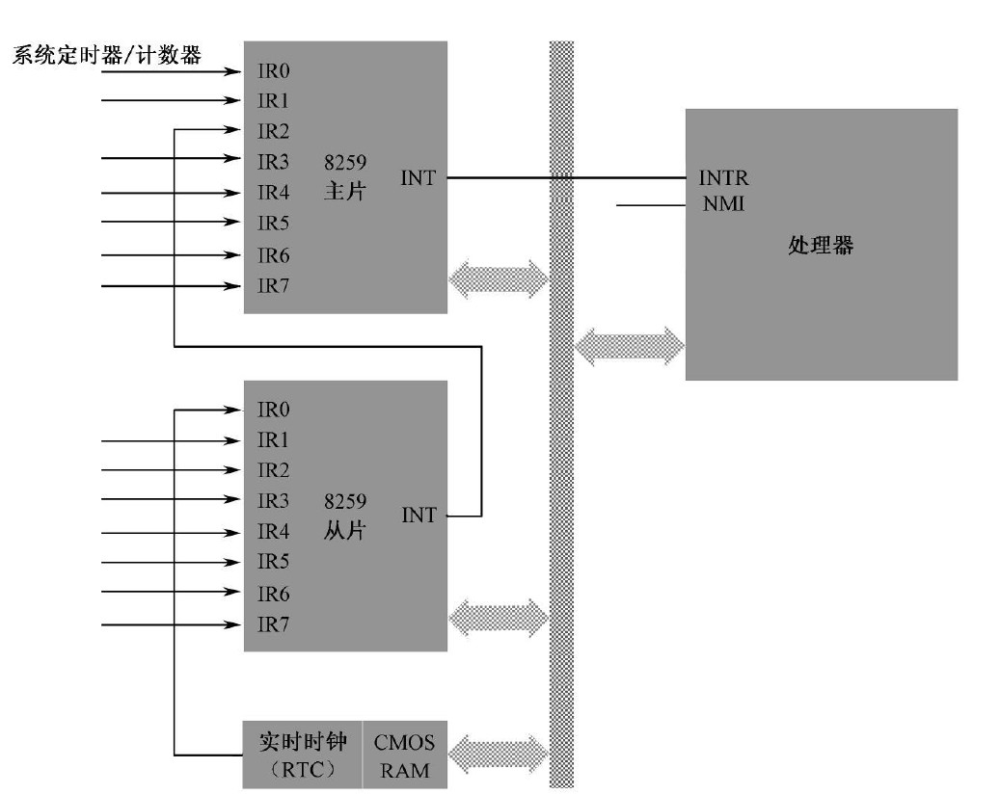

</center>

主要特点：
> * 处理的中断类型多
> * **可以在中断芯片中，对中断进行屏蔽**。
> * 中断号靠程序自定义。
> * 中断的影响程序次于NMI，计算机内部可调控。

代表性中断芯片8259：
> * 两个8259芯片为：主片（master），从片（slave）
> * 两个8259芯片处理 **256个中断** 的其中 **15个**。
> * 中断屏蔽寄存器（interrupt mask register，IMR）：8位，对应了8个输入的中断信号，0允许，1屏蔽。
> * 标志位 **IF** 能对所有INTR的中断进行屏蔽。
> * 中断优先级：主 > 从，IR0 > IR1 > .. > IR7


## 二、中断向量表

### 2.1 向量表

<center>

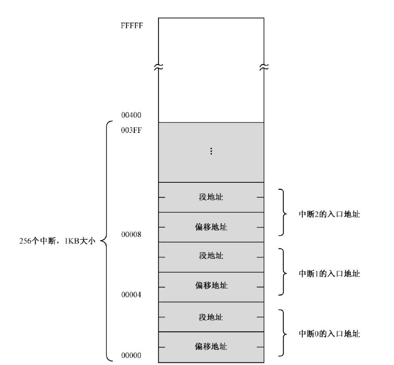
</center>

&emsp;&emsp; **中断函数的首地址，储存了：程序段地址：程序偏移地址。**

> * 一个中断的入口为两个字节：程序段地址：偏移地址
> * 中断向量表位置：0x0000:0x0000 ~ 0x0000:0x03ff (256 * 2)

### 2.2 向量表的初始化

&emsp;&emsp;向量表的初始化由BIOS完成，会为每个中断号填入入口地址：**iret** 指令。<span style="color:red;font-weight:bold"> 就是说，之后中断的设置，需要程序自己定义。 </span>

## 三、中断运行流程

1. **初始化中断**
提起准备好中断的程序，并添加中断向量表。

3. **接收中断信号**
cpu收到中断，执行完当前指令后，识别出中断号。<span style="color:red;font-weight:bold"> NMI 不会去识别中断号，处理器直接赋予中断号2 </span>。

1. **保护现场**
将FLAGS压栈；清空IF和TF（陷阱标志）；将当前的CS:IP压栈。

1. **跳转中断程序，执行程序**
CS = 0x0000；IP = 2 * 中断号。

1. **返回原来的程序**
执行iret；从栈中恢复CS:IP，FLAGS。

## 四、其他中断

### 4.1 内部中断

> * 定义： 发生在处理器内部，由执行指令触发。
> * 不受IF标签控制。

### 4.2 软中断

> * 定义： 由**int**指令触发。
> * 通过程序，人为可控的触发相应中断。

### 4.3 BIOS中断

> * 定义：在BIOS程序加载时，配置的中断。
> * 可用于之后的程序，通过 **int** 进行调用使用。（就可以当成BIOS提供的底层接口函数。） 

# 第七章 32位处理处理器
## 一、实模式
&emsp;&emsp;8086架构的操作模式，就是实模式，内存访问没限制，不安全。

## 二、寄存器

<center>

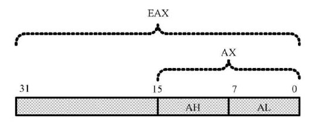
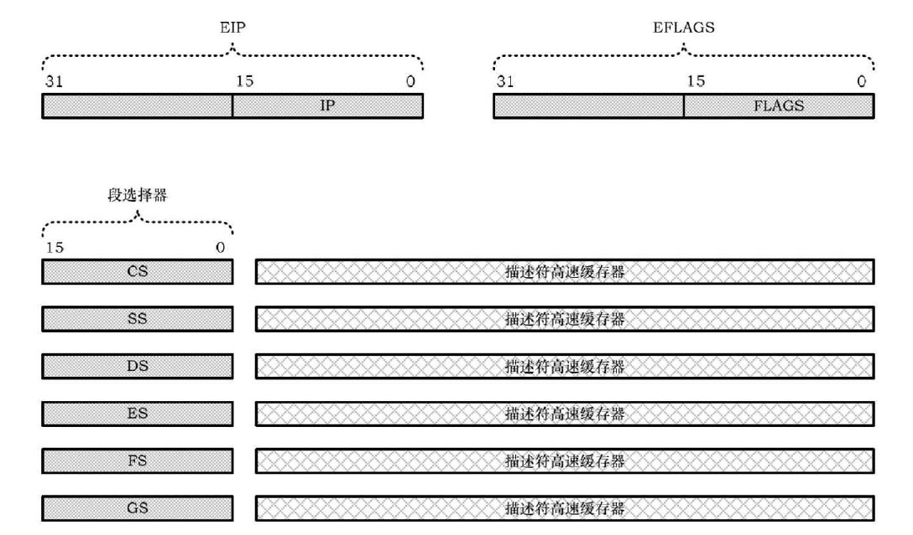
</center>

> * 长度由16扩展到 **32**
> * 通用寄存器的**高16位不能拆开用，低16位兼容8086**
> * <span style="color:blue;font-weight:bold"> 地址线 32 根，所以IP扩展到EIP(32位) </span>
> * 标志寄存器扩展到32位
> * <span style="color:blue;font-weight:bold"> 段寄存器变更位段选择器（EIP已经是32位，不用段也能访问所有地址）。由原来的16位 + 描述符高速缓存器组成。</span>
> * **描述符高速缓存器：用户不可见部分，储存了真正的段地址和各种访问属性。** 

## 三、流水线

<center>

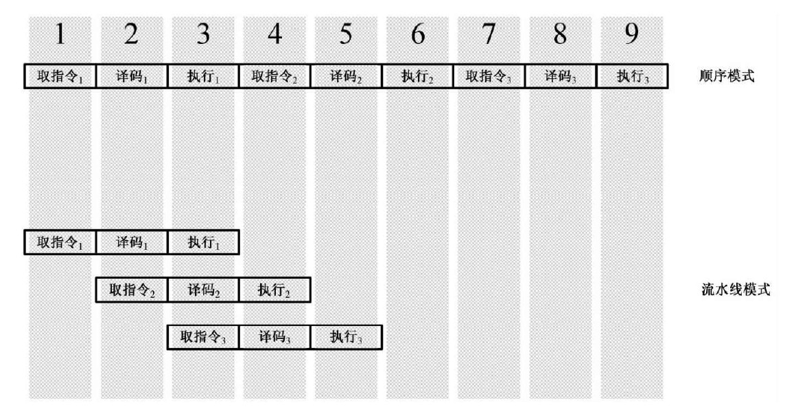
</center>

&emsp;&emsp;**处理器只负责计算，因此可以将一条指令拆分成多个片段，然后各个器件就能同时运行，加快指令执行速度。** <span style="color:blue;font-weight:bold"> 由于流水线技术的投入，指令的执行也不是单纯的顺序执行（一条一条的运行），而是乱序执行：指令拆分成的多个微操作不是顺序执行的。</span> **名义上只有那几个寄存器名字，但实际指令运行时，还有许多未命名的临时寄存器，这些寄存器会被处理临时命名，然后加以利用。**

## 四、缓存

&emsp;&emsp;硬盘的数据读取速度相对于DRAM和寄存器来说 **速度极其缓慢**，完全跟不上处理器的运行速度，为了弥补这一点，引入 **缓存来预先加载硬盘中的数据**。预先取数据又产生了 **分支目标预测技术**。

## 五、指令

<center>

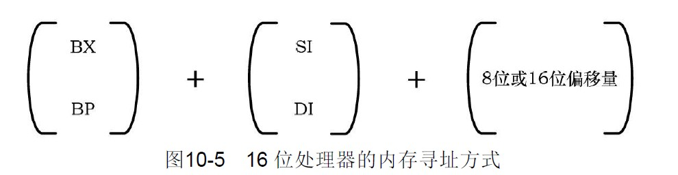
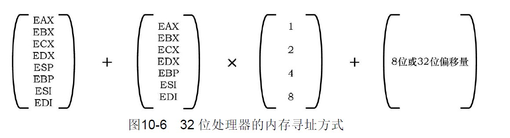


</center>