<h1>x86从实模式到保护模式</h1>

*****
[toc]
*****

****
# 第一章 处理器、内存和指令

## 一、寄存器

### 1.1 触发器

<center>


</center>

&emsp;&emsp;启动触发器开关后，触发器会锁存当前的输入，并一直记住该输入，直到下一次锁存数据。

### 1.2 寄存器

<center>

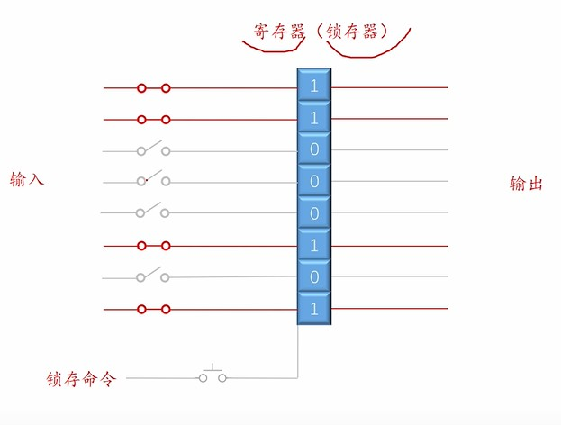
</center>

&emsp;&emsp;改进触发器，用于临时储存一个数据。

## 二、指令
<center>

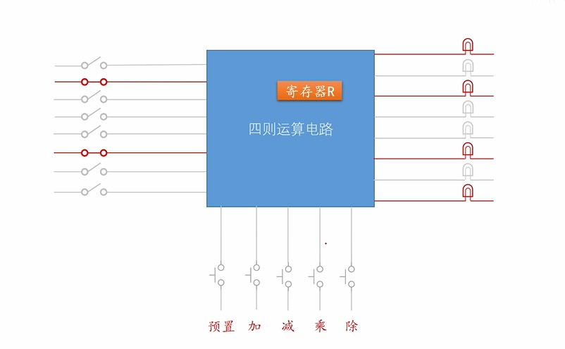
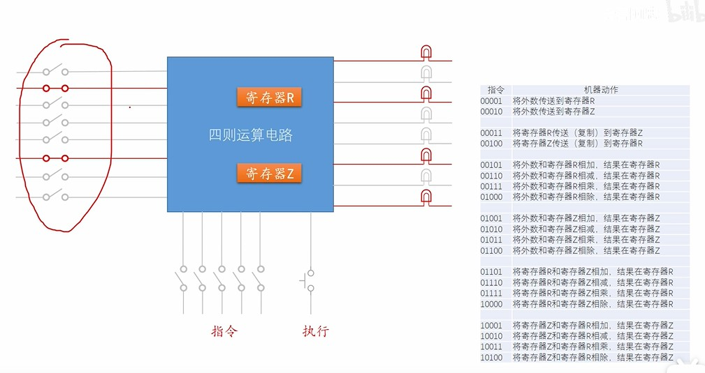
</center>

&emsp;&emsp;当使用涉及一个寄存器的计算器时，可以通过定义不同操作的开关来完成计算；当涉及多个寄存器进行计算时，每个操作设置一个开关就会很丧心病狂，所以就可以对这些操作进行编号，减少输入量。这些编号就是指令。

> * 指令集：所有指令的集合
> * 算数运算指令和逻辑指令
> * 数据传输指令
> * 处理器状态指令

## 三、内存
<center>


</center>

* 地址线：用于访问地址
* 数据线：读写内存中的数据
* 读写控制：切换读写模式

> 字节序：字节的存储顺序
> * 低端字节序：数据的高位对应高位内存，低位对应低位内存
> * 高端字节序：数据的高位对应低位内存，低位对应高位内存  

## 三、处理器

### 3.1 自动执行指令处理器

<center>

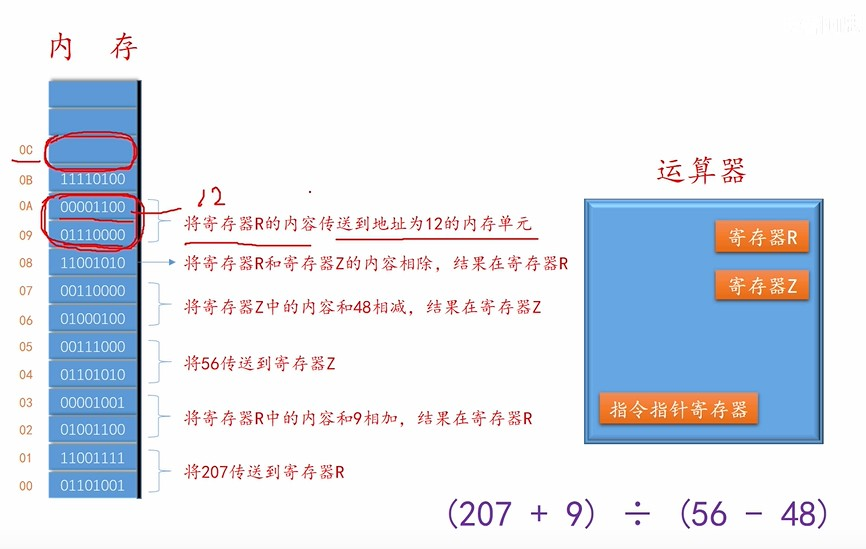
</center>

&emsp;&emsp;使用内存来存储一段指令（程序），然后靠运算器自动读取指令，进行数学运算。
$$
指令 = 操作码 + 操作数 \tag{3.1}
$$
&emsp;&emsp;立即数就是一类操作数；操作码就是操作的指令。

### 3.2 处理器

<center>

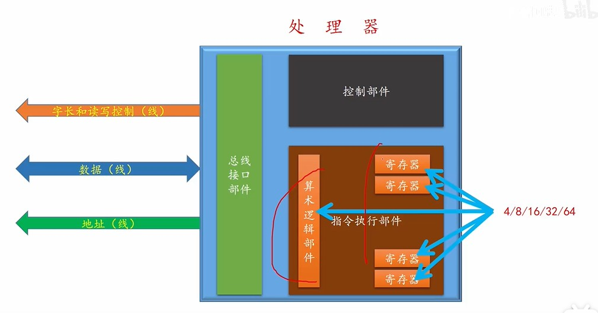
</center>

&emsp;&emsp;4位，8位，16位，32位，64位：就是指寄存器，算数运算的数据长度。

> 16位：8086CPU
> 32位：80836（i386）

## 四、8086处理器

### 4.1 通用寄存器

<center>

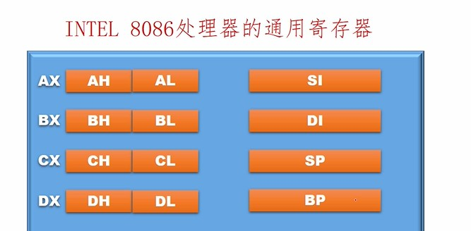
</center>

&emsp;&emsp;AX,BX,CX,DX,SI,DI,SP,BP；均为16位（一个字长）的寄存器。其中AX,BX,CX,DX可以拆开为两个的8位的寄存器使用：高位H，低位L。

### 4.2 程序的存储

&emsp;&emsp;一个程序在内存的存储大体主要分为**程序段与数据段**。
<center>

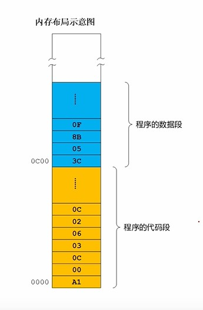
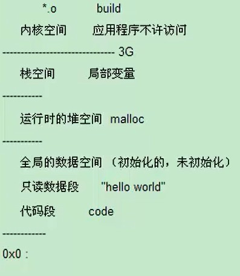
</center>

### 4.3 数据段的重定位

<center>

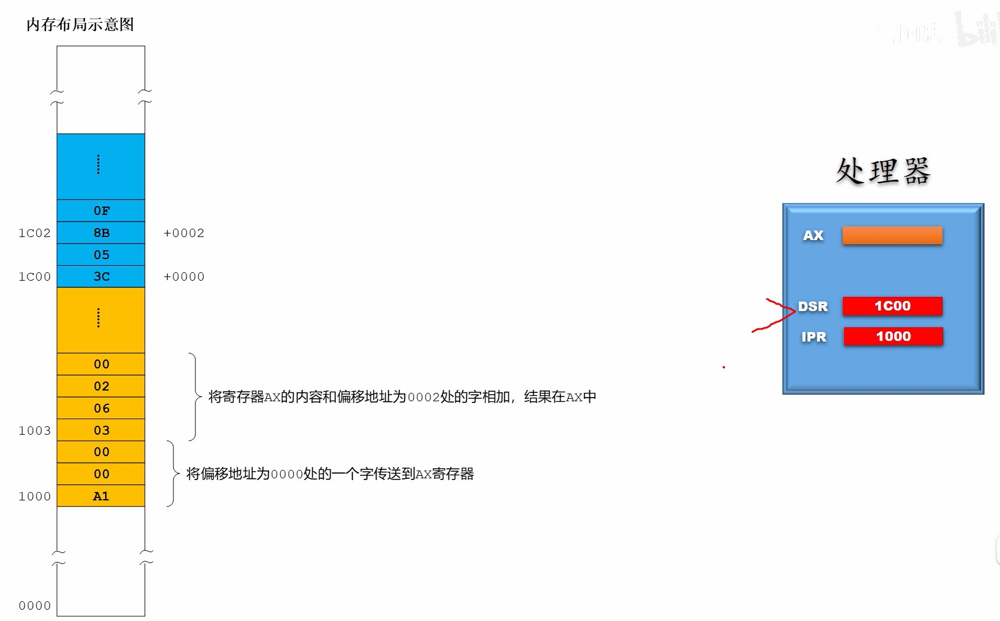
</center>

&emsp;&emsp;在处理器中会分配出两个寄存器：1）一个用于存储下次指令的首地址；2）一个用于存储数据段的起始地址。**对于程序段中存储的数据信息为数据首地址相对于数据段起始地址的偏移量，这个就能实现程序在内存中的浮动加载。**

$$
真实地址 = 段地址 + 偏移量 \tag{4.1}
$$

### 4.4 段寄存器
<center>

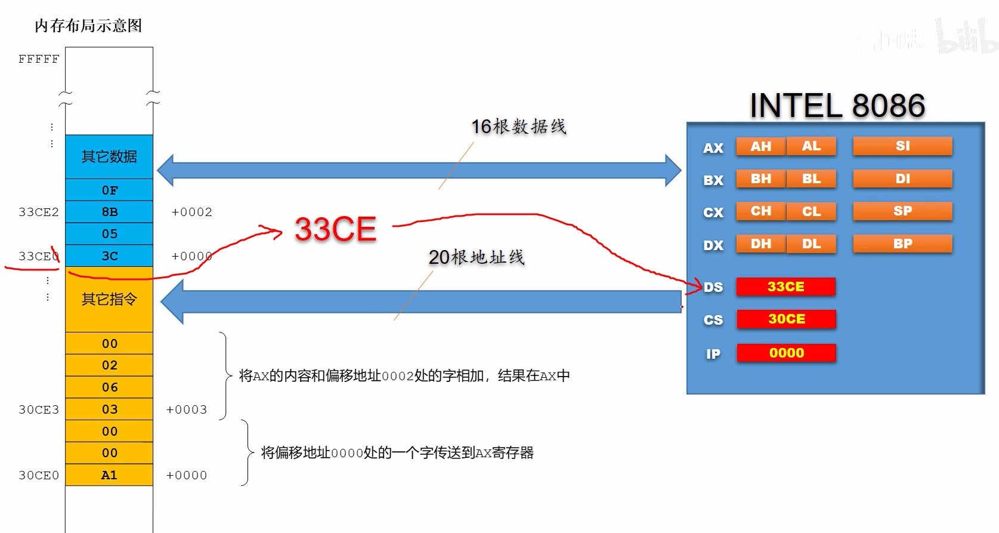
</center>

&emsp;&emsp;对于8086而言，有20根地址线，能访问1MB的内存。**由于寄存器为16位，不是所有的地址都能作为段地址。能作为段地址使用的是16进制的低位为0的地址，例如（33CE0）将低位的0抹掉，（33CE）放入段地址寄存器中。**
> DS：存储数据段的段地址。
> CS：存储代码段的段地址。
> IP：存储代码指令的偏移量。（数据的偏移量已经存储在代码中了）

&emsp;&emsp;段地址的表示为：**段地址:偏移量**。**一个段地址最大能访问64KB内存。**

<center>

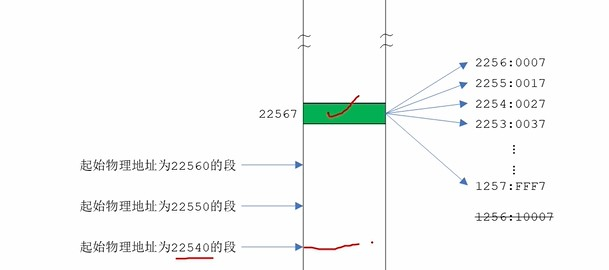
</center>

# 第二章 操作系统的启动

## 一、8086计算机的加电和复位

<center>

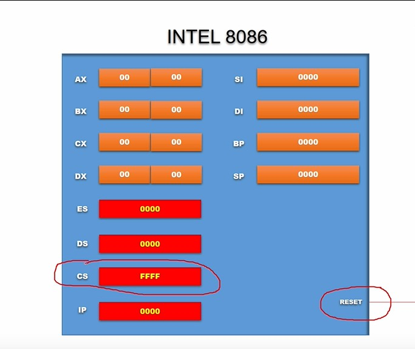
</center>

&emsp;&emsp;通过 **rest** 引脚，可以对cpu进行复位操作。**reset会使得cpu的寄存器恢复默认值，并且cpu一上电就会加载默认指定的内存段中的指令。** 8086一上电就会加载 FFFF:0000 处的指令。

## 二、地址分配

<center>

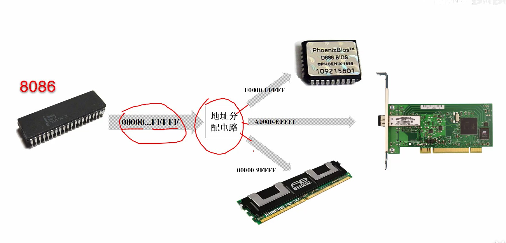
</center>

&emsp;&emsp;8086cpu能识别1MB的地址，**但是这些地址不是集中在一个硬件上的，而是在不同的硬件中进行分配，例如内存条，显卡，硬盘，声卡，网卡等等。**

### 2.1 DRAM

&emsp;&emsp;依靠**晶体管+电容**储存0与1，无法断电后保存数据。

### 2.2 ROM
&emsp;&emsp;**断电后还能存储数据。** 根据需求不同，可以进行电擦除等手段重写数据。

## 三、BIOS
<center>

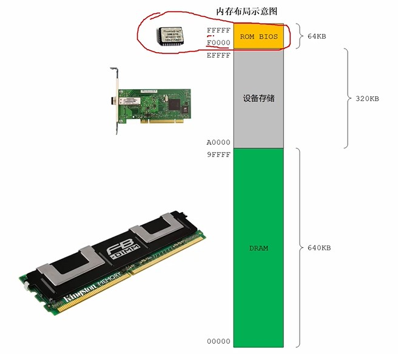
</center>

&emsp;&emsp;8086首先调用FFFF0处的ROM芯片中的指令，这些指令就是用于内存，键盘，鼠标等硬件启动，是最基础的指令，因此 **又将其称之为BIOS（基础的输入输出系统）**。

> **当BIOS将硬件设置启动完毕后，最后一条指令就是去加载硬盘的主引导扇区，准备开始加载硬盘中的操作系统。**

## 四、硬盘

### 4.1 机械硬盘结构

<center>

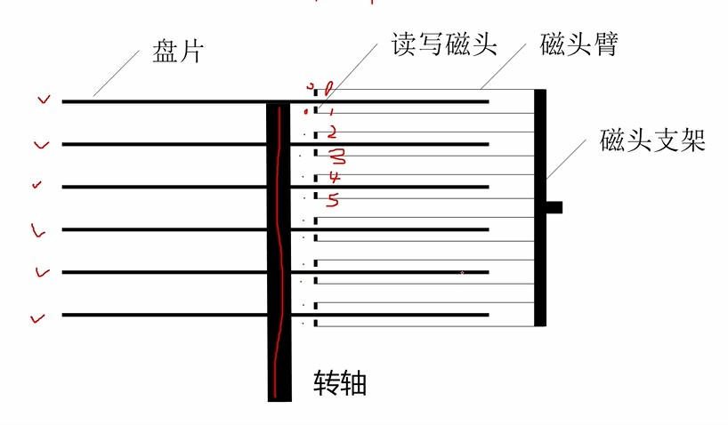
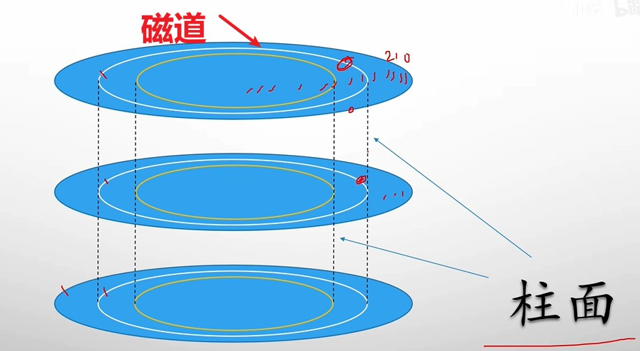
</center>

&emsp;&emsp;机械硬盘盘片的两面都能依靠磁道存储数据。1) 盘面，磁头，磁道的编号都是从0开始。2）由于磁头都是靠支架转动而转动，所以将在同一直径下的所有磁道组成的圆柱称之为柱面，数据的存储是以柱面的结构在不同盘面上进行读写的。

<center>

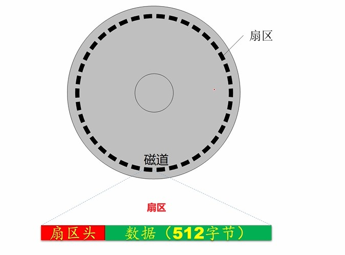
</center>

&emsp;&emsp;每个磁道又分为多个扇区，一般为63个扇区，**并且编号从1开始**。扇区头会记录当前磁道的位置，盘面的位置，扇区的位置，扇区的好坏等信息。

### 4.2 扇区的编号

<center>


</center>

&emsp;&emsp;机械硬盘对于数据块（block：扇区）的访问在物理结构上就是靠柱面（cylinder），磁头（header）和扇区（sector）一级一级的查找，但是这样不方便编程。**所以，为了程序查找方便，引入了逻辑块地址（Logic block address）来对所有扇区进行编号，方便查找。**

# 第三章 汇编

## 一、虚拟机

&emsp;&emsp;**为了运行通过nasm编译好汇编二进制文件，需要将程序加载到硬件的导引区，让cpu运行完bios后运行相关的汇编程序。** 由于该方法会覆盖掉原有的硬盘导引，操作系统就完蛋了，所有需要用虚拟机来模拟运行。

> bochs : 可以对汇编程序进行调试。
> visual box：用于创建虚拟硬盘等操作。

## 二、编译器NASM

&emsp;&emsp;编译：

```linux
    nasm -f bin 汇编文件.asm -o 输出文件.bin
```

&emsp;&emsp;列表文件：

```linux
    nasm 汇编文件.asm -l 输出文件.lst
```

## 三、虚拟硬盘

&emsp;&emsp;虚拟机上的硬盘是以一个文件的形式进行模拟，采用 **固定分配的vhd格式** 。该格式简单，数据的存放就是按照机械硬件的 **逻辑地址** 顺序进行存放。

## 四、主引导扇区

&emsp;&emsp;对于硬盘的主引导扇区需要满足规范，才能让cpu识别并加载。**加载到内存的地址为 0x7C00**。
> 1. 主引导扇区为逻辑0扇区，即0面，0道，1扇区。
> 1. 导引头扇区的结尾的两个字节为：0x55 0xAA

## 五、bochsdbg 调试指令

> 1. s : step 执行一步指令
> 1. c : countinue 继续运行
> 1. b : break 打断点，断点打在内存地址上。
> 1. r : register 查看通用寄存器
> 1. sreg : sector register 段寄存器
> 1. xp /512xb 内存地址：查看 512 个 b 的内存，并且以 x 进行显示
> 1. u /数量: 反编译
> 1. next ： 下一步，可用于显卡调试 

## 六、32位与64位寄存器

<center>

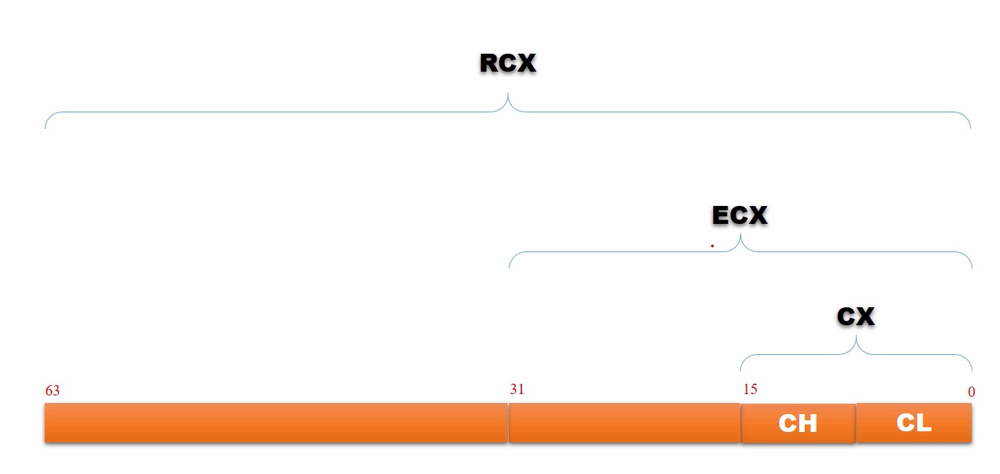
</center>

> R : 64 位的扩展
> E ：32 位的扩展

## 七、显卡
****
### 7.1 显卡的工作原理

<center>

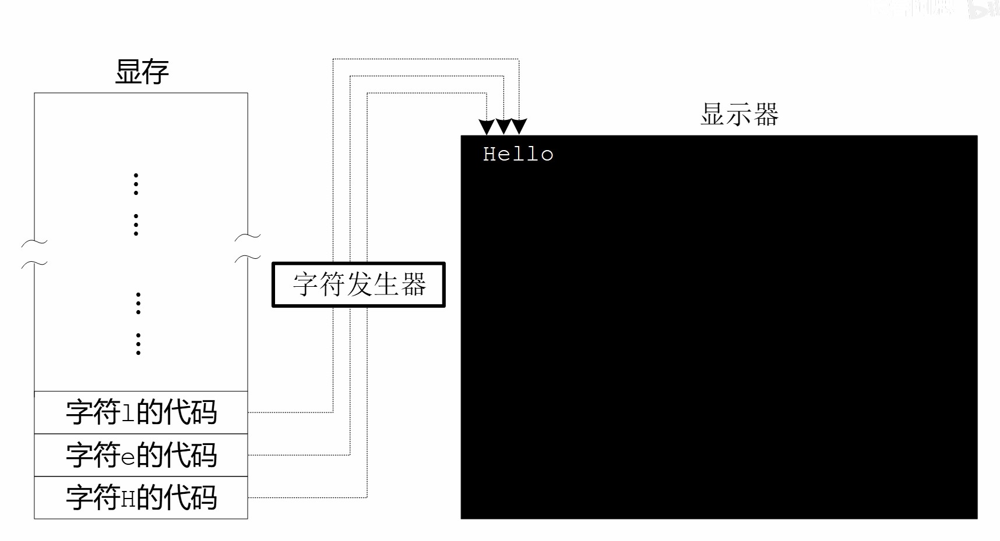
</center>

&emsp;&emsp;显卡先读取显存上的指令，然后再在屏幕上将内容通过像素点将内容绘制出来。对于图像，在现存上存储的是RGB像素信息；对于字符，显卡自带字符发生器，能够将显存上的代号转换为字符显示在屏幕上。

> 80x25显示的显存在内存上的逻辑地址为：B800:0000 到 B800:7FFF

### 7.2 字符编码

<center>

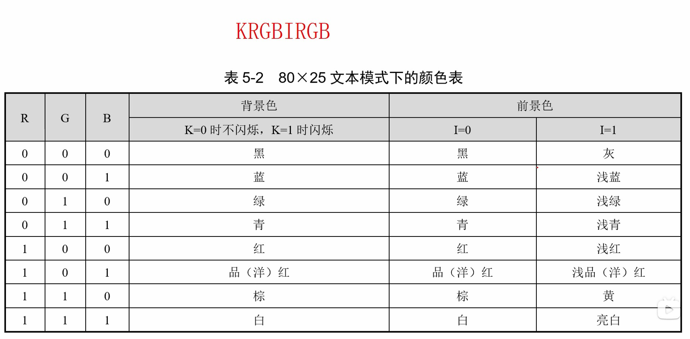
</center>

> 字符类型：最具代表的是ASCII码
> 字符样式：对于80x25的文本显示用跟随在ascii码后的一个字节（KRGB IRGB）进行设置。

## 八、汇编指令

### 8.1 段寄存器赋值

<center>

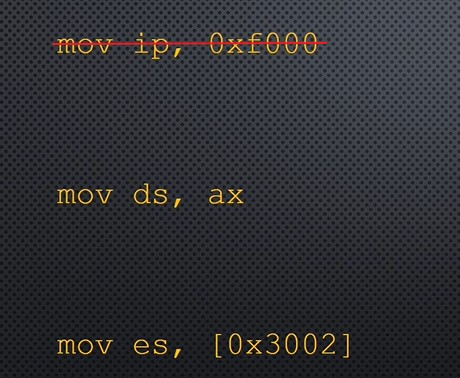
</center>

&emsp;&emsp;段地址不能直接通过 **立即数** 进行赋值。

### 8.2 mov

&emsp;&emsp;mov 指令必须字节长度明确才能进行；不同类型的mov操作，其二进制指令集不同(可以通过列表文件查看)。

### 8.3 JMP

<center>

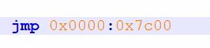
</center>

&emsp;&emsp;直接使用 **JMP + 逻辑地址** 完成指令的跳转，称之为 **段间直接绝对跳转指令**。

### 8.4 标号

<center>

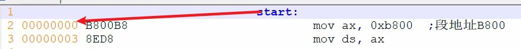
</center>

&emsp;&emsp;标号代表了最近一行指令的 **汇编地址**，并且其数值可以在汇编中使用。